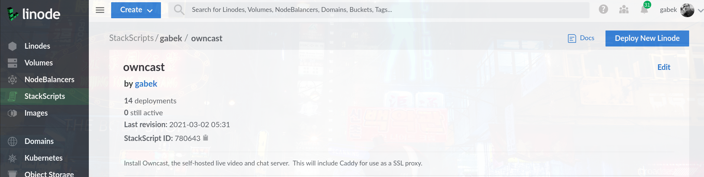
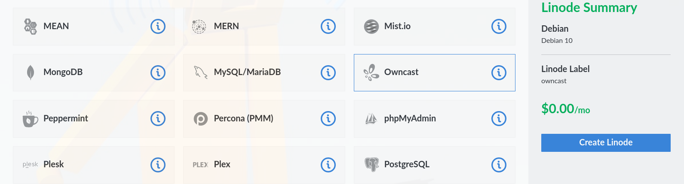
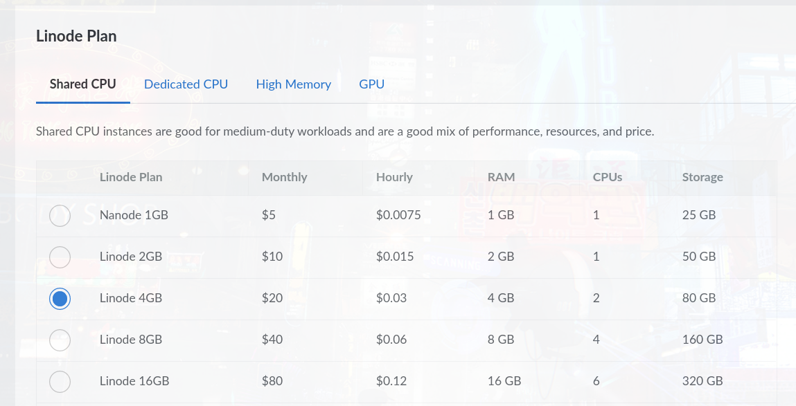

If you choose to use Linode as your hosting provider you can use the Linode One-Click-Install method.

**Note:** The Owncast Project may receive referral credit for deploying Owncast with Linode, so it's an easy way to support the project.

Linode has [written up a guide](https://www.linode.com/docs/guides/deploy-owncast-with-marketplace-apps) as well that you may want to reference, but the following Owncast documentation goes into more detail that may be helpful to you.

<iframe width="560" height="315" src="https://www.youtube.com/embed/eWE7HGJQI_4" title="YouTube video player" frameborder="0" allow="accelerometer; autoplay; clipboard-write; encrypted-media; gyroscope; picture-in-picture" allowfullscreen></iframe>

## What you need

1. A domain name and access to your DNS settings. This is required for supporting [SSL](/docs/sslproxies/).
1. A [Linode](https://www.linode.com/marketplace/apps/owncast/owncast/?r=588ad4bf08ce8394e8eb11f0a463fde64637af9d) account.

## Create your new server

1. Visit the [Owncast Linode Marketplace app](https://www.linode.com/marketplace/apps/owncast/owncast/?r=588ad4bf08ce8394e8eb11f0a463fde64637af9d).
1. Press the "Deploy this app" button and get sent to the page with the "Linode Summary" where you can press "Create Linode".
   
     
   
1. Under "Advanced Options" put in the hostname that you'll use for this server, such as owncast.mydomain.com.
1. Put in your email address.
1. If you skip this hostname and email step your server will not get automatically configured for SSL.
   
1. Select the region nearest to you.
1. Select a monthly plan. The more CPU you can afford the better quality you'll have in the end.
   
1. Enter a secure root password. Don't lose this.
1. Click "Create"

## Setup DNS for your hostname

1. Copy the IP Address for your new server from the new server status page.
   
1. Login to your DNS provider for your domain you used in step 3.
1. Add an "A Record" pointing to this ip address and the name you specified in step 3 (if you used owncast.mydomain.com then type in owncast).
1. Wait no less than 5 minutes for your server setup to complete and DNS to take effect. It may take longer depending on your DNS provider.
1. When you can access `http://ipaddress:8080` then the install is complete.
1. Reboot your new server.

## Test

1. In your browser make sure Owncast is running by visiting `http://ipaddress:8080`.
1. If you configured SSL by specifying a hostname, put that hostname in your browser to make sure you can access it via https, for example: `https://owncast.mydomain.com`.
1. Send a stream using your software to this hostname using abc123 as the stream key.
