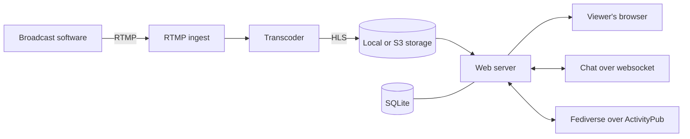

A quick tour of the moving parts, so you know where your change belongs. You do not need to understand all of this to contribute, but a map helps. For where each piece lives in the source, see [Where the Code Lives](/dev-docs/where-the-code-lives).

## The streaming path

This is the heart of Owncast.

1. You broadcast from software like OBS, which sends video to Owncast over RTMP.
2. Owncast takes that feed and hands it to the transcoder, which uses ffmpeg to produce one or more output qualities.
3. The output is written as HLS, a playlist plus a series of short video segments.
4. Those segments are stored on local disk or on S3 compatible storage.
5. The web server delivers them to each viewer's player.

## The web server

A single Go web server ties everything together. It serves the web app and the admin interface, exposes the admin and third party APIs, and runs the websocket that powers chat.

## Chat

Chat is real time and runs over a websocket. Viewers can register a name and, when the server requires it, authenticate before taking part.

## The fediverse

Owncast can federate over ActivityPub. People follow a stream from Mastodon and other fediverse servers, and go-live announcements are delivered to those followers.

## Data and structure

A local SQLite database holds configuration, users, chat history, followers, and more. Code reaches the database through repositories rather than touching it directly, and a central application controller gives each service access to the things it needs.

## Plugins

Plugins extend a running server with custom behavior without changing its source. See the [plugin documentation](/docs/plugins) for how they work.