Owncast accepts one RTMP broadcaster, turns it into HLS playlists and MPEG-TS segments with ffmpeg, stores those files, and serves them from `/hls/`.

```mermaid
flowchart LR
  Broadcaster[Broadcast software] -->|RTMP| Ingest[RTMP service]
  Ingest -->|FLV byte stream| Engine[Local stream engine]
  Engine -->|stdin| Ffmpeg[ffmpeg transcoder]
  Ffmpeg -->|HTTP PUT| Receiver[Internal HLS receiver]
  Receiver -->|writes then notifies| Storage[Local disk or S3-compatible storage]
  Storage -->|master playlist| HLS["/hls/stream.m3u8"]
  HLS --> Players[Players]
```

## Ingest

The RTMP service binds the configured RTMP address and port, which default to `0.0.0.0:1935`. It accepts one authenticated broadcaster at a time. The stream key from the RTMP connection must match a configured key, or the temporary `--streamkey` override set at startup.

After authentication, the RTMP service writes the inbound FLV-muxed byte stream into an in-memory pipe. It also reads the source metadata and reports the broadcaster's codec and related details to the stream service.

## Stream lifecycle

A connected broadcaster captures the current latency level and output-variant settings as the active broadcast. Owncast then:

- marks the stream online and starts viewer statistics
- starts directory, webhook, chat, notification, and federation go-live work
- starts ffmpeg and the thumbnail generator

When ffmpeg exits, Owncast marks the stream offline, stops the thumbnail generator and federation stream-ping ticker, sends offline events, and appends the offline video to each active variant. Five minutes after the stream ends, it clears the live HLS files and recreates the offline state.

ffmpeg can exit with an error when a broadcaster disconnects, so the lifecycle boundary preserves that exit cause without treating every non-nil error as a user-visible transcoding failure.

## Transcoding and HLS output

The transcoder gives ffmpeg the RTMP byte stream on standard input. It uses the configured ffmpeg binary, codec, latency level, and output variants to create one HLS variant for each configured quality. Each variant has its own playlist and MPEG-TS segment files. ffmpeg also writes a master playlist named `stream.m3u8` that lists the variants.

The latency level determines the segment duration and the number of segments retained in each variant playlist. ffmpeg writes program-date-time and independent-segment tags. Live playlists omit the end marker so Owncast can append the offline video when the broadcast ends.

ffmpeg does not write the HLS files directly to the public web server. It sends every playlist and segment with an HTTP `PUT` request to the internal HLS receiver. The receiver writes the file under `data/hls/` and notifies the storage provider after the write finishes.

The internal receiver selects an ephemeral port at startup. Its host is `127.0.0.1` by default, which keeps the unauthenticated PUT endpoint on loopback. `InternalHLSListenerHost` controls both the receiver bind address and ffmpeg's PUT target. It can be set to a reachable address when the transcoder and receiver are deliberately separated. Empty values still fall back to loopback. IPv6 hosts use normal bracketed host-and-port formatting.

## Storage

The stream service selects a provider when it starts and again when a stream comes online:

- **Local storage** keeps files in `data/hls/`. Cleanup retains the current playlist window plus ten additional files. A configured video-serving endpoint rewrites locations in the master playlist.
- **S3-compatible storage** uploads each segment, then uploads its variant playlist so a playlist does not reference a segment that is not available remotely. The master playlist is rewritten to use the configured serving endpoint or the bucket URL.

Storage receives separate notifications for segments, variant playlists, and the master playlist. This order matters for external storage. A viewer must not receive a playlist that refers to an object that has not been uploaded yet.

## Delivery

`GET /hls/stream.m3u8` is the viewer entry point. The HLS handler only serves `.m3u8` playlists and `.ts` segments, rejects non-local paths, disables caching for playlists, and sets `application/x-mpegURL` on them. Segments receive cache-control headers based on their path.

With local storage, the server reads playlists and segments from `data/hls/`. With S3-compatible storage, Owncast serves only the master playlist locally. Its rewritten variant and segment URLs send the player to the configured external endpoint.

Playlist requests mark the viewer active. Segment requests can also carry Common Media Client Data. Owncast records player-reported measurements when present and uses completed segment-transfer timing as a fallback for players that do not report their own measurements. See [CMCD playback reporting](/dev-docs/cmcd-playback-reporting) for the metrics path.

## The engine boundary

[PR #4984](https://github.com/owncast/owncast/pull/4984) separated the video engine's dependencies from the rest of Owncast without changing the default single-process deployment.

The `StreamEngine` interface owns starting and stopping ingest. `StreamEvents` carries `StreamConnected`, `BroadcasterSet`, and `StreamDisconnected` back to the core stream service. The current `localStreamEngine` still starts the in-process RTMP listener and ffmpeg path. A remote engine is not implemented today. The boundary lets a future engine process report the same lifecycle events without moving the chat, directory, webhook, notification, federation, viewer-status, or offline-content behavior out of core.

The engine-facing `EngineConfig` interface exposes only the nine values the RTMP, transcoder, and storage packages read: RTMP address and port, ffmpeg path, codec, S3 settings, latency level, output variants, video-serving endpoint, and stream keys. The database-backed configuration repository satisfies this interface in the current deployment. A separate engine can supply the same values from a configuration snapshot without linking the core configuration repository or web API types.

`models.StreamKey` is now the domain stream-key type used by configuration storage and the engine. The generated HTTP type remains at the API edge. Their JSON shape is the same, so persisted stream keys continue to decode unchanged.

## Implementation map

| Responsibility | Source |
| --- | --- |
| RTMP listener, authentication, and FLV pipe | `services/rtmp/` |
| Stream lifecycle, offline state, and engine wiring | `services/stream/` |
| ffmpeg arguments, thumbnail generation, and HTTP receiver | `services/transcoder/` |
| Local and S3-compatible HLS storage | `services/storage/` |
| Engine configuration and stream-key domain types | `models/engineConfig.go`, `models/streamKey.go` |
| Runtime listener configuration | `config/config.go` |
| Viewer HLS responses and metrics registration | `webserver/handlers/hls.go` |