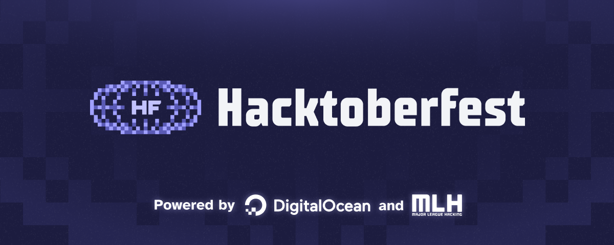

    

Some of the information about Hacktoberfest was copied here from the official [Hacktoberfest website](https://hacktoberfest.com/participation/) and should be referenced for more information.

---

## What is Hacktoberfest?

Hacktoberfest is the annual event that encourages people to contribute to Open Source throughout October. Much of modern tech relies on open-source projects built and maintained by passionate people who often don’t have the staff or budgets to do much more than keep the project alive. Hacktoberfest is all about giving back to those projects, sharpening skills, and celebrating all things open source, especially the people that make open source so special.

For the past 10 years, thousands of people, coders and non-coders alike, have participated in hacktoberfest to support the projects they use and love, learn and practice skills that will enhance their careers, and meet new people who love open source as much as they do.

## What is Owncast?

Owncast is a single-user live streaming server with chat features that allows you to run your own live stream. It's volunteer run, donation funded, and 100% free and open source software that exists for the community. [See some examples in use](https://directory.owncast.online). If you're curious what some of the users have to say about the software and what they're doing with it, [here's some discussing why they like it](https://videos.owncast.online/v/GbUWuPQzFvN88SGuihfrS9).

## What do you receive by contributing to Owncast during Hacktoberfest?

- You’ll unlock a digital badge when you register for Hacktoberfest, and level it up with each of your four pull/merge requests accepted during Hacktoberfest.
- Quality contributions[^1] to Owncast will receive an **Owncast t-shirt**. If you feel like you have qualified for a shirt, please [register for your t-shirt here!](https://gabekangas.typeform.com/to/Wfx9UHVZ).
- You get added to the Owncast list of contributors on the [Owncast website](https://owncast.online), [GitHub repository](https://github.com/owncast/owncast) **and** the contributors thank-you video on [Owncast TV](https://watch.owncast.online).
- You take part in a **global event**, contribute to **a cool project**, and be a part of the **open source community**.

## Code Contributions

Visit our [Owncast contributor guide](https://owncast.online/contribute/) to learn how to get started with contributing to Owncast.
Owncast's backend is written in Go, and the frontend uses React, written in TypeScript.

Visit our [Good First Issues](https://github.com/owncast/owncast/issues?q=is%3Aissue+is%3Aopen+label%3A%22good+first+issue%22) to see what has been designated as a good place to start. These issues are generally smaller in scope and easier to work on without knowing everything about Owncast and its codebase.

### Other code-related contribution ideas

- Write a bot, add-on, or integration with a 3rd party service that can be used with Owncast.
- Write tests around Javascript, Go or frontend components. Every project needs more tests!
- See something in the project that could be improved? File an issue first to discuss it, and if it's something you'd like to work on, then go for it! It's generally frowned upon, however, to put up a PR to "fix" something that you haven't discussed with the project first.

## Content, No-code or Low Code Contributions

At its core, Hacktoberfest aims to encourage more people to participate in open source and collaborate to enhance the software driving our world today. Open source projects can benefit greatly from community contributions, and there are a multitude of ways to get involved that don’t involve coding skills. Whether you possess technical expertise or not, you can leverage your professional skills to support open-source projects. In line with last year’s effort, we’re committed to promoting contributions that don’t require technical knowledge. Visit GitHub’s The ReadMe Project to learn more

We’re making a point to encourage contributions that require low technical experience or none at all. No matter your experience, you can participate in Hacktoberfest!

- Write documentation and tutorials.
- Provide product design feedback and ideas about work that is currently being done.
- Help answer questions in the [Owncast chat](https://owncast.rocket.chat).

The Owncast project is always looking for ways to get in front of more people and share the project with the world. If you're interested in helping with that, here are some ideas:

- Discuss Owncast on your Podcast, YouTube channel, PeerTube account, Twitch stream, or blog.
- Create a screencast or video showing Owncast in action.
- Taking part in talks or presentations that feature Owncast.
- Invite somebody from Owncast to discuss the project somewhere.
- Social media posts and general advocacy.

## Usage Contributions

If you've been thinking about trying Owncast for the first time but haven't found the right time to be inspired to try it out, **this is your chance**. If you spin up a new public Owncast server and list it on the [Owncast Directory](https://owncast.online/directory) during Hacktoberfest, you'll receive a t-shirt from us.

## Where to Begin

- Read the [Hacktoberfest Values](https://hacktoberfest.com/participation/#values).
- Register for [Hacktoberfest 2024](https://hacktoberfest.com/participation/) starting September 26th.
- Read the Owncast [Contributor Guide](https://owncast.online/contribute/).
- Visit the Owncast [Good first Issues](https://github.com/owncast/owncast/issues?q=is%3Aissue+is%3Aopen+label%3A%22good+first+issue%22) list to see what has been designated as a good place to start.
- [Install your own instance](/quickstart) of Owncast in about a minute.
- [Join our chat](https://owncast.rocket.chat) and introduce yourself.

See you soon!

---

[^1]: A quality contribution is generally seen as that needed to be completed, fixing a bug that was reported, writing useful documentation, creating content around Owncast, or performing some piece of work within the Owncast organization that previously was determined to be needed. Coming up with your own arbitrary ideas, fixing typos, or making up changes just for the sake of getting PRs merged in are not seen as a quality contribution.
