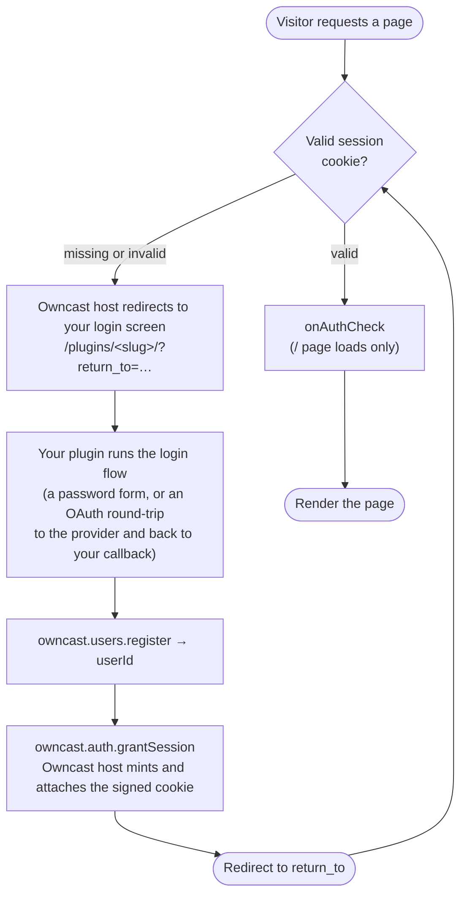

import Tabs from '@theme/Tabs';
import TabItem from '@theme/TabItem';

An **authentication gate** plugin makes viewers sign in before reaching the
resources selected by the server operator. The plugin supplies the login
method, such as OAuth, a magic link, SAML, or a shared password. Owncast
enforces the selected access mode.

- **Your plugin is the identity provider.** It renders the login screen, talks to the external provider, and decides who is allowed in.
- **The Owncast host is the gatekeeper and session authority.** It owns the session cookie, enforces the selected access mode, and never puts your plugin in the per-request hot path.

:::info[Requires auth.gate]
Everything on this page needs the [`auth.gate`](/docs/plugins/permissions#authgate) permission, plus [`users.register`](/docs/plugins/permissions#usersregister) to create the authenticated user and [`http.serve`](/docs/plugins/permissions#httpserve) to render the login flow.
:::

## What gets gated

When an `auth.gate` plugin is enabled, the viewer page, chat, embeds,
`/api/config`, and the rest of the public web surface require login. A short
list of routes stays public in every mode, including Owncast's admin pages
(they keep their own admin authentication, so an operator can always disable a
broken gate), the instance logo, and the ActivityPub federation endpoints. See
[what bypasses the gate](#what-bypasses-the-gate) for the full list.

The operator selects one cumulative access mode on the plugin's
**Authentication** tab:

| Access mode | Effect |
| --- | --- |
| Website only (default) | The web interface requires sign-in. `/hls/*`, `/api/status`, and Owncast Directory listing stay public. |
| Website, video players, and other resources | Also gates Owncast-hosted `/hls/*`. Players such as VLC cannot complete the browser login. `/api/status` and directory listing stay public. |
| Website, video players, and server status requests | Gates the web interface, Owncast-hosted `/hls/*`, and `/api/status`. Owncast Directory listing is disabled. |

The modes are cumulative. There is no status-only mode that hides
`/api/status` while leaving HLS public. The default protects the website
without breaking existing players or uptime monitors.

Selecting either stream-protection mode blocks native players. VLC, QuickTime,
mobile apps, and restreamers cannot complete a browser login or carry the
session cookie. An `Authorization` header or query token does not bypass the
gate.

A viewer with a valid session is always let through, regardless of the
selected mode.

:::warning[Distributing your video with External storage (Object storage/CDN) caveat]
When distributing your video stream directly from your server, stream protection is airtight: every byte flows through Owncast. With Object Storage or CDN, playlists are rewritten to absolute remote URLs and segments are fetched directly from the bucket, so the gate never sees those requests. Gating still stops an anonymous visitor from _discovering_ the segment list, but a _leaked or shared_ segment URL stays fetchable. **Stream protection + local distribution is airtight. Stream protection + Object Storage is good friction, not airtight.**
:::

## How it works

Once the gate is armed, every non-exempt request is checked. Under stream protection that includes each HLS segment, which a live viewer pulls every few seconds. Calling into your plugin's embedded engine on every one of those would melt the server, so the plugin is kept out of the hot path:

| When                                             | Cost                                                                   | What happens                                                         |
| ------------------------------------------------ | ---------------------------------------------------------------------- | -------------------------------------------------------------------- |
| **Every non-exempt request**                     | Verify cookie signature + expiry                                       | valid passes. Missing or invalid gets a redirect to login, or a `401` for anything that is not a `GET` or `HEAD` |
| **`/` page loads only**                          | Optional engine call: [`onAuthCheck`](/docs/plugins/events#auth-check) | re-validate against your provider, returns `ok` / `refresh` / `deny` |

Your plugin only runs the **login flow** (infrequent, about once per viewer session) and the optional per-page-load `onAuthCheck`. The Owncast host mints and checks a **signed session cookie** so the per-request check is signature-and-expiry only: no database lookup, no plugin call.

The cookie is a signed envelope carrying an Owncast access token plus a session expiry. The host mints a fresh access token for the user each time it grants a session. The Owncast host owns the cookie end to end: it reserves the cookie name (`owncast_session`), signs it with a host-held secret, and attaches it to the response. Your plugin never sees or sets the token, so it can't forge or leak one. (This is also how chat picks up the viewer's identity automatically. See [Chat identity](#chat-identity) below.)

## Building a gate plugin

A gate plugin is an [HTTP-serving plugin](/docs/plugins/http) with a login flow. The control loop, by convention, is rooted at your plugin's own namespace `/plugins/<your-slug>/`:



Three pieces do the work:

1. **Register the user.** Turn the external identity into a real Owncast user with [`owncast.users.register`](/docs/plugins/apis#users-register). Pass a stable, provider-scoped `authId` (e.g. `"github:583231"`). The host namespaces it by your slug so plugins can't collide or spoof each other.
2. **Grant the session.** Call [`owncast.auth.grantSession`](/docs/plugins/apis#auth-grant-session) with that `userId`. The Owncast host mints the signed cookie and attaches it to the in-flight response. This only works inside an `onHttpRequest` handler.
3. **Redirect home.** The Owncast host appends a `return_to` query parameter when it bounces an unauthenticated visitor to your login screen, and **sanitizes it to a same-origin path** (so it can't be turned into an open redirect). Send the viewer there after a successful login.

To sign a viewer out, call [`owncast.auth.endSession()`](/docs/plugins/apis#auth-end-session) and redirect. Your plugin still controls where to (it may bounce on to the provider's own logout).

### Revocation with `onAuthCheck`

Sessions are stateless, so there's no per-request "is this user still allowed" list. That would put the plugin back on the hot path. Instead, define the optional [`onAuthCheck`](/docs/plugins/events#auth-check) handler. It fires on each `/` page load with the resolved viewer identity, and returns `ok`, `refresh` (re-issue the cookie, optionally with a new TTL for sliding expiry), or `deny` (end the session and bounce to login). A provider-backed plugin re-checks membership here (org still valid? account not deleted?).

Because the check runs only on `/`, a viewer you revoke keeps any open tab working until they reload or the cookie expires. The session **TTL is the hard backstop** for revocation, so keep it short if fast revocation matters.

## Worked example: a shared-password gate

The `basic-auth` example plugin is the simplest possible gate: one shared password, one shared "Guest" identity, no external provider. It ships in both [`examples/js/basic-auth`](https://github.com/owncast/plugin-sdk/tree/main/examples/js/basic-auth) and [`examples/python/basic-auth`](https://github.com/owncast/plugin-sdk/tree/main/examples/python/basic-auth).

Its manifest declares the permissions and a single config field for the password:

```json
{
  "name": "Basic Auth",
  "slug": "basic-auth",
  "version": "0.1.0",
  "permissions": ["auth.gate", "users.register", "http.serve", "storage.kv"],
  "config": {
    "password": {
      "type": "string",
      "default": "letmein",
      "description": "Shared password viewers must enter to watch"
    }
  }
}
```

The handler renders a password form at `/`, checks the submitted password against the configured value, and on success registers the shared identity, grants a session, and redirects back. `onAuthCheck` reads an admin-flippable `revoked` flag to kick everyone on their next page load. (The `page()` helper that builds the HTML form is omitted below for brevity. See the example source.)

<Tabs groupId="plugin-lang">
<TabItem value="js" label="JavaScript" default>

```js
const { definePlugin, owncast, authCheck } = require('@owncast/plugin-sdk');

module.exports = definePlugin({
  onHttpRequest(req) {
    const query = req.query || {};
    const returnTo = query.return_to || '/';

    if (req.method === 'GET' && req.path === '/') {
      return {
        status: 200,
        headers: { 'content-type': 'text/html' },
        body: page(returnTo),
      };
    }

    if (req.path === '/login') {
      const expected = owncast.config.get('password', 'letmein');
      if ((query.password || '') !== expected) {
        return {
          status: 200,
          headers: { 'content-type': 'text/html' },
          body: page(returnTo, 'Incorrect password.'),
        };
      }
      // Everyone who knows the password shares one authenticated identity.
      const { userId } = owncast.users.register({
        authId: 'shared',
        displayName: 'Guest',
      });
      owncast.auth.grantSession({ userId });
      return { status: 302, headers: { Location: returnTo } };
    }

    if (req.path === '/logout') {
      owncast.auth.endSession();
      return { status: 302, headers: { Location: '/' } };
    }

    // Admin-only revocation toggle. req.authenticated is true for admins only.
    if (req.path === '/revoke' || req.path === '/unrevoke') {
      if (!req.authenticated) return { status: 403, body: 'admin only' };
      owncast.kv.set('revoked', req.path === '/revoke' ? '1' : '');
      return {
        status: 200,
        body: req.path === '/revoke' ? 'revoked' : 'unrevoked',
      };
    }

    return { status: 404, body: 'not found' };
  },

  // Re-validate on each page load. While revoked, end every session.
  onAuthCheck() {
    if (owncast.kv.get('revoked') === '1') return authCheck.deny('access has been revoked');
    return authCheck.ok();
  },
});
```

</TabItem>
<TabItem value="py" label="Python">

```python
from owncast_plugin import plugin, owncast, auth_check


@plugin.get("/")
def login_form(req):
    return_to = (req.raw.get("query") or {}).get("return_to") or "/"
    return {"status": 200, "headers": {"content-type": "text/html"}, "body": page(return_to)}


@plugin.get("/login")
def login(req):
    query = req.raw.get("query") or {}
    return_to = query.get("return_to") or "/"
    expected = owncast.config.get("password", "letmein")
    if (query.get("password") or "") != expected:
        return {"status": 200, "headers": {"content-type": "text/html"},
                "body": page(return_to, "Incorrect password.")}
    # Everyone who knows the password shares one authenticated identity.
    result = owncast.users.register("shared", display_name="Guest")
    owncast.auth.grant_session(result.user_id)
    return {"status": 302, "headers": {"Location": return_to}}


@plugin.get("/logout")
def logout(req):
    owncast.auth.end_session()
    return {"status": 302, "headers": {"Location": "/"}}


@plugin.get("/revoke")
def revoke(req):
    if not req.authenticated:  # true for admin requests only
        return {"status": 403, "body": "admin only"}
    owncast.kv.set("revoked", "1")
    return {"status": 200, "body": "revoked"}


@plugin.on_auth_check
def check(_req):
    # Re-validate on each page load. While revoked, end every session.
    if owncast.kv.get("revoked") == "1":
        return auth_check.deny("access has been revoked")
    return auth_check.ok()
```

</TabItem>
</Tabs>

For a real OAuth flow (CSRF `state` in [`storage.kv`](/docs/plugins/permissions#storagekv), a code exchange over [`network.fetch`](/docs/plugins/permissions#networkfetch), org-membership enforcement, and a callback URL built from [`owncast.server.info()`](/docs/plugins/apis#stream-and-server-state)), see the `github-auth` example in the SDK.

## Enabling the gate

Declaring `auth.gate` does nothing on its own. The gate is armed by **enabling the plugin** through the normal enable/disable lifecycle in the admin. Disable it and the gate drops instantly.

- **Only one `auth.gate` plugin can be enabled at a time.** Owncast refuses to enable a second one while one is already live ("disable the other first").
- **Configure before you enable.** A plugin can be installed and configured while disabled, then enabled to go live. Use the auto-generated [config form](/docs/plugins/configuration) for credentials like an OAuth client ID and secret.

### Fail closed

The gate's posture is decoupled from your plugin's health. If the gate is armed but the plugin is unavailable (crashed, failed to load, errored, or auto-disabled after repeated failures), Owncast **denies all viewer traffic** and serves a static "authentication temporarily unavailable" page. It never falls open. The admin is always reachable (admin routes use Owncast's existing Basic Auth and bypass the gate) so you can fix the config or disable the plugin. Already-valid sessions survive an outage, because checking a cookie needs no plugin call.

A gate that is enabled but not running is still a gate. No access-policy setting can turn a failing-closed gate into an open one.

### What bypasses the gate

The gate covers the otherwise-public surface. Routes that enforce their own
credentials bypass it. The selected access mode also leaves some resources
public.

Always exempt:

- The active gate plugin's own namespace `/plugins/<your-slug>/*` and its static assets, so the login screen remains reachable.
- `/admin/*` and `/api/admin/*`, which use admin authentication.
- External API routes under `/api/integrations/`, which validate their own Bearer tokens.
- Static viewer assets needed to render the page. HTML entry points are still gated.
- `/api/yp`, which the Owncast Directory fetches anonymously. The most restrictive mode disables directory listing and makes this endpoint return `404`.
- `/logo` and `/logo/external`, the instance logo, which the viewer shell and federation metadata both reference.
- `/federation/*`, the ActivityPub protocol surface. Those handlers enforce Owncast's own federation and privacy settings.

Mode-dependent:

- `/hls/*` stays public only in **Website only** mode.
- `/api/status` stays public in **Website only** and **Website, video players, and other resources** modes.

Everything else is gated, including embeds and `/api/config`.

## Session details

- **Stateless signed cookie** named `owncast_session`, `HttpOnly`, `Secure` (on HTTPS requests), `SameSite=Lax`, `Path=/`. Lax rather than Strict because the provider callback is a cross-site top-level redirect. The host owns the name: a plugin that tries to set it in its own response has that header stripped.
- **TTL is set by your plugin** when it calls `grantSession({ ttl })`, defaulting to 24 hours and capped at 30 days. A sliding refresh is available through `onAuthCheck`'s `refresh` verdict. Because the TTL is the revocation backstop, it's a real security knob.
- **The signing secret is the Owncast host's responsibility.** It's auto-generated on first use and persisted in config. Rotating it invalidates every session (a panic button). Plugin authors never touch it, and it's separate from any OAuth _client_ secret, which is your plugin's config concern.

## Chat identity {/* #chat-identity */}

A gate login produces an authenticated chat identity automatically. Because `users.register` creates or links a real Owncast user (marked authenticated, with the display name you passed, or a generated one if you passed none) and the session cookie carries an access token for that user, chat reads the identity straight from the cookie: when `/ws` (or a chat REST call) arrives with no `?accessToken=` query parameter, it falls back to the access token in the gate cookie. No token is ever shuttled into the browser's `localStorage`. The viewer signs in once and shows up in chat under that name.

## Related

- [Permissions](/docs/plugins/permissions): `auth.gate`, `users.register`
- [Owncast APIs](/docs/plugins/apis#authentication): `users.register`, `auth.grantSession`, `auth.endSession`
- [Events](/docs/plugins/events#auth-check): the `onAuthCheck` handler
- [Serving HTTP](/docs/plugins/http): the request model the login flow is built on
