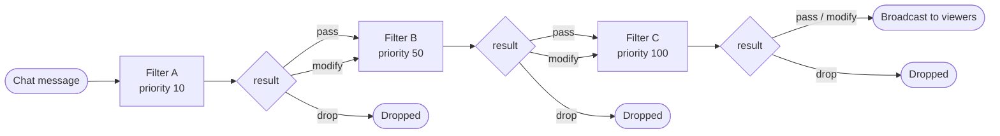

If you want to build a plugin that talks in chat, reacts to viewers, or moderates messages, this is the page to start with.

Owncast exposes chat functionality in three layers:

1. **Chat event handlers** so your plugin can react when people talk, join, leave, or rename themselves.
2. **Chat and user APIs** so your plugin can post messages, inspect chat state, and moderate users.
3. **Chat filters** so your plugin can rewrite or drop messages *before* viewers see them.

## What you can build

* Chat bots that reply to commands or keywords.
* Welcome bots that greet people when they join.
* Reminder bots that post messages when the stream starts.
* Countdown and timer bots powered by `owncast.timer` or `onTick`.
* Moderation helpers that hide messages, disconnect clients, or disable abusive users.
* Filters that rewrite, translate, or drop messages before they are broadcast.

## Event handlers

Plugins react to chat activity by defining handler methods on the object you pass to `definePlugin(...)`.

Only define the handlers you actually need. In the SDK, missing handlers mean no subscription.

```js
const { definePlugin, owncast, filter } = require("@owncast/plugin-sdk");

module.exports = definePlugin({
  onChatMessage(msg) {
    if (msg.body === "!ping") {
      owncast.chat.send("pong");
    }
  },

  onChatUserJoined(user) {
    owncast.chat.send(`Welcome, ${user.displayName}!`);
  },

  filterChatMessage(msg) {
    return filter.pass();
  },
});
```

### `onChatMessage(msg)`

Fires once per chat message after filters have run and the message is being broadcast to viewers.

```ts
interface ChatMessage {
  id: string;
  user?: ChatUser; // full sender identity; absent for the rare message with no account
  clientId?: number; // originating connection, used for whispers/private replies
  body: string; // raw text, not HTML-rendered markup
  timestamp: string; // RFC3339Nano / ISO-8601, e.g. "2026-05-28T14:00:00.123456789Z"
}
```

Use `msg.user.id` for stable per-user state and `msg.user.scopes` for moderator checks. Do not key permissions or cooldowns off display names alone.

If you need to support older hosts, `msg.user` may still be a plain display-name string there. A safe compatibility pattern is:

```js
const displayName = typeof msg.user === "string" ? msg.user : msg.user?.displayName;
```

The sandbox clock works (`Date.now()` is real), but `msg.timestamp` is deterministic — prefer it when comparing elapsed time across events or asserting in tests.

No permission required to subscribe.

### `onChatUserJoined(user)` and `onChatUserParted(user)`

Fires when a chat user connects or disconnects.

```ts
interface ChatUser {
  id: string;
  displayName: string;
  isBot?: boolean;
  isAuthenticated?: boolean;
  scopes?: string[];
}
```

No permission required.

### `onChatUserRenamed(change)`

Fires when a chat user changes their display name.

```ts
interface { user: ChatUser; previousName: string }
```

No permission required.

### `onMessageModerated(event)`

Fires when a moderator hides or unhides a chat message.

```ts
interface { messageId: string; visible: boolean; moderator?: ChatUser }
```

No permission required.

## Sending chat messages

### `owncast.chat.send(text)`

Post a chat message. Sent as your plugin's bot identity.

```js
owncast.chat.send("hello chat");
```

This takes plain text, not markup. The chat UI HTML-escapes it on display, so characters like `<`, `&`, and `"` render as text rather than HTML.

Requires `chat.send`.

### `owncast.chat.sendAction(text)`

Post an action-style (`/me`) message.

```js
owncast.chat.sendAction("is now live");
```

Like `send`, this takes plain text and is HTML-escaped by the chat UI on display.

Requires `chat.send`.

### `owncast.chat.system(body)`

Post a server-announcement message. No bot identity is attached; the body renders inline as HTML.

```js
owncast.chat.system("<strong>Stream starting in 5 minutes</strong>");
```

Use this for short, server-attributed notices. Treat the body as untrusted HTML output: don't interpolate viewer-controlled input without escaping it.

Requires `chat.send`.

### Chat identity

Every plugin has exactly one chat identity: the bot Owncast provisions when your plugin is installed. Its display name is your manifest's `bot.displayName` if set, otherwise `name`.

Both `send` and `sendAction` post as this identity through Owncast's normal chat pipeline, including filters, rate limits, and moderation. Plugins cannot post under arbitrary names or impersonate real users.

The bot user is keyed on the plugin's `slug`, so the identity survives manifest edits to `name` or `bot.displayName`. If you need multiple chat personas, ship multiple plugins.

## Reading chat state

### `owncast.chat.history(limit?)`

Return the most recent chat messages. `limit` defaults to 50.

```js
const messages = owncast.chat.history(20);
// [{ id, user?, clientId?, body, timestamp }, ...]
```

Requires `chat.history`.

### `owncast.chat.clients()`

Return the list of currently connected chat clients.

```js
const clients = owncast.chat.clients();
// [{ id, userId?, displayName?, connectedAt?, userAgent?, ipAddress?, messageCount? }, ...]
// `id` is the per-connection client ID used by owncast.chat.kick.
```

Requires `chat.history`.

### `owncast.server.emotes()`

Read the server's custom chat emotes when your bot wants to reference or mirror the emote catalog.

```js
const emotes = owncast.server.emotes();
// [{ name, url }, ...]
```

Requires `server.read`.

### `owncast.users.list()` and `owncast.users.get(id)`

Read the chat user list or a single user record.

```js
const users = owncast.users.list();
const alice = owncast.users.get("user-id-123");
```

Requires `users.read`.

## Moderation APIs

### `owncast.chat.deleteMessage(messageId)`

Hide a chat message from viewers.

```js
owncast.chat.deleteMessage(msg.id);
```

Requires `chat.moderate`.

### `owncast.chat.kick(clientId)`

Disconnect a chat client.

```js
owncast.chat.kick(client.id);
```

Requires `chat.moderate`.

### `owncast.chat.sendTo(clientId, text)`

Send a private message to a single connected client.

```js
owncast.chat.sendTo(msg.clientId, "you said: " + msg.body);
```

Requires `chat.send`.

### `owncast.chat.replyTo(msgOrClientId, text)`

Whisper a reply back to whoever sent a chat message.

```js
if (!owncast.chat.replyTo(msg, "slow down — try again in a few seconds")) {
  owncast.chat.send("slow down — try again in a few seconds");
}
```

You can pass either the full `msg` object from `onChatMessage` / `filterChatMessage`, or a bare `clientId` if that's all you have. It returns `false` when the sender connection is no longer known, which gives you a clean fallback to a public message.

Requires `chat.send`.

## Command bots with `defineCommands(...)`

If your plugin responds to chat commands, the SDK now ships a command router so you don't have to hand-roll prefix parsing, aliases, moderator gates, and cooldown tracking in every bot.

```js
const { definePlugin, defineCommands, filter } = require("@owncast/plugin-sdk");

const commands = defineCommands({
  prefix: "!", // default
  commands: {
    uptime: {
      run: (ctx) => ctx.reply("we've been live a while!")
    },
    so: {
      aliases: ["shoutout"],
      cooldownMs: 10_000,
      run: (ctx) => ctx.reply(`go follow ${ctx.args[0] || "someone cool"}`),
    },
    clear: {
      modOnly: true,
      run: (ctx) => ctx.replyPrivately("done"),
      onDenied: (ctx) => ctx.replyPrivately("mods only"),
    },
  },
  onUnknown: (ctx) => ctx.replyPrivately(`unknown command: ${ctx.command}`),
});

module.exports = definePlugin({
  onChatMessage: commands,
  // Or hide command invocations from public chat:
  // filterChatMessage: (msg) => (commands(msg) ? filter.drop("command") : filter.pass()),
});
```

`commands(msg)` returns `true` when a message was recognized as a command, even if it was denied by cooldown or moderator gating. Command handlers receive a context shaped like:

```ts
{
  msg,
  user,
  command,
  args,
  argString,
  reply(text),
  replyPrivately(text),
}
```

Use this whenever your plugin is mostly a command bot. It gives you stable per-user cooldowns keyed off `msg.user.id` / `msg.timestamp`, and moderator gating based on `user.scopes` instead of display-name matching.

### `owncast.users.setEnabled(id, enabled, reason?)`

Enable or disable a chat user.

```js
owncast.users.setEnabled("user-id-123", false, "harassment");
```

Requires `users.moderate`.

### `owncast.users.banIP(ip)`

Ban an IP from joining chat.

```js
owncast.users.banIP("203.0.113.42");
```

Requires `users.moderate`.

## Chat filters

Filters see chat messages before they're broadcast, with the ability to rewrite or drop them.



Filters run lowest-priority first. A `drop` ends the chain and the message never reaches later filters or notifications. A `modify` passes the new payload to the next filter.

### `filterChatMessage(msg)`

Receives the same `ChatMessage` shape as `onChatMessage`. Returns one of:

```js
const { filter } = require("@owncast/plugin-sdk");

return filter.pass(); // let the message through unchanged
return filter.modify({ ...msg, body: "edited" }); // replace it
return filter.drop("spam"); // drop it; chain stops here
```

Requires the `chat.filter` permission. The host rejects the load if a plugin defines `filterChatMessage` without declaring that permission.

### `filterPriority` (number, optional)

Lower numbers run earlier. Default `100`.

Use this when your plugin's behavior depends on whether other filters have already run. For example, a profanity filter should usually run before a translator.

### Filter safety

* Errors are treated as `filter.pass()`. A throwing filter never blocks chat.
* Filters are time-capped at 50 ms. A slow filter is cancelled and treated as pass.
* After 5 consecutive failures (errors or timeouts) the plugin is auto-disabled for the rest of the session. A successful filter call resets the counter.

## Host-enforced limits that matter for chat plugins

The updated SDK author guide now documents a few host limits worth designing around:

* `filterChatMessage` runtime: **50 ms** per message
* event-handler runtime (`onChatMessage`, `onChatUserJoined`, etc.): **500 ms** per call
* hard per-call ceiling: **10 s**
* `filterChatMessage` output size: **1 MiB**
* pending timers: **64** at once
* timer delay range: **100 ms to 24 h**

That means chat bots and filters should stay lightweight, avoid slow network round-trips in the hot path, and keep rewritten payloads small.

## Permissions you'll commonly need

* `chat.send`: post chat messages and private replies.
* `chat.history`: read recent chat messages and connected clients.
* `chat.moderate`: hide messages and disconnect clients.
* `chat.filter`: rewrite or drop messages before broadcast.
* `users.read`: inspect user records.
* `users.moderate`: disable chat users or ban IPs.

See [Permissions](/docs/plugins/permissions) for the complete security model.

## SDK examples worth copying from

The plugin SDK already ships small chat-focused examples that map closely to the patterns on this page:

* `echo-bot`: the smallest possible reply bot using `onChatMessage` + `owncast.chat.send()`.
* `chat-logger`: logs every chat message without replying.
* `stream-tracker`: combines chat commands, chat-user lifecycle handlers, and `sendAction()` announcements.
* `profanity-filter`: demonstrates `filter.modify(...)` to rewrite messages without dropping them.
* `slow-mode`: demonstrates `filter.drop(...)` using `msg.timestamp` for rate limiting.
* `engagement-bot`: demonstrates moderation by calling `owncast.chat.deleteMessage(msg.id)`.
* `timer-bot`: demonstrates reminder/countdown bots driven from chat, using timers and `onTick`.

Source lives in the plugin SDK repo under `examples/js/`:

* [github.com/owncast/plugin-sdk/tree/main/examples/js](https://github.com/owncast/plugin-sdk/tree/main/examples/js)

## Where this fits with the other plugin docs

* [Event handlers](/docs/plugins/handlers) is the full handler reference for *all* plugin events.
* [Owncast APIs](/docs/plugins/apis) is the full API reference for *all* `owncast.*` methods.
* [Manifest reference](/docs/plugins/manifest) covers permissions, bot identity fields, and every manifest property.
* [Contributing UI](/docs/plugins/ui) covers viewer-side UI, overlays, buttons, scripts, and styles if your chat plugin also ships frontend pieces.
* The SDK's long-form author guide is the upstream source for the JS examples and packaging flow: [docs/PLUGIN_AUTHOR_GUIDE.md](https://github.com/owncast/plugin-sdk/blob/main/docs/PLUGIN_AUTHOR_GUIDE.md).

If you're starting from scratch, read [Quickstart](/docs/plugins/quickstart) first and then come back here.