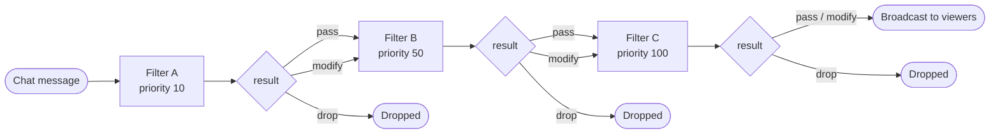

import Tabs from '@theme/Tabs';
import TabItem from '@theme/TabItem';

If you want to build a plugin that talks in chat, reacts to viewers, or moderates messages, this is the page to start with. Code samples are shown in both supported languages — set up your toolchain on the [JavaScript](/docs/plugins/sdks/javascript) or [Python](/docs/plugins/sdks/python) SDK page first.

Owncast exposes chat functionality in three layers:

1. **Chat event handlers** so your plugin can react when people talk, join, leave, or rename themselves.
2. **Chat and user APIs** so your plugin can post messages, inspect chat state, and moderate users.
3. **Chat filters** so your plugin can rewrite or drop messages *before* viewers see them.

## What you can build

* Chat bots that reply to commands or keywords.
* Welcome bots that greet people when they join.
* Reminder bots that post messages when the stream starts.
* Countdown and timer bots powered by `owncast.timer` or the tick handler.
* Moderation helpers that hide messages, disconnect clients, or disable abusive users.
* Filters that rewrite, translate, or drop messages before they are broadcast.

A reply bot is just one handler:

<Tabs groupId="plugin-lang">
<TabItem value="js" label="JavaScript / TypeScript" default>

```js
const { definePlugin, owncast } = require("@owncast/plugin-sdk");

module.exports = definePlugin({
  onChatMessage(msg) {
    const name = msg.user?.displayName ?? "someone";
    owncast.chat.send(`${name} said: ${msg.body}`);
  },
});
```

</TabItem>
<TabItem value="py" label="Python">

```python
from owncast_plugin import plugin, owncast

@plugin.on_chat_message
def echo(msg):
    name = msg.user.display_name if msg.user else "someone"
    owncast.chat.send(f"{name} said: {msg.body}")
```

</TabItem>
</Tabs>

## Event handlers

Plugins react to chat activity by defining a handler for each event they care about — a method on `definePlugin({ ... })` in JavaScript, or a `@plugin.*` decorated function in Python. Only define the handlers you actually need — a missing handler simply means no subscription to that event.

### `onChatMessage`

Fires once per chat message after filters have run and the message is being broadcast to viewers.

```ts
interface ChatMessage {
  id: string;
  user?: ChatUser; // full sender identity; absent for the rare message with no account
  clientId?: number; // originating connection, used for whispers/private replies
  body: string; // raw text, not HTML-rendered markup
  timestamp: string; // RFC3339Nano / ISO-8601, e.g. "2026-05-28T14:00:00.123456789Z"
}
```

The shape above is the wire payload. JavaScript exposes the fields as written (`msg.user.displayName`, `msg.clientId`); Python exposes them as `snake_case` attributes (`msg.user.display_name`, `msg.client_id`), with `msg.raw` for the underlying dict.

Use the stable user id (`user.id`) for per-user state and the sender scopes (`user.scopes`) for moderator checks. Do not key permissions or cooldowns off display names alone.

The sandbox clock works, but `timestamp` is deterministic — prefer it when comparing elapsed time across events or asserting in tests.

No permission required to subscribe.

### User join/part

Fires when a chat user connects or disconnects.

```ts
interface ChatUser {
  id: string;
  displayName: string;
  isBot?: boolean;
  isAuthenticated?: boolean;
  scopes?: string[];
}
```

<Tabs groupId="plugin-lang">
<TabItem value="js" label="JavaScript / TypeScript" default>

```js
module.exports = definePlugin({
  onChatUserJoined(user) {
    owncast.chat.send(`welcome, ${user.displayName}!`);
  },
  onChatUserParted(user) {
    /* ... */
  },
});
```

</TabItem>
<TabItem value="py" label="Python">

```python
@plugin.on_chat_user_joined
def welcome(user):
    owncast.chat.send(f"welcome, {user.display_name}!")

@plugin.on_chat_user_parted
def goodbye(user):
    ...
```

</TabItem>
</Tabs>

No permission required.

### Rename

Fires when a chat user changes their display name. Payload: an object with a `user` (`ChatUser`) and a `previousName` string (`previous_name` in Python). The handler is `onChatUserRenamed` / `@plugin.on_chat_user_renamed`.

No permission required.

### Moderation events

Fires when a moderator hides or unhides a chat message. Payload: an object with a `messageId` string, a `visible` boolean, and an optional `moderator` (`ChatUser`). The handler is `onMessageModerated` / `@plugin.on_message_moderated`.

No permission required.

## Sending chat messages

### `owncast.chat.send`

Post a chat message. Sent as your plugin's bot identity. Takes plain text, not markup — the chat UI HTML-escapes it on display, so characters like `<`, `&`, and `"` render as text rather than HTML.

<Tabs groupId="plugin-lang">
<TabItem value="js" label="JavaScript / TypeScript" default>

```js
owncast.chat.send("hello chat");
owncast.chat.sendAction("waves");        // /me-style action message
owncast.chat.system("Stream starting in 5 minutes");
```

</TabItem>
<TabItem value="py" label="Python">

```python
owncast.chat.send("hello chat")
owncast.chat.send_action("waves")        # /me-style action message
owncast.chat.system("Stream starting in 5 minutes")
```

</TabItem>
</Tabs>

Requires `chat.send`.

### `owncast.chat.sendAction`

Post an action-style (`/me`) message — `sendAction` in JavaScript, `send_action` in Python. Like `send`, takes plain text and is HTML-escaped by the chat UI on display.

Requires `chat.send`.

### `owncast.chat.system`

Post a server-announcement message. No bot identity is attached; the body renders inline as HTML. Use this for short, server-attributed notices like "Stream starting in 5 minutes". Treat the body as untrusted HTML output: don't interpolate viewer-controlled input without escaping it.

Requires `chat.send`.

### Chat identity

Every plugin has exactly one chat identity: the bot Owncast provisions when your plugin is installed. Its display name is your manifest's `bot.displayName` if set, otherwise `name`.

Both `send` and `sendAction` post as this identity through Owncast's normal chat pipeline, including filters, rate limits, and moderation. Plugins cannot post under arbitrary names or impersonate real users.

The bot user is keyed on the plugin's `slug`, so the identity survives manifest edits to `name` or `bot.displayName`. If you need multiple chat personas, ship multiple plugins.

## Reading chat state

### `owncast.chat.history`

Return the most recent chat messages (an optional limit defaults to 50). Each entry has the shape `{ id, user?, clientId?, body, timestamp }`.

Requires `chat.history`.

### `owncast.chat.clients`

Return the list of currently connected chat clients: `{ id, userId?, displayName?, connectedAt?, userAgent?, ipAddress?, messageCount? }`. The `id` is the per-connection client ID used by `owncast.chat.kick`.

Requires `chat.history`.

### `owncast.server.emotes`

Read the server's custom chat emotes (`{ name, url }`) when your bot wants to reference or mirror the emote catalog.

Requires `server.read`.

### `owncast.users.list` and `owncast.users.get`

Read the chat user list or a single user record by id.

Requires `users.read`.

## Moderation APIs

These are `deleteMessage` / `kick` / `sendTo` / `replyTo` in JavaScript and `delete_message` / `kick` / `send_to` / `reply_to` in Python.

### `owncast.chat.deleteMessage`

Hide a chat message from viewers, by message id.

Requires `chat.moderate`.

### `owncast.chat.kick`

Disconnect a chat client, by client id.

Requires `chat.moderate`.

### `owncast.chat.sendTo`

Send a private message to a single connected client, by client id.

Requires `chat.send`.

### `owncast.chat.replyTo`

Whisper a reply back to whoever sent a chat message. You can pass either the full message object from the chat-message / filter handler, or a bare client id if that's all you have. It returns a falsy value when the sender connection is no longer known, which gives you a clean fallback to a public message.

<Tabs groupId="plugin-lang">
<TabItem value="js" label="JavaScript / TypeScript" default>

```js
module.exports = definePlugin({
  onChatMessage(msg) {
    if (!owncast.chat.replyTo(msg, "psst — got your message")) {
      owncast.chat.send("got your message"); // sender already disconnected
    }
  },
});
```

</TabItem>
<TabItem value="py" label="Python">

```python
@plugin.on_chat_message
def whisper(msg):
    if not owncast.chat.reply_to(msg, "psst — got your message"):
        owncast.chat.send("got your message")  # sender already disconnected
```

</TabItem>
</Tabs>

Requires `chat.send`.

## Command bots

If your plugin responds to chat commands, declare a **command table** instead of hand-rolling prefix parsing, aliases, moderator gates, and cooldown tracking. A command table gives you:

* a configurable command prefix (default `!`);
* per-command `description`, `usage`, and `aliases`;
* per-user cooldowns, clocked off `msg.timestamp`;
* moderator-only gating based on the sender's scopes;
* an automatic, host-owned `!help`;
* a fallback for unrecognized commands.

<Tabs groupId="plugin-lang">
<TabItem value="js" label="JavaScript / TypeScript" default>

```js
const { definePlugin } = require("@owncast/plugin-sdk");

module.exports = definePlugin({
  commandPrefix: "!", // optional, default "!"
  commands: {
    uptime: {
      description: "How long we've been live",
      run: (ctx) => ctx.reply("we've been live a while!"),
    },
    so: {
      description: "Shout out a viewer",
      usage: "!so <name>",
      aliases: ["shoutout"],
      cooldownMs: 10_000, // per user, clocked off msg.timestamp
      run: (ctx) => ctx.reply(`go follow ${ctx.args[0] || "someone cool"}`),
    },
    clear: {
      description: "Clear the chat",
      modOnly: true, // requires the sender's scopes to include "MODERATOR"
      run: (ctx) => ctx.replyPrivately("done"),
      onDenied: (ctx) => ctx.replyPrivately("mods only"),
    },
  },
  onUnknownCommand: (ctx) => ctx.replyPrivately(`unknown command: ${ctx.command}`),
});
```

</TabItem>
<TabItem value="py" label="Python">

```python
from owncast_plugin import plugin

plugin.commands({
    "uptime": {
        "description": "How long we've been live",
        "run": lambda ctx: ctx.reply("we've been live a while!"),
    },
    "so": {
        "description": "Shout out a viewer",
        "usage": "!so <name>",
        "aliases": ["shoutout"],
        "cooldown_ms": 10_000,  # per user, clocked off msg.timestamp
        "run": lambda ctx: ctx.reply(f"go follow {ctx.args[0] if ctx.args else 'someone cool'}"),
    },
    "clear": {
        "description": "Clear the chat",
        "mod_only": True,  # requires the sender's scopes to include "MODERATOR"
        "run": lambda ctx: ctx.reply_privately("done"),
        "on_denied": lambda ctx: ctx.reply_privately("mods only"),
    },
}, command_prefix="!")  # command_prefix optional, default "!"
```

</TabItem>
</Tabs>

Each command handler receives a context with `msg`, `user`, `command`, `args`, `argString`, a public `reply`, and a private `replyPrivately` (whisper) — `args`/`reply` in both, `argString`/`replyPrivately` are `arg_string`/`reply_privately` in Python. Gating uses the stable sender identity (`user.scopes`, `user.id`), so it's reliable rather than a display-name guess. The command table reports a message as recognized even when it was denied by cooldown or moderator gating.

When you want to compose — for example, to drop command invocations from public chat with a filter — use the lower-level router (`defineCommands` in JavaScript, `define_commands` in Python), which returns a callable you feed messages yourself:

<Tabs groupId="plugin-lang">
<TabItem value="js" label="JavaScript / TypeScript" default>

```js
const { definePlugin, defineCommands, filter } = require("@owncast/plugin-sdk");
const commands = defineCommands({ commands: { /* same shape as above */ } });

module.exports = definePlugin({
  filterChatMessage: (msg) => (commands(msg) ? filter.drop("command") : filter.pass()),
});
```

</TabItem>
<TabItem value="py" label="Python">

```python
from owncast_plugin import plugin, define_commands, filter

commands = define_commands({"commands": { }})  # same shape as above

@plugin.filter_chat_message
def hide_commands(msg):
    return filter.drop("command") if commands(msg) else filter.pass_()
```

</TabItem>
</Tabs>

### `!help` is automatic

The **host** owns `!help` — type it in chat and the host lists every command's `description` across all enabled plugins, posted as a system message. You don't implement it, and it works even if your plugin holds no `chat.send` permission. Moderator-only commands are hidden from non-moderators. The only thing you do to take part is declare a command table with descriptions.

For a single fixed command you can just check the message body in the chat-message handler — you simply won't show up in `!help` unless you declare a command table.

## Moderating users

### `owncast.users.setEnabled`

Enable or disable a chat user, by id, with an optional reason — `setEnabled` in JavaScript, `set_enabled` in Python.

Requires `users.moderate`.

### `owncast.users.banIP`

Ban an IP from joining chat — `banIP` in JavaScript, `ban_ip` in Python.

Requires `users.moderate`.

## Chat filters

Filters see chat messages before they're broadcast, with the ability to rewrite or drop them.



Filters run lowest-priority first. A `drop` ends the chain and the message never reaches later filters or notifications. A `modify` passes the new payload to the next filter.

### `filterChatMessage`

Receives the same `ChatMessage` shape as the chat-message handler and returns one of three results, built with the `filter` helper:

* **pass** — let the message through unchanged.
* **modify** — replace it with a new payload.
* **drop** — drop it (with a reason); the chain stops here.

<Tabs groupId="plugin-lang">
<TabItem value="js" label="JavaScript / TypeScript" default>

```js
const { definePlugin, filter } = require("@owncast/plugin-sdk");

module.exports = definePlugin({
  filterChatMessage(msg) {
    if (msg.body.includes("spam")) return filter.drop("spam keyword");
    if (msg.body.includes("damn")) {
      return filter.modify({ ...msg, body: msg.body.replace("damn", "****") });
    }
    return filter.pass();
  },
});
```

</TabItem>
<TabItem value="py" label="Python">

```python
from owncast_plugin import plugin, filter

@plugin.filter_chat_message
def clean(msg):
    if "spam" in msg.body:
        return filter.drop("spam keyword")
    if "damn" in msg.body:
        return filter.modify({**msg.raw, "body": msg.body.replace("damn", "****")})
    return filter.pass_()  # trailing underscore — pass is a keyword
```

</TabItem>
</Tabs>

Requires the `chat.filter` permission. The host rejects the load if a plugin defines the filter handler without declaring that permission.

### Filter priority (optional)

Lower numbers run earlier. Default `100`. Set it with `filterPriority` (JavaScript) / `filter_priority` (Python) on the plugin definition.

Use this when your plugin's behavior depends on whether other filters have already run. For example, a profanity filter should usually run before a translator.

### Filter safety

* Errors are treated as a pass. A throwing filter never blocks chat.
* Filters are time-capped at 50 ms. A slow filter is cancelled and treated as pass.
* After 5 consecutive failures (errors or timeouts) the plugin is auto-disabled for the rest of the session. A successful filter call resets the counter.

## Host-enforced limits that matter for chat plugins

A few host limits are worth designing around:

* filter runtime: **50 ms** per message
* event-handler runtime (chat-message, user-joined, etc.): **500 ms** per call
* hard per-call ceiling: **10 s**
* filter output size: **1 MiB**
* pending timers: **64** at once
* timer delay range: **100 ms to 24 h**

That means chat bots and filters should stay lightweight, avoid slow network round-trips in the hot path, and keep rewritten payloads small.

## Permissions you'll commonly need

* `chat.send`: post chat messages and private replies.
* `chat.history`: read recent chat messages and connected clients.
* `chat.moderate`: hide messages and disconnect clients.
* `chat.filter`: rewrite or drop messages before broadcast.
* `users.read`: inspect user records.
* `users.moderate`: disable chat users or ban IPs.

See [Permissions](/docs/plugins/permissions) for the complete security model.

## Example chat plugins

The plugin SDK ships small chat-focused examples that map closely to the patterns on this page (each has both a JavaScript and a Python version):

* `echo-bot`: the smallest possible reply bot using the chat-message handler + `owncast.chat.send`.
* `chat-logger`: logs every chat message without replying.
* `stream-tracker`: combines chat commands, chat-user lifecycle handlers, and action announcements.
* `profanity-filter`: rewrites messages without dropping them.
* `slow-mode`: drops messages using `msg.timestamp` for rate limiting.
* `engagement-bot`: moderates by deleting a message.
* `timer-bot`: reminder/countdown bots driven from chat, using timers and the tick handler.

Browse them at [examples/js](https://github.com/owncast/plugin-sdk/tree/main/examples/js) · [examples/python](https://github.com/owncast/plugin-sdk/tree/main/examples/python).

## Where this fits with the other plugin docs

* [Choosing an SDK](/docs/plugins/sdks) and the [JavaScript](/docs/plugins/sdks/javascript) / [Python](/docs/plugins/sdks/python) pages cover the language-specific setup, CLI, and syntax.
* [Event handlers](/docs/plugins/handlers) is the full handler reference for *all* plugin events.
* [Owncast APIs](/docs/plugins/apis) is the full API reference for *all* `owncast.*` methods.
* [Manifest reference](/docs/plugins/manifest) covers permissions, bot identity fields, and every manifest property.
* [Contributing UI](/docs/plugins/ui) covers viewer-side UI, overlays, buttons, scripts, and styles if your chat plugin also ships frontend pieces.

If you're starting from scratch, read [Quickstart](/docs/plugins/quickstart) first and then come back here.
