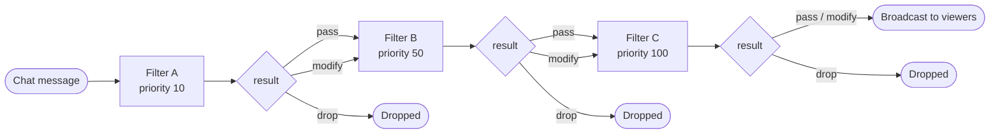

Plugins react to things happening in Owncast by defining handler methods on the object you pass to `definePlugin(...)`. Only define the handlers you care about. Missing handlers mean no subscription. The SDK derives the manifest's subscription list from which methods are present, so there's nothing else to keep in sync.

```js
const { definePlugin, owncast, filter } = require("@owncast/plugin-sdk");

module.exports = definePlugin({
  onChatMessage(msg) {
    /* ... */
  },
  filterChatMessage(msg) {
    return filter.pass();
  },
  onStreamStarted(info) {
    /* ... */
  },
});
```

This page is the catalog of every available handler and the shape of the payload it receives.

## Chat events

If you're specifically building a chat-focused plugin, start with [Chat plugins](/docs/plugins/chat). This page remains the complete handler reference across all plugin capabilities.

### `onChatMessage(msg)`

Fires once per chat message after filters have run and the message is being broadcast to viewers.

```ts
interface ChatMessage {
  id: string;
  user?: ChatUser; // full sender identity; absent for the rare message with no account
  clientId?: number; // originating connection, used for private replies
  body: string; // raw text, not HTML-rendered markup
  timestamp: string; // RFC3339Nano / ISO-8601, e.g. "2026-05-28T14:00:00.123456789Z"
}
```

Use `msg.user.id` for stable per-user state and `msg.user.scopes` for moderator checks. If you need to support older hosts, `msg.user` may still be a plain display-name string there.

Use `msg.timestamp` (not your language's built-in clock) when you need wall-clock time. The sandbox's clock is frozen at a default value; the host's timestamp on each event is your source of truth.

No permission required to subscribe.

### `onChatUserJoined(user)` and `onChatUserParted(user)`

Fires when a chat user connects or disconnects.

```ts
interface ChatUser {
  id: string;
  displayName: string;
  isBot?: boolean;
  isAuthenticated?: boolean;
  scopes?: string[];
}
```

No permission required.

### `onChatUserRenamed(change)`

Fires when a chat user changes their display name.

```ts
interface { user: ChatUser; previousName: string }
```

No permission required.

### `onMessageModerated(event)`

Fires when a moderator hides or unhides a chat message.

```ts
interface { messageId: string; visible: boolean; moderator?: ChatUser }
```

No permission required.

## Stream lifecycle

### `onStreamStarted(info)`

Fires when a broadcast begins.

```ts
interface { startedAt: string; title: string; summary: string }
```

No permission required.

### `onStreamStopped(info)`

Fires when a broadcast ends.

```ts
interface { stoppedAt: string }
```

No permission required.

### `onStreamTitleChanged(change)`

Fires when the streamer updates the title mid-stream.

```ts
interface { from?: string; to: string }
```

`from` is currently always empty: Owncast's title-changed event carries only the new title.

No permission required.

## Fediverse events

Owncast forwards inbound fediverse activity to plugins. Engagement events (follow, like, repost) carry just the actor. Mentions and replies carry the post content.

### `onFediverseFollow(event)`, `onFediverseLike(event)`, `onFediverseRepost(event)`

```ts
interface {
  actor: { name: string; handle: string; url?: string; image?: string };
  target?: { url: string }; // set for likes and reposts
}
```

`actor.handle` is the fully-qualified address (for example `@alice@fediverse.example`). No permission required.

### `onFediverseMention(post)` and `onFediverseReply(post)`

Both receive a `FediverseInboundPost`:

```ts
interface FediverseInboundPost {
  actor: { name: string; handle: string; url?: string; image?: string };
  content: string; // rendered HTML from the source instance
  contentText: string; // plain-text version, usually what you want
  url: string; // permalink on the source instance
  postedAt: string; // ISO-8601
  inReplyTo?: string; // parent post URL, set when this is a reply
  attachments?: { url: string; mediaType: string; alt?: string }[];
  language?: string;
}
```

Use `contentText` for analysis or to echo into chat. Use `content` if you need to preserve the original formatting.

No permission required to subscribe.

## Filter chain

Filters see chat messages before they're broadcast, with the ability to rewrite or drop them. They run sequentially, in priority order, and any one filter can short-circuit the chain.



Filters run lowest-priority first. A `drop` ends the chain. A `modify` passes the new payload to the next filter.

### `filterChatMessage(msg)`

Receives the same `ChatMessage` shape as `onChatMessage`. Returns one of:

```js
const { filter } = require("@owncast/plugin-sdk");

return filter.pass(); // let the message through unchanged
return filter.modify({ ...msg, body: "edited" }); // replace it
return filter.drop("spam"); // drop it; chain stops here
```

Requires the `chat.filter` permission. Reading or rewriting every chat message is a meaningful side-effect, so the admin has to see the permission to grant it. The host rejects the load if a plugin defines `filterChatMessage` without declaring the permission.

### `filterPriority` (number, optional)

Lower numbers run earlier. Default `100`. Use this when your plugin's behavior depends on whether other filters have already run (for example, a profanity filter should usually run before a translator).

### Filter safety

* Errors are treated as `filter.pass()`. A throwing filter never blocks chat. The chain continues with the original message.
* Filters are time-capped at 50 ms. A slow filter is cancelled and treated as pass.
* After 5 consecutive failures (errors or timeouts) the plugin is auto-disabled for the rest of the session, with a one-time log line. A successful filter call resets the counter, so transient flakiness doesn't accumulate. Restart the host to re-enable.

## HTTP handler

### `onHttpRequest(req)`

Fires for every request to `/plugins/<your-slug>/*` that didn't match a static file in `public/`. Returns a response object.

```ts
interface IncomingHttpRequest {
  method: string;
  path: string; // relative to /plugins/<your-slug>/
  query: Record<string, string>;
  headers: Record<string, string>;
  body: string;
  remoteAddr: string;
  authenticated: boolean; // came from an authenticated Owncast admin
  user?: { id: string; displayName: string; scopes: string[] }; // user-token requests only
}

interface OutgoingHttpResponse {
  status?: number; // default 200
  headers?: Record<string, string>;
  body?: string;
}
```

Endpoints are public by default. Gate admin features on `req.authenticated`. Manifest-declared admin paths (`admin.pages[].path`) are auth-gated by the host before your handler runs, so for those routes you don't need to check.

Requires the `http.serve` permission. Full coverage in [Serving HTTP](/docs/plugins/http).

## Plugin-to-plugin events

Plugins can compose by emitting and subscribing to arbitrary custom events.

### `on: { "<event-type>"(payload) { ... } }`

```js
module.exports = definePlugin({
  on: {
    "announcement.broadcast"(payload) {
      console.log(`announcement from ${payload.by}: ${payload.text}`);
    },
  },
});
```

Subscribing requires no permission. To emit custom events, declare `events.emit` and call `owncast.events.emit(eventType, payload)`. Event names are arbitrary strings. Namespacing with your plugin name (for example `"my-plugin.thing-happened"`) avoids collisions.

## Complete handler reference

| Handler                    | Payload                            | Permission to subscribe                |
| -------------------------- | ---------------------------------- | -------------------------------------- |
| `onChatMessage`            | `ChatMessage`                      | none                                   |
| `onChatUserJoined`         | `ChatUser`                         | none                                   |
| `onChatUserParted`         | `ChatUser`                         | none                                   |
| `onChatUserRenamed`        | `{ user, previousName }`           | none                                   |
| `onMessageModerated`       | `{ messageId, visible, moderator}` | none                                   |
| `onStreamStarted`          | `{ startedAt, title, summary }`    | none                                   |
| `onStreamStopped`          | `{ stoppedAt }`                    | none                                   |
| `onStreamTitleChanged`     | `{ from, to }`                     | none                                   |
| `onFediverseFollow`        | `{ actor }`                        | none                                   |
| `onFediverseLike`          | `{ actor, target }`                | none                                   |
| `onFediverseRepost`        | `{ actor, target }`                | none                                   |
| `onFediverseMention`       | `FediverseInboundPost`             | none                                   |
| `onFediverseReply`         | `FediverseInboundPost`             | none                                   |
| `filterChatMessage`        | `ChatMessage`                      | `chat.filter`                          |
| `onHttpRequest`            | `IncomingHttpRequest`              | `http.serve`                           |
| `on: { ... }`              | (per-event)                        | none to subscribe, `events.emit` to emit |

Subscribing is free. Calling Owncast APIs from inside a handler is what needs permissions. See [Owncast APIs](/docs/plugins/apis) for the catalog of methods and what each one grants.
