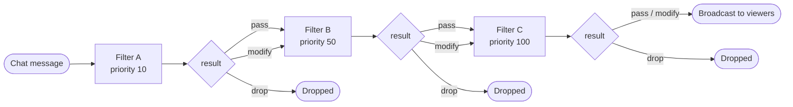

import Tabs from '@theme/Tabs';
import TabItem from '@theme/TabItem';

Plugins react to things happening in Owncast by defining a handler for each event they care about. Only define the handlers you want — a missing handler means no subscription, and the SDK derives the manifest's subscription list from which handlers are present, so there's nothing else to keep in sync.

Code below is shown for both SDKs — pick your language with the tabs and your choice follows you across the docs. New to this? See the [JavaScript](/docs/plugins/sdks/javascript) or [Python](/docs/plugins/sdks/python) setup pages first.

<Tabs groupId="plugin-lang">
<TabItem value="js" label="JavaScript / TypeScript" default>

```js
const { definePlugin, owncast, filter } = require("@owncast/plugin-sdk");

module.exports = definePlugin({
  onChatMessage(msg) {
    /* react to a chat message */
  },
  onStreamStarted(info) {
    /* react to the stream going live */
  },
});
```

Handlers are methods on the object you pass to `definePlugin`, named in camelCase (`onChatMessage`, `onStreamStarted`, …). Payload fields are camelCase too (`msg.user.displayName`, `msg.clientId`).

</TabItem>
<TabItem value="py" label="Python">

```python
from owncast_plugin import plugin, owncast, filter

@plugin.on_chat_message
def handle_chat(msg):
    # react to a chat message
    ...

@plugin.on_stream_started
def handle_live(info):
    # react to the stream going live
    ...
```

Handlers are decorated functions (`@plugin.on_chat_message`, `@plugin.on_stream_started`, …). Payload fields are snake_case (`msg.user.display_name`, `msg.client_id`); use `msg.raw` for the underlying dict.

</TabItem>
</Tabs>

This page is the catalog of every available event, the payload it delivers, and the permission (if any) needed to subscribe. Payloads are shown as their wire shape; each SDK exposes the fields idiomatically (the JavaScript SDK as-is, the Python SDK as snake_case attributes over the same JSON, with the raw dict available too).

## Chat events

If you're specifically building a chat-focused plugin, start with [Chat plugins](/docs/plugins/chat). This page remains the complete handler reference across all plugin capabilities.

### Chat message — `chat.message.received`

Fires once per chat message after filters have run and the message is being broadcast to viewers.

```ts
interface ChatMessage {
  id: string;
  user?: ChatUser; // full sender identity (see ChatUser below); absent for the rare message with no account
  clientId?: number; // originating connection; pass to the chat send-to / reply-to APIs for private replies
  body: string; // raw text, not HTML-rendered markup
  timestamp: string; // RFC3339Nano / ISO-8601, e.g. "2026-05-28T14:00:00.123456789Z"
}
```

<Tabs groupId="plugin-lang">
<TabItem value="js" label="JavaScript / TypeScript" default>

```js
module.exports = definePlugin({
  onChatMessage(msg) {
    if (msg.user?.scopes?.includes("MODERATOR")) {
      owncast.chat.send(`hi mod ${msg.user.displayName}`);
    }
  },
});
```

</TabItem>
<TabItem value="py" label="Python">

```python
@plugin.on_chat_message
def greet_mods(msg):
    if msg.user and "MODERATOR" in (msg.user.scopes or []):
        owncast.chat.send(f"hi mod {msg.user.display_name}")
```

</TabItem>
</Tabs>

`user` carries the **full sender identity**, so key per-user state on the stable `user.id` and gate moderator-only behavior on `user.scopes` (e.g. `"MODERATOR"`) rather than matching the display name. To reply privately to the sender, use the chat reply-to API (see [Owncast APIs](./apis#chat-replyto)).

`timestamp` is the host's wall-clock time for the message. The sandbox clock works, but `timestamp` is deterministic and the right choice when comparing elapsed time across events or asserting in tests.

No permission required to subscribe.

> **Older hosts** delivered `user` as a plain display-name string rather than the identity object. If you support hosts that predate the identity payload, read it defensively — see your SDK page for the idiom.

### Chat user joined / parted — `chat.user.joined`, `chat.user.parted`

Fires when a chat user connects or disconnects.

```ts
interface ChatUser {
  id: string;
  displayName: string;
  isBot?: boolean;
  isAuthenticated?: boolean;
  scopes?: string[];
}
```

<Tabs groupId="plugin-lang">
<TabItem value="js" label="JavaScript / TypeScript" default>

```js
module.exports = definePlugin({
  onChatUserJoined(user) { owncast.chat.send(`welcome ${user.displayName}`); },
  onChatUserParted(user) { /* … */ },
});
```

</TabItem>
<TabItem value="py" label="Python">

```python
@plugin.on_chat_user_joined
def welcome(user):
    owncast.chat.send(f"welcome {user.display_name}")

@plugin.on_chat_user_parted
def farewell(user):
    ...
```

</TabItem>
</Tabs>

No permission required.

### Chat user renamed — `chat.user.renamed`

Fires when a chat user changes their display name.

```ts
interface { user: ChatUser; previousName: string }
```

No permission required.

### Message moderated — `chat.message.moderated`

Fires when a moderator hides or unhides a chat message.

```ts
interface { messageId: string; visible: boolean; moderator?: ChatUser }
```

No permission required.

## Stream lifecycle

### Stream started — `stream.started`

Fires when a broadcast begins.

```ts
interface { startedAt: string; title: string; summary: string }
```

<Tabs groupId="plugin-lang">
<TabItem value="js" label="JavaScript / TypeScript" default>

```js
module.exports = definePlugin({
  onStreamStarted(info) { owncast.chat.send(`live now: ${info.title}`); },
  onStreamStopped(info) { /* … */ },
  onStreamTitleChanged(change) { /* change.to */ },
});
```

</TabItem>
<TabItem value="py" label="Python">

```python
@plugin.on_stream_started
def announce(info):
    owncast.chat.send(f"live now: {info.title}")

@plugin.on_stream_stopped
def wrap_up(info):
    ...

@plugin.on_stream_title_changed
def retitle(change):
    ...  # change.to
```

</TabItem>
</Tabs>

No permission required.

### Stream stopped — `stream.stopped`

Fires when a broadcast ends.

```ts
interface { stoppedAt: string }
```

No permission required.

### Stream title changed — `stream.title.changed`

Fires when the streamer updates the title mid-stream.

```ts
interface { from?: string; to: string }
```

`from` is currently always empty: Owncast's title-changed event carries only the new title.

No permission required.

## Fediverse events

Owncast forwards inbound fediverse activity to plugins. Engagement events (follow, like, repost) carry just the actor. Mentions and replies carry the post content.

### Follow / like / repost — `fediverse.follow`, `fediverse.like`, `fediverse.repost`

```ts
interface {
  actor: { name: string; handle: string; url?: string; image?: string };
  target?: { url: string }; // set for likes and reposts
}
```

<Tabs groupId="plugin-lang">
<TabItem value="js" label="JavaScript / TypeScript" default>

```js
module.exports = definePlugin({
  onFediverseFollow(e) { owncast.chat.send(`new follower: ${e.actor.handle}`); },
  onFediverseLike(e) { /* e.target.url */ },
});
```

</TabItem>
<TabItem value="py" label="Python">

```python
@plugin.on_fediverse_follow
def thank(e):
    owncast.chat.send(f"new follower: {e.actor.handle}")

@plugin.on_fediverse_like
def note_like(e):
    ...  # e.target.url
```

</TabItem>
</Tabs>

`actor.handle` is the fully-qualified address (for example `@alice@fediverse.example`). No permission required.

### Mention / reply — `fediverse.mention`, `fediverse.reply`

Both receive a `FediverseInboundPost`:

```ts
interface FediverseInboundPost {
  actor: { name: string; handle: string; url?: string; image?: string };
  content: string; // rendered HTML from the source instance
  contentText: string; // plain-text version, usually what you want
  url: string; // permalink on the source instance
  postedAt: string; // ISO-8601
  inReplyTo?: string; // parent post URL, set when this is a reply
  attachments?: { url: string; mediaType: string; alt?: string }[];
  language?: string;
}
```

Use `contentText` for analysis or to echo into chat. Use `content` if you need to preserve the original formatting.

No permission required to subscribe.

## Filter chain

Filters see chat messages before they're broadcast, with the ability to rewrite or drop them. They run sequentially, in priority order, and any one filter can short-circuit the chain.



Filters run lowest-priority first. A `drop` ends the chain. A `modify` passes the new payload to the next filter.

### Chat message filter — `chat.message.received` (filter)

A filter handler receives the same `ChatMessage` shape as the chat-message event and returns one of three results:

- **pass** — let the message through unchanged.
- **modify** — replace the message with a new payload, which flows to the next filter.
- **drop** — block the message with a reason; the chain stops here.

<Tabs groupId="plugin-lang">
<TabItem value="js" label="JavaScript / TypeScript" default>

```js
module.exports = definePlugin({
  filterChatMessage(msg) {
    if (msg.body.includes("spam")) return filter.drop("spam");
    if (msg.body.includes("damn"))
      return filter.modify({ ...msg, body: msg.body.replace("damn", "****") });
    return filter.pass();
  },
});
```

</TabItem>
<TabItem value="py" label="Python">

```python
@plugin.filter_chat_message
def clean(msg):
    if "spam" in msg.body:
        return filter.drop("spam")
    if "damn" in msg.body:
        return filter.modify({**msg.raw, "body": msg.body.replace("damn", "****")})
    return filter.pass_()
```

</TabItem>
</Tabs>

Requires the `chat.filter` permission. Reading or rewriting every chat message is a meaningful side-effect, so the admin has to see the permission to grant it. The host rejects the load if a plugin defines the filter handler without declaring the permission.

### Filter priority (optional)

Each filter can declare a priority; lower numbers run earlier (default `100`). Use this when your plugin's behavior depends on whether other filters have already run (for example, a profanity filter should usually run before a translator). See your SDK page for where to set it.

### Filter safety

* Errors are treated as a pass. A throwing filter never blocks chat. The chain continues with the original message.
* Filters are time-capped at 50 ms. A slow filter is cancelled and treated as pass.
* After 5 consecutive failures (errors or timeouts) the plugin is auto-disabled for the rest of the session, with a one-time log line. A successful filter call resets the counter, so transient flakiness doesn't accumulate. Restart the host to re-enable.

### Command routing

Rather than hand-rolling prefix parsing, aliases, cooldowns, and moderator gating in your chat handler, declare a **command table**: the SDK wires the chat subscription and prefix parsing for you, and the host's built-in `!help` lists every command. Gating uses the sender identity on the message (`user.scopes`, `user.id`), not a display-name guess.

<Tabs groupId="plugin-lang">
<TabItem value="js" label="JavaScript / TypeScript" default>

```js
module.exports = definePlugin({
  commands: {
    uptime: { description: "How long we've been live", run: (ctx) => ctx.reply("a while!") },
  },
});
```

</TabItem>
<TabItem value="py" label="Python">

```python
plugin.commands({
    "uptime": {"description": "How long we've been live",
               "run": lambda ctx: ctx.reply("a while!")},
})
```

</TabItem>
</Tabs>

See [Chat plugins](/docs/plugins/chat#commands) for the full command-table reference (aliases, cooldowns, mod-only gating, `!help`).

## HTTP handler

### HTTP request

Fires for every request to `/plugins/<your-slug>/*` that didn't match a static file in `public/`. Returns a response object.

```ts
interface IncomingHttpRequest {
  method: string;
  path: string; // relative to /plugins/<your-slug>/
  query: Record<string, string>;
  headers: Record<string, string>;
  body: string;
  remoteAddr: string;
  authenticated: boolean; // came from an authenticated Owncast admin
  user?: { id: string; displayName: string; scopes: string[] }; // user-token requests only
}

interface OutgoingHttpResponse {
  status?: number; // default 200
  headers?: Record<string, string>;
  body?: string;
}
```

<Tabs groupId="plugin-lang">
<TabItem value="js" label="JavaScript / TypeScript" default>

```js
module.exports = definePlugin({
  onHttpRequest(req) {
    if (req.path === "/status") return { status: 200, body: '{"ok":true}' };
    return { status: 404 };
  },
});
```

</TabItem>
<TabItem value="py" label="Python">

```python
@plugin.get("/status")
def status(req):
    return {"status": 200, "body": '{"ok":true}'}
```

</TabItem>
</Tabs>

Endpoints are public by default. Gate admin features on `req.authenticated`. Manifest-declared admin paths (`admin.pages[].path`) are auth-gated by the host before your handler runs, so for those routes you don't need to check.

Requires the `http.serve` permission. The JavaScript SDK exposes a single `onHttpRequest` catch-all; the Python SDK adds declarative per-path/per-method routes (`@plugin.get`, `@plugin.route`, …). See [Serving HTTP](/docs/plugins/http) for the full request model.

## Content handlers

These two handlers let a plugin generate tab or extra-page HTML at request time — useful when the content should be personalised per viewer or depend on live stream data. They're the dynamic counterpart to shipping a static HTML file via `manifest.tabs[].content` or `manifest.extraPageContent.content`.

Both handlers receive a `ContentRequest`:

```ts
interface ContentRequest {
  slug: string;   // stable identifier declared in the manifest
  user?: ChatUser; // viewer's chat identity — present when authenticated, absent for anonymous viewers
}
```

Return the full HTML string for the content block. If you don't recognise the slug, return an empty string.

<Tabs groupId="plugin-lang">
<TabItem value="js" label="JavaScript / TypeScript" default>

```js
module.exports = definePlugin({
  onTabContent: {
    stats(ctx) { return `<h1>Live stats for ${ctx.user?.displayName ?? "viewer"}</h1>`; },
  },
  onPageContent: {
    banner(ctx) { return "<p>Welcome!</p>"; },
  },
});
```

</TabItem>
<TabItem value="py" label="Python">

```python
@plugin.on_tab_content("stats")
def stats(ctx):
    name = ctx.user.display_name if ctx.user else "viewer"
    return f"<h1>Live stats for {name}</h1>"

@plugin.on_page_content("banner")
def banner(ctx):
    return "<p>Welcome!</p>"
```

</TabItem>
</Tabs>

### Tab content

Called when a tab entry in `manifest.tabs[]` has no static `content` file. The host passes the tab's `slug` so a single plugin can serve multiple tabs. No permission required to subscribe; whatever Owncast APIs you call from inside the handler require their usual permissions.

### Page content

Called when `manifest.extraPageContent` has no static `content` file. The host passes the slug from the manifest so the handler knows which content slot is being requested. Same permission rules as tab content.

See [Contributing UI](/docs/plugins/ui) for the manifest side.

## Plugin-to-plugin events

Plugins can compose by emitting and subscribing to arbitrary custom events. Subscribing to a custom event requires no permission. To emit, declare `events.emit`. Event names are arbitrary strings; namespacing with your plugin name (for example `"my-plugin.thing-happened"`) avoids collisions.

<Tabs groupId="plugin-lang">
<TabItem value="js" label="JavaScript / TypeScript" default>

```js
module.exports = definePlugin({
  on: {
    "other-plugin.milestone"(payload) { /* react */ },
  },
  onStreamStarted() {
    owncast.events.emit("my-plugin.went-live", { at: Date.now() });
  },
});
```

</TabItem>
<TabItem value="py" label="Python">

```python
@plugin.on("other-plugin.milestone")
def react(payload):
    ...

@plugin.on_stream_started
def went_live(info):
    owncast.events.emit("my-plugin.went-live", {"at": info.started_at})
```

</TabItem>
</Tabs>

See [Owncast APIs](./apis#plugin-to-plugin-events) for the emit API.

## Complete handler reference

Each row is a runtime event. The handler name follows your SDK's convention — camelCase methods (`onChatMessage`) in JavaScript, `@plugin.*` decorators (`@plugin.on_chat_message`) in Python.

| Event                      | Payload                            | Permission to subscribe                |
| -------------------------- | ---------------------------------- | -------------------------------------- |
| `chat.message.received`    | `ChatMessage`                      | none                                   |
| `chat.user.joined`         | `ChatUser`                         | none                                   |
| `chat.user.parted`         | `ChatUser`                         | none                                   |
| `chat.user.renamed`        | `{ user, previousName }`           | none                                   |
| `chat.message.moderated`   | `{ messageId, visible, moderator}` | none                                   |
| `stream.started`           | `{ startedAt, title, summary }`    | none                                   |
| `stream.stopped`           | `{ stoppedAt }`                    | none                                   |
| `stream.title.changed`     | `{ from, to }`                     | none                                   |
| `fediverse.follow`         | `{ actor }`                        | none                                   |
| `fediverse.like`           | `{ actor, target }`                | none                                   |
| `fediverse.repost`         | `{ actor, target }`                | none                                   |
| `fediverse.mention`        | `FediverseInboundPost`             | none                                   |
| `fediverse.reply`          | `FediverseInboundPost`             | none                                   |
| chat message filter        | `ChatMessage`                      | `chat.filter`                          |
| HTTP request               | `IncomingHttpRequest`              | `http.serve`                           |
| tab content                | `ContentRequest`                   | none to subscribe; whatever APIs the handler calls |
| page content               | `ContentRequest`                   | none to subscribe; whatever APIs the handler calls |
| custom events              | (per-event)                        | none to subscribe, `events.emit` to emit |

Subscribing is free. Calling Owncast APIs from inside a handler is what needs permissions. See [Owncast APIs](/docs/plugins/apis) for the catalog of methods and what each one grants.
