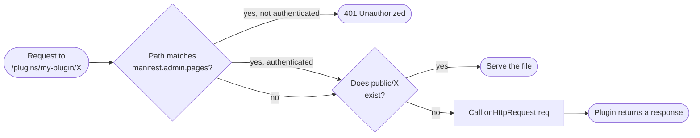
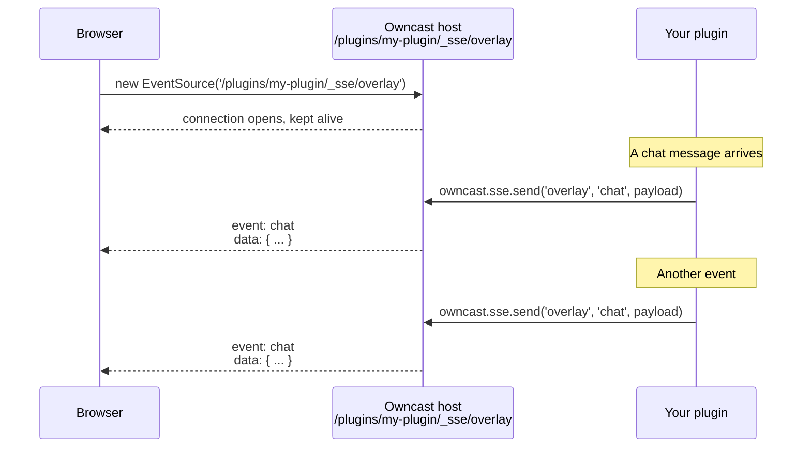

Plugins can serve their own URLs. Once you declare `http.serve` in your manifest, the URL space at `/plugins/<your-slug>/` is yours: static files from your `public/` directory go out verbatim, and anything else falls through to your `onHttpRequest(req)` handler.

This page covers serving HTTP, request routing, the request and response limits the host enforces, and how to push realtime events to viewer browsers.

## Routing

Once `http.serve` is declared, the host routes every request under `/plugins/<your-slug>/` to your plugin:

1. Static files. Anything in your `public/` directory is served verbatim.
2. Dynamic handler. Anything else falls through to your `onHttpRequest(req)` function.



The `manifest.admin.pages` gate at the top is covered in [UI: Admin pages](/docs/plugins/ui#admin-pages); from the perspective of HTTP serving it's just a 401-before-your-handler-runs filter applied to matching paths.

## Static files

The `public/` directory holds files served at `/plugins/<your-slug>/<path>`. A separate `assets/` directory holds files the host reads internally for manifest fields that inline content (`styles`, `scripts`, `extraPageContent`); those are not reachable through the plugin's URL space.

```text
my-plugin/
└── public/
    ├── index.html        → /plugins/my-plugin/index.html (and /plugins/my-plugin/)
    ├── style.css         → /plugins/my-plugin/style.css
    └── img/
        └── logo.png      → /plugins/my-plugin/img/logo.png
```

A request to `/plugins/my-plugin/` (no trailing path) serves `public/index.html` automatically.

## Dynamic endpoints

For JSON APIs, webhooks, and so on, write an `onHttpRequest` handler. It receives the request and returns a response:

```js
const { definePlugin, owncast } = require("@owncast/plugin-sdk");

module.exports = definePlugin({
  onHttpRequest(req) {
    if (req.method === "GET" && req.path === "/api/messages") {
      const messages = owncast.chat.history(20);
      return {
        status: 200,
        headers: { "content-type": "application/json" },
        body: JSON.stringify({ messages }),
      };
    }
    return { status: 404 };
  },
});
```

`req.path` is relative to your plugin's namespace. A request to `/plugins/my-plugin/api/messages` shows up as `req.path === "/api/messages"`.

## Request and response limits

* Request bodies are capped at 1 MB.
* Response bodies are capped at 10 MB.
* Path traversal (`..`) in URLs is blocked at the host level. You'll never see it in `req.path`.
* Response headers are filtered through an allowlist. You can set `Content-Type`, `Cache-Control`, `Set-Cookie`, `Location`, `ETag`, `Last-Modified`, `Vary`, `Link`, and CORS (`Access-Control-*`) headers. Owncast-owned headers (`Server`, `Content-Security-Policy`, `Strict-Transport-Security`, `X-Frame-Options`) are blocked.
* Cookies you set apply to your plugin's URL space by default (`/plugins/<your-slug>/`). If you want a cookie to be sent on requests outside that path, set `Path=...` explicitly; otherwise the browser scopes it to your namespace and won't leak it into other plugins or into Owncast's own paths.
* Each request is time-capped at 5 seconds before the host returns a `504` and discards your response.

## Public vs. authenticated

Endpoints are public by default. To make something admin-only, either gate it explicitly:

```js
onHttpRequest(req) {
  if (req.path.startsWith("/admin/") && !req.authenticated) {
    return { status: 401 };
  }
  /* ... */
}
```

…or declare the path in `manifest.admin.pages[]` and let the host gate it for you (see [UI: Admin pages](/docs/plugins/ui#admin-pages)).

For requests made by a chat user with a valid user-token, `req.user` carries `{ id, displayName, scopes }`. Useful for per-user dashboards or moderator-only tools.

## Realtime updates (Server-Sent Events)

For pushing live updates to a browser (an overlay that reacts to chat, a dashboard that ticks viewer counts, an alert widget) declare `http.sse` and use `owncast.sse.send`.

You do not open or hold the connection yourself. Your `onHttpRequest` handler can't stream. Each call is a single buffered request/response. The host owns the long-lived connection and exposes a ready-made endpoint at `/plugins/<your-slug>/_sse/<channel>`. Your plugin pushes. The host fans each message out to every connected browser.



### Plugin side

```js
const { definePlugin, owncast } = require("@owncast/plugin-sdk");

module.exports = definePlugin({
  onChatMessage(msg) {
    // Notify every browser watching the "overlay" stream.
    owncast.sse.send("overlay", "chat", {
      from: msg.user,
      body: msg.body,
    });
  },
});
```

`send(channel, event, data)`:

* `channel`: which stream to push to. Browsers subscribe per channel, so you can run several independent streams (`"overlay"`, `"admin-stats"`) from one plugin. Use `""` for a single default channel.
* `event`: the event name the browser listens for (`addEventListener("chat", ...)`). Pass `""` for the browser's default `message` event.
* `data`: the payload. Strings are sent as-is. Anything else is JSON-encoded for you.

Sends are fire-and-forget. The call returns immediately and never blocks, even if no one is connected or a client is slow. Slow clients drop frames rather than stall your plugin.

### Browser side

Standard `EventSource` API. No library:

```html
<!-- public/index.html, served at /plugins/my-plugin/ -->
<script>
  const events = new EventSource("/plugins/my-plugin/_sse/overlay");
  events.addEventListener("chat", (e) => {
    const { from, body } = JSON.parse(e.data);
    document.getElementById("feed").textContent = `${from}: ${body}`;
  });
</script>
```

### Notes

* Up to 64 simultaneous connections per plugin. Over that the endpoint returns `503`. `EventSource` reconnects automatically.
* If the channel matches one of your `admin.pages[]` globs, it's auth-gated like any admin route. Handy for an admin-only stats stream.
* The endpoint is host-owned. Your `onHttpRequest` never sees `/_sse/...` requests, and you can't serve your own route there.

## Putting it together: a complete overlay plugin

```json
{
  "api": "1",
  "name": "Chat Overlay",
  "slug": "overlay",
  "version": "0.1.0",
  "permissions": ["http.serve", "http.sse"]
}
```

```js
const { definePlugin, owncast } = require("@owncast/plugin-sdk");

module.exports = definePlugin({
  onChatMessage(msg) {
    owncast.sse.send("overlay", "chat", { from: msg.user, body: msg.body });
  },
});
```

```html
<!-- public/index.html -->
<!doctype html>
<body>
  <div id="feed"></div>
  <script>
    const events = new EventSource("./_sse/overlay");
    events.addEventListener("chat", (e) => {
      const { from, body } = JSON.parse(e.data);
      document.getElementById("feed").textContent = `${from}: ${body}`;
    });
  </script>
</body>
```

Build, package, install. Open `/plugins/overlay/` in OBS as a browser source.
