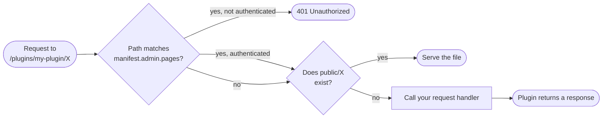
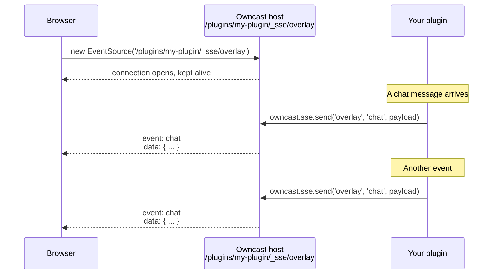

import Tabs from '@theme/Tabs';
import TabItem from '@theme/TabItem';

Plugins can serve their own URLs. Once you declare `http.serve` in your manifest, the URL space at `/plugins/<your-slug>/` is yours: static files from your `public/` directory go out verbatim, and anything else falls through to your request handler.

This page covers serving HTTP, request routing, the request and response limits the host enforces, and how to push realtime events to viewer browsers. Code is shown for both SDKs; see [JavaScript](/docs/plugins/sdks/javascript) or [Python](/docs/plugins/sdks/python) for install and setup.

## Routing

Once `http.serve` is declared, the host routes every request under `/plugins/<your-slug>/` to your plugin:

1. Static files. Anything in your `public/` directory is served verbatim.
2. Dynamic handler. Anything else falls through to your plugin's request handler.



A request's path is relative to your plugin's namespace: a request to `/plugins/my-plugin/api/messages` reaches your handler as `/api/messages` (the query string is excluded). The handler reads query parameters and the request body from the request, and returns a response with a status, optional headers, and an optional body.

There are two routing styles. In **JavaScript** you write a single `onHttpRequest(req)` handler and branch on `req.method` / `req.path`. In **Python** you declare per-method routes with decorators; a request whose path matches a route but not its method gets an automatic **405**, and an unmatched path falls through to the bare catch-all, else **404**.

<Tabs groupId="plugin-lang">
<TabItem value="js" label="JavaScript / TypeScript" default>

```js
const { definePlugin } = require("@owncast/plugin-sdk");

module.exports = definePlugin({
  onHttpRequest(req) {
    // req: { method, path, headers, query, body, user? }
    if (req.method === "GET" && req.path === "/api/messages") {
      return {
        status: 200,
        headers: { "Content-Type": "application/json" },
        body: "[]",
      };
    }
    if (req.method === "POST" && req.path === "/api/messages") {
      const data = JSON.parse(req.body || "{}");
      return { status: 201 };
    }
    return { status: 404 };
  },
});
```

</TabItem>
<TabItem value="py" label="Python">

```python
from owncast_plugin import plugin

@plugin.get("/api/messages")
def list_messages(req):
    return {"status": 200, "headers": {"Content-Type": "application/json"}, "body": "[]"}

@plugin.post("/api/messages")
def add_message(req):
    body = req.body          # raw request body
    return {"status": 201}

@plugin.on_http_request      # bare: catch-all fallback (any method, any path)
def fallback(req):
    return {"status": 404}
```

Routes are exact and plugin-relative; read query params from `req.query`. A handler returns a `dict` (`{status, body, headers}`), a `str` (→ 200), or `None` (→ 204). `@plugin.route(path, methods=[...])` covers multiple methods on one path.

</TabItem>
</Tabs>

The `manifest.admin.pages` gate at the top is covered in [UI: Admin pages](/docs/plugins/ui#admin-pages); from the perspective of HTTP serving it's just a 401-before-your-handler-runs filter applied to matching paths.

## Static files

The `public/` directory holds files served at `/plugins/<your-slug>/<path>`. A separate `assets/` directory holds files the host reads internally for manifest fields that inline content (`styles`, `scripts`, `extraPageContent`); those are not reachable through the plugin's URL space.

```text
my-plugin/
└── public/
    ├── index.html        → /plugins/my-plugin/index.html (and /plugins/my-plugin/)
    ├── style.css         → /plugins/my-plugin/style.css
    └── img/
        └── logo.png      → /plugins/my-plugin/img/logo.png
```

A request to `/plugins/my-plugin/` (no trailing path) serves `public/index.html` automatically.

## Request and response limits

* Request bodies are capped at 1 MB.
* Response bodies are capped at 10 MB.
* Path traversal (`..`) in URLs is blocked at the host level. You'll never see it in your handler's path.
* Response headers are filtered through an allowlist. You can set `Content-Type`, `Cache-Control`, `Set-Cookie`, `Location`, `ETag`, `Last-Modified`, `Vary`, `Link`, and CORS (`Access-Control-*`) headers. Owncast-owned headers (`Server`, `Content-Security-Policy`, `Strict-Transport-Security`, `X-Frame-Options`) are blocked.
* Cookies you set apply to your plugin's URL space by default (`/plugins/<your-slug>/`). If you want a cookie to be sent on requests outside that path, set `Path=...` explicitly; otherwise the browser scopes it to your namespace and won't leak it into other plugins or into Owncast's own paths.
* Each request is time-capped at 5 seconds before the host returns a `504` and discards your response.

## Public vs. authenticated

Endpoints are public by default. To make something admin-only, either check whether the request is authenticated inside your handler and return `401` when it isn't, or declare the path in `manifest.admin.pages[]` and let the host gate it for you (see [UI: Admin pages](/docs/plugins/ui#admin-pages)).

For requests made by a chat user with a valid user-token, the request carries the user's identity (`id`, display name, and `scopes`). Useful for per-user dashboards or moderator-only tools:

<Tabs groupId="plugin-lang">
<TabItem value="js" label="JavaScript / TypeScript" default>

```js
module.exports = definePlugin({
  onHttpRequest(req) {
    if (!req.user) return { status: 401 };           // not signed in
    if (!req.user.scopes?.includes("MODERATOR")) return { status: 403 };
    return { status: 200, body: `hello ${req.user.displayName}` };
  },
});
```

</TabItem>
<TabItem value="py" label="Python">

```python
@plugin.get("/my-data")
def my_data(req):
    if not req.user:                                  # not signed in
        return {"status": 401}
    if "MODERATOR" not in (req.user.scopes or []):
        return {"status": 403}
    return {"status": 200, "body": f"hello {req.user.display_name}"}
```

</TabItem>
</Tabs>

For paths declared in `manifest.admin.pages[]`, the host returns `401` before your handler runs, so you don't have to check at all.

## Realtime updates (Server-Sent Events)

For pushing live updates to a browser (an overlay that reacts to chat, a dashboard that ticks viewer counts, an alert widget) declare `http.sse` and use `owncast.sse.send`.

You do not open or hold the connection yourself. Your request handler can't stream — each call is a single buffered request/response. The host owns the long-lived connection and exposes a ready-made endpoint at `/plugins/<your-slug>/_sse/<channel>`. Your plugin pushes. The host fans each message out to every connected browser.



### Plugin side

Push from any handler — for example, from your chat handler — by calling `owncast.sse.send(channel, event, data)`:

<Tabs groupId="plugin-lang">
<TabItem value="js" label="JavaScript / TypeScript" default>

```js
const { definePlugin, owncast } = require("@owncast/plugin-sdk");

module.exports = definePlugin({
  onChatMessage(msg) {
    owncast.sse.send("overlay", "chat", {
      from: msg.user?.displayName,
      body: msg.body,
    });
  },
});
```

</TabItem>
<TabItem value="py" label="Python">

```python
from owncast_plugin import plugin, owncast

@plugin.on_chat_message
def push(msg):
    owncast.sse.send("overlay", "chat", {
        "from": msg.user.display_name if msg.user else None,
        "body": msg.body,
    })
```

</TabItem>
</Tabs>

* `channel`: which stream to push to. Browsers subscribe per channel, so you can run several independent streams (`"overlay"`, `"admin-stats"`) from one plugin. Use `""` for a single default channel.
* `event`: the event name the browser listens for (`addEventListener("chat", ...)`). Pass `""` for the browser's default `message` event.
* `data`: the payload. Strings are sent as-is. Anything else is JSON-encoded for you.

Sends are fire-and-forget. The call returns immediately and never blocks, even if no one is connected or a client is slow. Slow clients drop frames rather than stall your plugin. There are also SSE-connection lifecycle events (a viewer's stream opening and closing) you can subscribe to — see the [handlers reference](/docs/plugins/handlers#sse-events).

### Browser side

Standard `EventSource` API on the viewer page. No library — this runs in the browser, so it's always JavaScript whatever language your plugin is written in:

```html
<!-- public/index.html, served at /plugins/my-plugin/ -->
<script>
  const events = new EventSource("/plugins/my-plugin/_sse/overlay");
  events.addEventListener("chat", (e) => {
    const { from, body } = JSON.parse(e.data);
    document.getElementById("feed").textContent = `${from}: ${body}`;
  });
</script>
```

### Notes

* Up to 64 simultaneous connections per plugin. Over that the endpoint returns `503`. `EventSource` reconnects automatically.
* If the channel matches one of your `admin.pages[]` globs, it's auth-gated like any admin route. Handy for an admin-only stats stream.
* The endpoint is host-owned. Your request handler never sees `/_sse/...` requests, and you can't serve your own route there.

## Putting it together: a complete overlay plugin

The manifest declares the two permissions the overlay needs:

```json
{
  "api": "1",
  "name": "Chat Overlay",
  "slug": "overlay",
  "version": "0.1.0",
  "permissions": ["http.serve", "http.sse"]
}
```

The plugin subscribes to chat messages and pushes each one to the `overlay` SSE channel:

<Tabs groupId="plugin-lang">
<TabItem value="js" label="JavaScript / TypeScript" default>

```js
// src/plugin.js
const { definePlugin, owncast } = require("@owncast/plugin-sdk");

module.exports = definePlugin({
  onChatMessage(msg) {
    owncast.sse.send("overlay", "chat", {
      from: msg.user?.displayName,
      body: msg.body,
    });
  },
});
```

</TabItem>
<TabItem value="py" label="Python">

```python
# src/plugin.py
from owncast_plugin import plugin, owncast

@plugin.on_chat_message
def push(msg):
    owncast.sse.send("overlay", "chat", {
        "from": msg.user.display_name if msg.user else None,
        "body": msg.body,
    })
```

</TabItem>
</Tabs>

The viewer page is the same `EventSource` snippet shown above, pointed at the relative `./_sse/overlay` endpoint:

```html
<!-- public/index.html -->
<!doctype html>
<body>
  <div id="feed"></div>
  <script>
    const events = new EventSource("./_sse/overlay");
    events.addEventListener("chat", (e) => {
      const { from, body } = JSON.parse(e.data);
      document.getElementById("feed").textContent = `${from}: ${body}`;
    });
  </script>
</body>
```

Build, package, install. Open `/plugins/overlay/` in OBS as a browser source.
