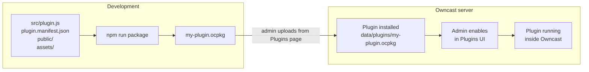

Owncast can be extended with **plugins**: small programs that the server loads at runtime to react to chat messages, stream events, fediverse activity, and HTTP requests. They run inside a sandbox, so a plugin can crash without taking the server down, and the host enforces a clear permission model so an admin always knows what a plugin can touch.

The examples in this section use `@owncast/plugin-sdk` from npm. The handlers, APIs, and permissions described here are properties of the host runtime, not of any particular SDK.

## What you can build

* Chat bots that reply to keywords or commands, post reminders, run polls, or moderate spam.
* Filters that rewrite or drop chat messages before they reach viewers.
* Overlays rendered on top of your stream, talking to your plugin's HTTP endpoints.
* Integrations that bridge Owncast to Discord, the fediverse, browser push, or any HTTPS service.
* Admin tools that add a tab to the Owncast admin UI for plugin-specific settings.
* Action buttons that appear under your stream, launching widgets, donation pages, or anything else you serve.

Every example plugin in the SDK is a complete starting point you can copy.

## How it fits together

A plugin is a single `.ocpkg` file containing your plugin's manifest, the compiled code, and any static assets. An admin drops the file into Owncast's `data/plugins/` directory and enables it from the **Plugins** page in the admin.

Once enabled, the plugin runs inside the Owncast process. Handlers you defined fire when matching events happen. APIs you call (sending chat, reading config, fetching URLs) go through the host, which checks the permissions you declared in your manifest.

## What a plugin can do

1. Subscribe to events. Chat messages, stream start and stop, fediverse follows, new chat user joins. Define a handler method and the SDK derives the subscription.
2. Filter chat. See every chat message before it's broadcast, modify it, or drop it.
3. Call Owncast APIs. `owncast.chat.send(text)`, `owncast.kv.get(key)`, `owncast.http.fetch(url)`, and around twenty more, each gated by a declared permission.
4. Serve HTTP. Every plugin can own the URL space at `/plugins/<your-slug>/...` for both static assets and dynamic handlers.
5. Add UI. Declare admin pages, action buttons, plugin stylesheets, plugin scripts, or an extra-content HTML block in your manifest and Owncast inlines them into its own chrome.

## What a plugin can't do

By design:

* No direct access to the host filesystem, network, or processes. The sandbox enforces this. Plugins do what the host APIs expose, and only with declared permissions.
* No identity impersonation. Each plugin gets one chat identity (the bot Owncast provisions on install), and outbound fediverse posts come from the streamer's own account.
* No cross-plugin reads. Each plugin's key-value store is namespaced.
* No indefinite chat blocking. Filter calls are time-capped at 50 ms, and a plugin that throws repeatedly is auto-disabled.

This is why an admin can install a third-party plugin without auditing every line of code. The trust boundary is the manifest's permission list.

## Where to go next

* [Quickstart](/docs/plugins/quickstart). Scaffold a new plugin, build it, install it.
* [Manifest reference](/docs/plugins/manifest). Every field your `plugin.manifest.json` can contain.
* [Chat plugins](/docs/plugins/chat). Build bots, moderation tools, and chat filters.
* [Event handlers](/docs/plugins/handlers). Every event your plugin can subscribe to, with payload shapes.
* [Owncast APIs](/docs/plugins/apis). Every `owncast.*` method, what it does, and the permission it needs.
* [Permissions](/docs/plugins/permissions). The full list and how the security model works.
* [Serving HTTP](/docs/plugins/http). Serve URLs from your plugin and push realtime events to browsers.
* [Contributing UI](/docs/plugins/ui). Register admin pages and contribute action buttons under the stream.
* [Testing](/docs/plugins/testing). Scenario tests that drive your plugin through the real runtime.
* [Packaging & distribution](/docs/plugins/packaging). Bundling the `.ocpkg`, icons, install paths.

## Source

* SDK + examples: [github.com/owncast/plugin-sdk](https://github.com/owncast/plugin-sdk)
* Example plugins, one per feature: [examples/js/](https://github.com/owncast/plugin-sdk/tree/main/examples/js)
* Long-form author guide on a single page: [docs/PLUGIN_AUTHOR_GUIDE.md](https://github.com/owncast/plugin-sdk/blob/main/docs/PLUGIN_AUTHOR_GUIDE.md)
