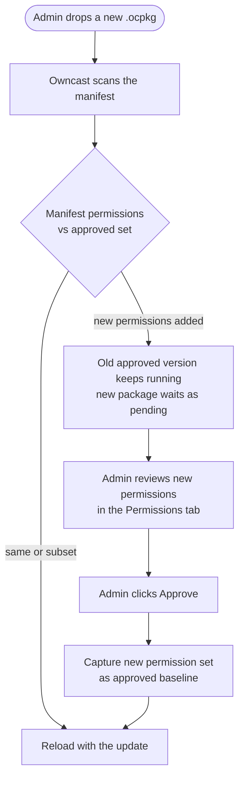

Every Owncast plugin runs in a sandbox with no implicit access to anything outside the plugin itself. To do useful work (read chat, post to the fediverse, fetch a URL, write to a key-value store) your plugin asks the host through `owncast.*` methods. Each of those methods is gated by a permission you declare in your manifest.

:::new[Plugin permissions require Owncast v0.3.0]
Plugins require Owncast 0.3.0 or later.
:::

When an admin installs a plugin, the **Permissions** tab on the plugin's detail page lists exactly what the plugin asked for, in plain language. That's the trust boundary: an admin can install a third-party plugin without auditing every line of code, because the manifest is the upper bound on what the plugin can do.


:::info[Available in every SDK]
The permission identifiers and the trust model below are the same regardless of which SDK you use. `owncast.*` methods are referenced here by their canonical names. For the exact spelling in your language, see the **[JavaScript](/docs/plugins/sdks/javascript)** or **[Python](/docs/plugins/sdks/python)** SDK reference.
:::

## How it works

1. You declare permissions in `plugin.manifest.json`:

   ```json
   { "permissions": ["chat.send", "storage.kv"] }
   ```

2. The admin reviews them when enabling. Owncast's plugin detail page lists each permission with a human-readable description.

3. The host enforces them at runtime. Calling `owncast.chat.send(...)` without `chat.send` in your manifest never reaches Owncast: the host logs the denial and the call returns an empty or zero value (calls that return nothing become silent no-ops).

4. The host catches drift. Your built plugin declares the permissions it uses at runtime. The host compares that against the manifest and refuses to load the plugin if the runtime asks for more than the manifest grants. You can't sneak in extra access by swapping out the plugin file after the fact.

### Re-approval when permissions expand

If you ship an update that asks for more permissions than the admin previously approved, the old approved version keeps running (it holds only the approved permissions) and the new package waits as pending. The plugin list shows a "needs re-approval" badge. The admin reviews the new permissions in the **Permissions** tab and clicks **Approve** to accept the expanded set and load the update. Shrinking permissions is silent.



An installed plugin's effective capabilities never grow without the admin saying yes again.

## Permission reference

### `chat.send`

Grants:

- `owncast.chat.send(text)`: post as the plugin's bot identity
- `owncast.chat.sendAction(text)`: post a "/me" message
- `owncast.chat.sendTo(clientId, text)`: private message a connected client
- `owncast.chat.replyTo(msg, text)`: whisper a reply back to whoever sent a chat message (sugar over `sendTo`)
- `owncast.chat.system(body)`: post a system message with no user identity, rendered as a server announcement (the body is HTML)

Messages go through Owncast's normal chat pipeline (filters, rate limits, persistence, moderation). Plugins cannot send under arbitrary names or impersonate real users.

### `chat.history`

Grants:

- `owncast.chat.history(limit?)`: read recent chat messages
- `owncast.chat.clients()`: list connected chat clients

Read-only.

### `chat.moderate`

Grants:

- `owncast.chat.deleteMessage(messageId)`: hide a message from viewers
- `owncast.chat.kick(clientId)`: disconnect a chat client

### `chat.filter`

Grants the ability to define `filterChatMessage(msg)`: see every chat message before it's broadcast, with the ability to rewrite or drop it.

Filtering happens inline on every chat message, so the admin needs to see this called out explicitly. The host rejects the load if a plugin defines `filterChatMessage` without declaring this permission.

### `users.read`

Grants:

- `owncast.users.list()`: read the chat user list
- `owncast.users.get(id)`: read a single user record

### `users.moderate`

Grants:

- `owncast.users.setEnabled(id, enabled, reason?)`: enable or disable a user
- `owncast.users.banIP(ip)`: ban an IP from joining chat

### `users.register`

Grants `owncast.users.register({ authId, displayName?, scopes? })`: find-or-create an authenticated Owncast user for an external identity and return its `userId`. The `authId` is a stable, provider-scoped identifier (e.g. `"github:583231"`); the host namespaces it by your plugin's slug, so two plugins can't collide on or spoof each other's users.

This is how a plugin turns a third-party login (OAuth, Discord, a shared password) into a real Owncast user with an authenticated chat identity. On its own it neither gates the site nor issues a session: pair it with `auth.gate` to build a login gate, or use it alone to mint verified chat identities.

### `auth.gate`

Grants the viewer-authentication gate:

- `owncast.auth.grantSession({ userId, ttl? })`: issue a signed session for an already-registered user (see `users.register`)
- `owncast.auth.endSession()`: clear the current viewer's session (sign-out)
- the optional `onAuthCheck` handler: re-validate a viewer's session on each page load

A plugin holding `auth.gate` is an **identity provider**. While it is enabled, every viewer must authenticate through it before they can reach the page, the video, chat, or the API. Only one `auth.gate` plugin can be enabled at a time, and the gate fails closed: if the plugin is unavailable, viewers are kept out rather than let in. See **[Authentication](/docs/plugins/auth)** for the full model.

### `storage.kv`

Grants `owncast.kv.get(key)`, `owncast.kv.set(key, value)`, and the JSON helpers `owncast.kv.getJSON(key, fallback?)` and `owncast.kv.setJSON(key, value)`: a per-plugin namespaced key/value store. Plugins cannot read each other's keys.

State persists across reloads and host restarts.

### `storage.upload`

Grants `owncast.storage.upload(name, bytes)`: upload a file to Owncast's public file area and get back a URL. Useful for badges, dynamically-generated images, fediverse post attachments.

### `storage.fs`

Grants `owncast.fs.*`: a private, sandboxed filesystem at `data/plugin-data/<your-slug>/` that your plugin can read, write, list, and delete within. Useful for caches, generated data files, append-style logs, or anything you need to persist as real files rather than key/value strings.

Unlike `storage.upload`, these files stay **server-side**: they're never served over HTTP. Every path is confined to your plugin's own directory: a plugin cannot read another plugin's files or escape its sandbox (`../` and absolute paths are collapsed back inside).

### `network.fetch`

Grants `owncast.http.fetch(url, opts?)`: synchronous outbound HTTP.

Requires a companion `network.allowedHosts` list in the manifest. The host rejects the load if `network.fetch` is granted without an allowlist. Each call is checked against the allowlist. Hosts that don't match return an error before any bytes leave the server.

```json
{
  "permissions": ["network.fetch"],
  "network": { "allowedHosts": ["api.discord.com", "*.weather.com"] }
}
```

The wildcard `"*"` is permitted but must be written explicitly so admins reviewing the manifest see the scope. The admin UI surfaces the full `allowedHosts` list on the **Permissions** tab next to the `network.fetch` row, so a server operator reviewing a plugin sees exactly which hosts it can reach without unpacking the `.ocpkg`.

### `events.emit`

Grants `owncast.events.emit(eventType, payload)`: emit a custom event that other plugins can subscribe to via `on: { ... }`.

Subscribing to events emitted by other plugins does not require a permission.

### `http.serve`

Grants the host's HTTP router permission to send requests at `/plugins/<your-slug>/*` to your plugin. This covers both static files in your `public/` directory and dynamic requests routed to your `onHttpRequest` handler.

Without this permission, the entire `/plugins/<your-slug>/` URL space returns `404`.

### `http.sse`

Grants `owncast.sse.send(channel, event, data)` and exposes a host-owned endpoint at `/plugins/<your-slug>/_sse/<channel>` that browsers connect to with `EventSource`. Independent of `http.serve`. A plugin may push events without serving any other routes.

### `server.read`

Grants the read-only stream and server state APIs:

- `owncast.stream.current()`: live stream state
- `owncast.stream.broadcaster()`: inbound encode telemetry
- `owncast.server.info()`: server name, version, summary
- `owncast.server.socials()`: configured social links
- `owncast.server.emotes()`: custom chat emotes configured on this server
- `owncast.server.federation()`: fediverse settings
- `owncast.server.tags()`: configured tags

### `videoconfig.read`

Grants `owncast.videoConfig.read()`: read the output and transcoding configuration (codecs, latency level, stream variants).

### `videoconfig.write`

Grants `owncast.videoConfig.write(partial)`: modify the video output configuration.

High-trust. Changes apply on the next stream start. The host does not restart an active broadcast. Admins should grant sparingly.

### `notifications.send`

Grants the broadcaster-notification APIs:

- `owncast.notifications.discord(text)`: through the streamer's configured Discord webhook
- `owncast.notifications.browserPush({ title, body, url? })`: to subscribed browsers
- `owncast.notifications.fediverse({ type, body, image?, link? })`: fediverse-formatted notification

### `fediverse.inbound`

Grants subscription to all seven inbound Fediverse plugin events:

- `fediverse.follow`
- `fediverse.like`
- `fediverse.repost`
- `fediverse.quote`
- `fediverse.mention`
- `fediverse.reply`
- `fediverse.activity`

The `fediverse.activity` catch-all receives the verified activity's raw JSON object. It runs in addition to any matching specialized event. This permission only covers receiving activity. Posting from the Owncast account requires the separate `fediverse.post` permission.

### `fediverse.post`

Grants `owncast.fediverse.post(text)`: make a public post to the fediverse from the Owncast account.

High-trust: posts go out under the streamer's own fediverse handle and can't be silently revoked. Admins should grant sparingly.

### `ui.modify`

Grants the ability to place UI inside Owncast's own chrome:

- Declaring `manifest.actions` (action buttons under the stream).
- Calling `owncast.actions.add(...)` / `.clear()` at runtime.
- Declaring `manifest.styles` (CSS inlined into the viewer page).
- Declaring `manifest.scripts` (JavaScript inlined into the viewer page).
- Declaring `manifest.extraPageContent` (an HTML block prepended to the viewer's extra-content area).
- Declaring `manifest.tabs` (additional tabs in the viewer page's tab row).
- Implementing an `onPageStyles` or `onPageScripts` handler (CSS or JavaScript returned at request time, with no manifest field).

Without this permission, manifests that declare any of those fields are rejected at load. The `onPageStyles` and `onPageScripts` handlers have no manifest field, so they aren't rejected at load. The host just doesn't call them unless the plugin holds `ui.modify`. Each of these reaches into the viewer page rather than staying inside the plugin's own URL space, so the admin needs to see the permission to understand the plugin paints into the host UI.

None of the four viewer-injection fields require `http.serve`, and neither do the two handlers. The host reads each file from the plugin's `assets/` directory (not from a URL), or calls the handler, and inlines the result into the existing config / custom-JS responses, so `ui.modify` alone is enough.

## Summary table

| Permission           | Grants                                                                                                                         |
| -------------------- | ------------------------------------------------------------------------------------------------------------------------------ |
| `chat.send`          | `owncast.chat.send`, `.sendAction`, `.sendTo`, `.replyTo`, `.system`                                                           |
| `chat.history`       | `owncast.chat.history`, `.clients`                                                                                             |
| `chat.moderate`      | `owncast.chat.deleteMessage`, `.kick`                                                                                          |
| `chat.filter`        | Subscribe to `filterChatMessage` (read, modify, or drop every chat message).                                                   |
| `users.read`         | `owncast.users.list`, `.get`                                                                                                   |
| `users.moderate`     | `owncast.users.setEnabled`, `.banIP`                                                                                           |
| `users.register`     | `owncast.users.register`: find-or-create an authenticated user for an external identity                                        |
| `auth.gate`          | `owncast.auth.grantSession`, `.endSession`, and the `onAuthCheck` handler: be the site's auth gate                             |
| `storage.kv`         | Per-plugin namespaced key/value store                                                                                          |
| `storage.upload`     | Upload files to Owncast's public file area                                                                                     |
| `storage.fs`         | Private, sandboxed server-side filesystem at `data/plugin-data/<your-slug>/`                                                   |
| `network.fetch`      | Outbound HTTP. Also requires `network.allowedHosts`                                                                            |
| `events.emit`        | Emit custom events for other plugins                                                                                           |
| `http.serve`         | Serve HTTP at `/plugins/<your-slug>/*`                                                                                         |
| `http.sse`           | Push realtime events via `owncast.sse.send` and the `/_sse/` endpoint                                                          |
| `server.read`        | Read stream state, server config, encode telemetry                                                                             |
| `videoconfig.read`   | Read the output/transcoding config                                                                                             |
| `videoconfig.write`  | Modify the video output config (applies on the next stream start)                                                              |
| `notifications.send` | Send Discord, browser-push, or fediverse notifications                                                                         |
| `fediverse.inbound`  | Subscribe to all seven inbound events: `fediverse.follow`, `.like`, `.repost`, `.quote`, `.mention`, `.reply`, and `.activity` |
| `fediverse.post`     | Public-post to the fediverse (rate-limited)                                                                                    |
| `ui.modify`          | Add action buttons or tabs to Owncast's viewer chrome. Inline plugin CSS, JavaScript, or HTML into the viewer page             |

## Principle of least privilege

Declare only what you actually use. The narrower your manifest, the easier the admin's trust decision. If you find yourself listing every permission, step back and see if your plugin should really be two plugins.

If you stop using a permission during development, drop it from the manifest. Shrinking is silent. There's no friction in removing unused entries.
