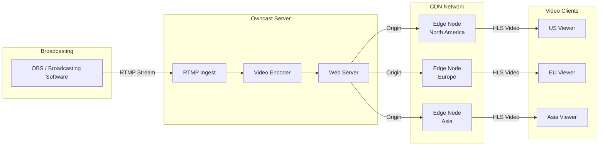

```mermaid
flowchart LR
    subgraph Broadcasting
        OBS[OBS / Broadcasting Software]
    end

    subgraph Owncast[Owncast Server]
        direction TB
        RTMP[RTMP Ingest]
        Encoder[Video Encoder]
        WebServer[Web Server]
        RTMP --> Encoder --> WebServer
    end

    subgraph CDN[CDN Network]
        direction TB
        Edge1[Edge Node<br/>North America]
        Edge2[Edge Node<br/>Europe]
        Edge3[Edge Node<br/>Asia]
    end

    subgraph Viewers[Video Clients]
        direction TB
        US[US Viewer]
        EU[EU Viewer]
        AS[Asia Viewer]
    end

    OBS -->|RTMP Stream| RTMP
    WebServer -->|Origin| Edge1
    WebServer -->|Origin| Edge2
    WebServer -->|Origin| Edge3
    Edge1 -->|HLS Video| US
    Edge2 -->|HLS Video| EU
    Edge3 -->|HLS Video| AS
```