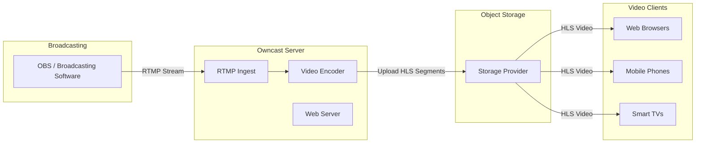

```mermaid
flowchart LR
    subgraph Broadcasting
        OBS[OBS / Broadcasting Software]
    end

    subgraph Owncast[Owncast Server]
        direction TB
        RTMP[RTMP Ingest]
        Encoder[Video Encoder]
        WebServer[Web Server]
        RTMP --> Encoder
    end

    subgraph Storage[Object Storage]
        S3[Storage Provider]
    end

    subgraph Viewers[Video Clients]
        direction TB
        Browser[Web Browsers]
        Phone[Mobile Phones]
        TV[Smart TVs]
    end

    OBS -->|RTMP Stream| RTMP
    Encoder -->|Upload HLS Segments| S3
    S3 -->|HLS Video| Browser
    S3 -->|HLS Video| Phone
    S3 -->|HLS Video| TV
```
