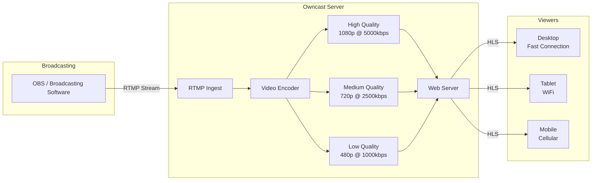

```mermaid
flowchart LR
    subgraph Broadcasting
        OBS[OBS / Broadcasting Software]
    end

    subgraph Owncast[Owncast Server]
        direction TB
        RTMP[RTMP Ingest]
        Encoder[Video Encoder]
        High[High Quality<br/>1080p @ 5000kbps]
        Medium[Medium Quality<br/>720p @ 2500kbps]
        Low[Low Quality<br/>480p @ 1000kbps]
        WebServer[Web Server]
        RTMP --> Encoder
        Encoder --> High
        Encoder --> Medium
        Encoder --> Low
        High --> WebServer
        Medium --> WebServer
        Low --> WebServer
    end

    subgraph Viewers
        Desktop[Desktop<br/>Fast Connection]
        Tablet[Tablet<br/>WiFi]
        Mobile[Mobile<br/>Cellular]
    end

    OBS -->|RTMP Stream| RTMP
    WebServer -->|HLS| Desktop
    WebServer -->|HLS| Tablet
    WebServer -->|HLS| Mobile
```