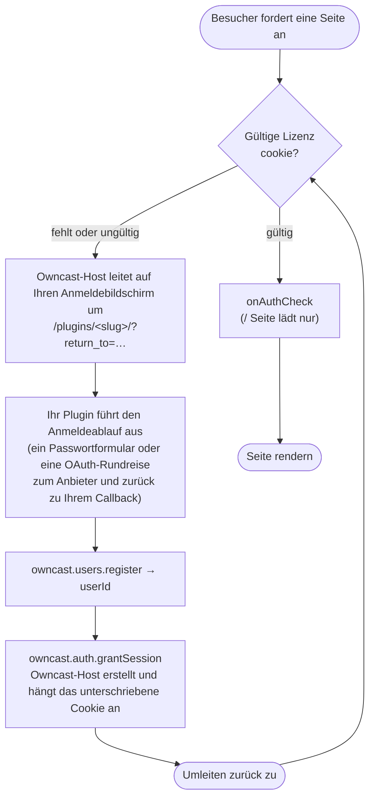

import Tabs from '@theme/Tabs';
import TabItem from '@theme/TabItem';

Ein Plugin kann das **Authentifizierungstor** für eine Owncast-Website sein: Die Zuschauer müssen sich darüber anmelden, bevor sie die Seite, das Video, den Chat oder die API erreichen können. Das Plugin liefert die Anmeldemethode: OAuth (GitHub, Discord, Google), ein magischer Link, SAML oder einfach ein gemeinsames Passwort. Owncast erzwingt das Tor. Dies ersetzt das hochgradige Muster "einen Reverse-Proxy wie Vouch vor Owncast zu setzen" durch eine erstklassige Plugin-Funktionalität.

Die Aufteilung der Verantwortung ist das gesamte Modell:

* **Ihr Plugin ist der Identitätsanbieter.** Es zeigt den Anmeldebildschirm an, kommuniziert mit dem externen Anbieter und entscheidet, wer hereingelassen wird.
* **Der Owncast-Host ist der Torwächter und die Sitzungsbehörde.** Er besitzt das Sitzungscookie, erzwingt das Tor bei jeder Anfrage und lässt Ihr Plugin niemals den per-Anfrage-Pfad erreichen.

:::info[Benötigt `auth.gate`]
Alles auf dieser Seite benötigt die Erlaubnis [`auth.gate`](/docs/plugins/permissions#authgate), plus [`users.register`](/docs/plugins/permissions#usersregister), um den authentifizierten Benutzer zu erstellen und [`http.serve`](/docs/plugins/permissions#httpserve), um den Anmeldeablauf darzustellen.
:::

## Was wird abgesichert

Wenn ein `auth.gate`-Plugin aktiviert ist, ist der **gesamte Webserver abgesichert**, nicht nur die HTML-Seite. Die Zuschauerseite (`/`), das Video (`/hls/*`), der Chat (`/ws`) und die API befinden sich alle hinter dem Tor. Owncasts eigene Administrationsseiten sind die Ausnahme: Sie sind hinter der Admin-Anmeldung und nicht hinter dem Zuschauer-Tor, damit ein Administrator immer auf die Kontrollen zugreifen kann.

Die akzeptierte Konsequenz: **Der Stream ist nur über die eigene Web-Benutzeroberfläche von Owncast sichtbar.** Native Player (VLC, QuickTime) können das Sitzungscookie nicht transportieren, sodass sie einen abgesicherten Stream nicht abspielen können.

:::warning[Hinweis zur Verteilung Ihres Videos mit externem Speicher (Objektspeicher/CDN)]
Wenn Sie Ihren Video-Stream direkt von Ihrem Server verteilen, ist das Tor luftdicht: Jeder Byte fließt durch Owncast. Mit Objektspeicher oder CDN werden Playlists in absolute Remote-URLs umgeschrieben und Segmente direkt aus dem Bucket abgerufen, sodass das Tor diese Anfragen niemals sieht. Die Sicherung stoppt immer noch einen anonymen Besucher daran, die Segmentliste *zu entdecken*, aber eine *geleakte oder geteilte* Segment-URL bleibt abrufbar. **Tor + lokale Verteilung ist luftdicht. Tor + Objektspeicher ist guter Widerstand, nicht luftdicht.**
:::

## Wie es funktioniert

Sobald das Tor aktiviert ist, wird jede Anfrage überprüft, einschließlich jedes HLS-Segments, das ein Live-Zuschauer alle paar Sekunden anfordert. Jede dieser Anfragen an die eingebaute Engine Ihres Plugins würde den Server überlasten, sodass das Plugin vom heißen Pfad ferngehalten wird:

| Wenn                                            | Kosten                                                                     | Was passiert                                                                  |
| ----------------------------------------------- | -------------------------------------------------------------------------- | ----------------------------------------------------------------------------- |
| **Jede Anfrage** (`/hls/*`, Bilder, `/ws`, API) | Überprüfen Sie die Cookie-Signatur + das Ablaufdatum                       | gültig → darf, fehlend/ungültig → umleiten zur Anmeldung                      |
| **`/`-Seite lädt nur**                          | Optionale Engine-Anfrage: [`onAuthCheck`](/docs/plugins/events#auth-check) | erneut gegen Ihren Anbieter validieren, gibt `ok` / `refresh` / `deny` zurück |

Ihr Plugin führt nur den **Anmeldeablauf** aus (selten, etwa einmal pro Zuschauersitzung) und die optionale `onAuthCheck` pro Seitenlade-Anfrage. Der Owncast-Host erstellt und überprüft ein **unterschriebenes Sitzungscookie**, sodass die Überprüfung pro Anfrage nur auf Signatur und Ablauf basiert: kein Datenbankaufruf, kein Pluginaufruf.

Das Cookie ist ein unterschriebener Umschlag, der das vorhandene Owncast-Zugangs-Token des Benutzers sowie ein Ablaufdatum enthält. Der Owncast-Host besitzt es von Anfang bis Ende: Er reserviert den Cookie-Namen, signiert ihn mit einem von HOST gehaltenen geheimen Schlüssel und hängt ihn an die Antwort an. Ihr Plugin sieht oder setzt das Token niemals, sodass es kein Token fälschen oder leaken kann. (So erdet auch der Chat automatisch die Identität des Zuschauers. Siehe [Chat-Identität](#chat-identity) weiter unten.)

## Erstellen eines Tor-Plugins

Ein Tor-Plugin ist ein [HTTP-dienendes Plugin](/docs/plugins/http) mit einem Anmeldeablauf. Der Steuerkreis ist nach Konvention im Namensraum des Plugins `/plugins/\<your-slug>/` verwurzelt:



Drei Teile erledigen die Arbeit:

1. **Registrieren Sie den Benutzer.** Machen Sie die externe Identität zu einem echten Owncast-Benutzer mit [`owncast.users.register`](/docs/plugins/apis#users-register). Geben Sie eine stabile, anbieterübergreifende `authId` (z. B. `"github:583231"`). Der Host benennt es mit Ihrem Slug, sodass Plugins einander nicht kollidieren oder sich nachahmen können.
2. **Genehmigen Sie die Sitzung.** Rufen Sie [`owncast.auth.grantSession`](/docs/plugins/apis#auth-grant-session) mit dieser `userId` auf. Der Owncast-Host erstellt das unterschriebene Cookie und hängt es an die in Bearbeitung befindliche Antwort an. Dies funktioniert nur innerhalb eines `onHttpRequest`-Handlers.
3. **Umleiten zur Startseite.** Der Owncast-Host fügt einen `return_to`-Abfrageparameter hinzu, wenn er einen nicht authentifizierten Besucher auf Ihren Anmeldebildschirm umleitet, und **sanifiziert ihn zu einem Pfad mit derselben Herkunft** (damit er nicht in eine offene Umleitung verwandelt werden kann). Senden Sie den Zuschauer nach einer erfolgreichen Anmeldung dorthin.

Um einen Zuschauer abzumelden, rufen Sie [`owncast.auth.endSession()`](/docs/plugins/apis#auth-end-session) auf und leiten Sie um. Ihr Plugin steuert weiterhin, wohin (es kann auf die Abmeldung des Anbieters umgleiten).

### Widerruf mit `onAuthCheck`

Sitzungen sind zustandslos, daher gibt es keine pro Anfrage-Liste "Darf dieser Benutzer weiterhin". Das würde das Plugin wieder auf den heißen Weg setzen. Definieren Sie stattdessen den optionalen [`onAuthCheck`](/docs/plugins/events#auth-check) Handler. Es wird bei jedem `/`-Seitenaufruf mit der gelösten Zuschaueridentität ausgelöst und gibt `ok`, `refresh` (erneuerung des Cookies, optional mit einer neuen TTL für gleitende Abläufe) oder `deny` (sitzung beenden und umleiten zur Anmeldung) zurück. Ein anbieterübergreifendes Plugin überprüft hier die Mitgliedschaft erneut (ist die Organisation weiterhin gültig? Wurde das Konto nicht gelöscht?).

Da die Überprüfung nur auf `/` ausgeführt wird, behält ein Zuschauer, dem Sie die Berechtigung entziehen, jede offene Registerkarte funktionstüchtig, bis er aktualisiert oder das Cookie abläuft. Die Sitzung **TTL ist das harte Sicherheitsnetz** für den Widerruf, also halten Sie sie kurz, wenn eine schnelle Widerrufung wichtig ist.

## Beispiel: ein Passworttor

Das Plugin-Beispiel `basic-auth` ist das einfachste mögliche Tor: ein gemeinsames Passwort, eine gemeinsame "Gast"-Identität, kein externer Anbieter. Es wird sowohl in [`examples/js/basic-auth`](https://github.com/owncast/plugin-sdk/tree/main/examples/js/basic-auth) als auch in [`examples/python/basic-auth`](https://github.com/owncast/plugin-sdk/tree/main/examples/python/basic-auth) geliefert.

Sein Manifest erklärt die Berechtigungen und ein einzelnes Konfigurationsfeld für das Passwort:

```json
{
  "name": "Basic Auth",
  "slug": "basic-auth",
  "version": "0.1.0",
  "permissions": ["auth.gate", "users.register", "http.serve", "storage.kv"],
  "config": {
    "password": {
      "type": "string",
      "default": "letmein",
      "description": "Gemeinsames Passwort, das Zuschauer eingeben müssen, um zu sehen"
    }
  }
}
```

Der Handler rendert ein Passwortformular auf `/`, überprüft das eingegebene Passwort mit dem konfigurierten Wert und registriert bei Erfolg die gemeinsame Identität, gewährt eine Sitzung und leitet zurück um. `onAuthCheck` liest ein von Administratoren umschaltbares `revoked`-Flag, um alle bei ihrem nächsten Seitenaufruf auszuschließen. (Der `page()`-Helper, der das HTML-Formular erstellt, wird der Kürze halber unten weggelassen. Siehe den Beispiel-Quellcode.)

<Tabs groupId="plugin-lang">
<TabItem value="js" label="JavaScript" default>

```js
const { definePlugin, owncast, authCheck } = require('@owncast/plugin-sdk');

module.exports = definePlugin({
  onHttpRequest(req) {
    const query = req.query || {};
    const returnTo = query.return_to || '/';

    if (req.method === 'GET' && req.path === '/') {
      return {
        status: 200,
        headers: { 'content-type': 'text/html' },
        body: page(returnTo),
      };
    }

    if (req.path === '/login') {
      const expected = owncast.config.get('password', 'letmein');
      if ((query.password || '') !== expected) {
        return {
          status: 200,
          headers: { 'content-type': 'text/html' },
          body: page(returnTo, 'Falsches Passwort.'),
        };
      }
      // Jeder, der das Passwort kennt, teilt eine authentifizierte Identität.
      const { userId } = owncast.users.register({
        authId: 'shared',
        displayName: 'Gast',
      });
      owncast.auth.grantSession({ userId });
      return { status: 302, headers: { Location: returnTo } };
    }

    if (req.path === '/logout') {
      owncast.auth.endSession();
      return { status: 302, headers: { Location: '/' } };
    }

    // Nur für Admins. req.authenticated ist nur für Admins wahr.
    if (req.path === '/revoke' || req.path === '/unrevoke') {
      if (!req.authenticated) return { status: 403, body: 'Nur für Admins' };
      owncast.kv.set('revoked', req.path === '/revoke' ? '1' : '');
      return {
        status: 200,
        body: req.path === '/revoke' ? 'widerrufen' : 'nicht widerrufen',
      };
    }

    return { status: 404, body: 'nicht gefunden' };
  },

  // Bei jedem Seitenaufruf neu validieren. Während widerrufen, beenden Sie jede Sitzung.
  onAuthCheck() {
    if (owncast.kv.get('revoked') === '1') return authCheck.deny('Zugang wurde widerrufen');
    return authCheck.ok();
  },
});
```

</TabItem>
<TabItem value="py" label="Python">

```python
from owncast_plugin import plugin, owncast, auth_check


@plugin.get("/")
def login_form(req):
    return_to = (req.raw.get("query") or {}).get("return_to") or "/"
    return {"status": 200, "headers": {"content-type": "text/html"}, "body": page(return_to)}


@plugin.get("/login")
def login(req):
    query = req.raw.get("query") or {}
    return_to = query.get("return_to") or "/"
    expected = owncast.config.get("password", "letmein")
    if (query.get("password") or "") != expected:
        return {"status": 200, "headers": {"content-type": "text/html"},
                "body": page(return_to, "Falsches Passwort.")}
    # Jeder, der das Passwort kennt, teilt eine authentifizierte Identität.
    result = owncast.users.register("shared", display_name="Gast")
    owncast.auth.grant_session(result.user_id)
    return {"status": 302, "headers": {"Location": return_to}}


@plugin.get("/logout")
def logout(req):
    owncast.auth.end_session()
    return {"status": 302, "headers": {"Location": "/"}}


@plugin.get("/revoke")
def revoke(req):
    if not req.authenticated:  # wahr nur für Admin-Anfragen
        return {"status": 403, "body": "Nur für Admins"}
    owncast.kv.set("revoked", "1")
    return {"status": 200, "body": "widerrufen"}


@plugin.on_auth_check
def check(_req):
    # Bei jedem Seitenaufruf neu validieren. Während widerrufen, beenden Sie jede Sitzung.
    if owncast.kv.get("revoked") == "1":
        return auth_check.deny("Zugang wurde widerrufen")
    return auth_check.ok()
```

</TabItem>
</Tabs>

Für einen echten OAuth-Fluss (CSRF `state` in [`storage.kv`](/docs/plugins/permissions#storagekv), ein Code-Austausch über [`network.fetch`](/docs/plugins/permissions#networkfetch), Durchsetzung der Mitgliedschaft und eine Callback-URL, die aus [`owncast.server.info()`](/docs/plugins/apis#stream-and-server-state) erstellt wurde), siehe das Beispiel `github-auth` im SDK.

## Das Tor aktivieren

Die Deklaration von `auth.gate` hat von sich aus keine Wirkung. Das Tor wird aktiviert, indem das Plugin über den normalen Lebenszyklus aktiv/passiv im Admin-Bereich **aktualisiert** wird. Deaktivieren Sie es und das Tor fällt sofort.

* **Es kann immer nur ein `auth.gate`-Plugin gleichzeitig aktiviert sein.** Owncast verweigert die Aktivierung eines zweiten, solange eines bereits aktiv ist ("deaktivieren Sie zuerst das andere").
* **Konfigurieren Sie, bevor Sie aktivieren.** Ein Plugin kann installiert und konfiguriert werden, während es deaktiviert ist, und dann aktiviert werden, um live zu gehen. Verwenden Sie das automatisch generierte [Konfigurationsformular](/docs/plugins/configuration) für Anmeldeinformationen wie eine OAuth-Client-ID und ein Geheimnis.

### Falls geschlossen

Die Haltung des Tors ist von der Gesundheit Ihres Plugins entkoppelt. Wenn das Tor aktiviert ist, aber das Plugin nicht verfügbar ist (abgestürzt, fehlgeschlagen, Fehler, oder nach wiederholtem Fehlschlagen automatisch deaktiviert), lehnt Owncast **allen Zuschauerverkehr ab** und zeigt eine statische "Authentifizierung vorübergehend nicht verfügbar"-Seite an. Es öffnet sich nie. Der Administrator ist immer erreichbar (Admin-Routen verwenden die vorhandene Basis-Authentifizierung von Owncast und umgehen das Tor), sodass Sie die Konfiguration beheben oder das Plugin deaktivieren können. Bereits gültige Sitzungen überstehen einen Ausfall, da die Überprüfung eines Cookies keinen Pluginaufruf benötigt.

### Was das Tor umgeht

Das Prinzip ist: Das Tor deckt nur die ansonsten öffentliche Oberfläche ab. Jede Route, die bereits ihre eigenen Anmeldeinformationen durchsetzt, umgeht es.

* Der Namensraum des Tor-Plugins `/plugins/\<your-slug>/*` und seine statischen Ressourcen (sodass der Anmeldebildschirm erreichbar ist, während Sie ausgesperrt sind).
* `/admin/*` und `/api/admin/*`, die bereits hinter der Admin-Basis-Authentifizierung gesichert sind.
* Routen zur externen API-Token, wo ein gültiger Bearer-Client kein Cookie trägt und die Sicherung ihn auf eine Anmeldeseite umleiten würde.
* Die eigenen statischen Ressourcen der Zuschauerseite (das benötigte JS/CSS-Bündel, um die Anmeldeschnittstelle darzustellen).

Alles andere ist abgesichert, **einschließlich `/api/status` und Einbettungen**. Äußerungen zum Live-Status oder Zuschauerzählungen an anonyme Besucher würden den Sinn der Sicherung untergraben.

## Sitzungsdetails

* **Zustandsloses unterschriebenes Cookie**, `HttpOnly`, `Sicher` (bei HTTPS-Anfragen), `SameSite=Lax`, `Path=/`. Lax statt Strict, da der Callback des Anbieters eine cross-site top-level Umleitung ist.
* **TTL standardmäßig 24 Stunden**, mit einem gleitenden Refresh über das `refresh`-Urteil von `onAuthCheck` verfügbar. Da die TTL das Sicherheitsnetz für den Widerruf ist, ist es ein echtes Sicherheitsinstrument.
* **Das Geheimnis der Signatur liegt in der Verantwortung des Owncast-Hosts.** Es wird bei der ersten Verwendung automatisch generiert und in der Konfiguration gespeichert. Die Rotation macht jede Sitzung ungültig (einen Panik-Button). Plugin-Autoren berühren es nie, und es ist unabhängig von einem OAuth-Client-Geheimnis, was die Konfiguration Ihres Plugins betrifft.

## Chat-Identität {/* #chat-identity */}

Ein Toranmeldung erzeugt automatisch eine authentifizierte Chat-Identität. Da `users.register` einen echten Owncast-Benutzer erstellt oder verknüpft (als authentifiziert gekennzeichnet, mit einem angezeigten Namen, der vom Anbieter stammt), und das Sitzungscookie das Zugangs-Token dieses Benutzers trägt, liest der Chat die Identität direkt aus dem Cookie: Wenn `/ws` (oder ein Chat-REST-Anruf) ohne das `?accessToken=`-Abfrageparameter ankommt, fällt er auf das Zugangs-Token im Gate-Cookie zurück. Kein Token wird jemals in den `localStorage` des Browsers transportiert. Der Zuschauer meldet sich einmal an und erscheint im Chat unter seinem Anbieternamen.

## Verwandt

* [Berechtigungen](/docs/plugins/permissions): `auth.gate`, `users.register`
* [Owncast APIs](/docs/plugins/apis#authentication): `users.register`, `auth.grantSession`, `auth.endSession`
* [Ereignisse](/docs/plugins/events#auth-check): der `onAuthCheck`-Handler
* [Serving HTTP](/docs/plugins/http): das Anfrage-Modell, auf dem der Anmeldeablauf basiert
