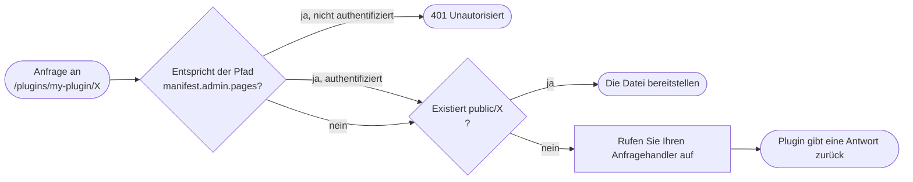

import Tabs from '@theme/Tabs';
import TabItem from '@theme/TabItem';

Plugins können ihre eigenen URLs bereitstellen. Sobald Sie `http.serve` in Ihrem Manifest deklarieren, gehört der URL-Bereich unter `/plugins/\<your-slug>/` Ihnen: Statische Dateien aus Ihrem `public/`-Verzeichnis werden genau so ausgegeben, und alles andere fällt auf Ihren Anfragehandler zurück.

Der Code wird für beide SDKs angezeigt. Siehe [JavaScript](/docs/plugins/sdks/javascript) oder [Python](/docs/plugins/sdks/python) für Installation und Einrichtung.

## Routing

Sobald `http.serve` deklariert ist, leitet der Host jede Anfrage unter `/plugins/\<your-slug>/` an Ihr Plugin weiter:

1. Statische Dateien. Alles im Verzeichnis `public/` wird genau so bereitgestellt.
2. Dynamischer Handler. Alles andere fällt auf den Anfragehandler Ihres Plugins zurück.



Der Pfad einer Anfrage ist relativ zum Namensraum Ihres Plugins: eine Anfrage an `/plugins/my-plugin/api/messages` erreicht Ihren Handler als `/api/messages` (der Abfrageparameter ist ausgeschlossen). Der Handler liest Abfrageparameter und den Anfragekörper aus der Anfrage und gibt eine Antwort mit einem Status, optionalen Headern und einem optionalen Körper zurück.

Es gibt zwei Routing-Stile. In **JavaScript** schreiben Sie einen einzelnen `onHttpRequest(req)`-Handler und verzweigen nach `req.method` / `req.path`. In **Python** deklarieren Sie methode-spezifische Routen mit Dekoratoren. Eine Anfrage, deren Pfad mit einer Route übereinstimmt, jedoch nicht mit ihrer Methode, erhält automatisch eine **405**, und ein nicht übereinstimmender Pfad fällt auf den allgemeinen Fangmechanismus zurück, andernfalls **404**.

<Tabs groupId="plugin-lang">
<TabItem value="js" label="JavaScript" default>

```js
const { definePlugin } = require("@owncast/plugin-sdk");

module.exports = definePlugin({
  onHttpRequest(req) {
    // req: { method, path, headers, query, body, user? }
    if (req.method === "GET" && req.path === "/api/messages") {
      return {
        status: 200,
        headers: { "Content-Type": "application/json" },
        body: "[]",
      };
    }
    if (req.method === "POST" && req.path === "/api/messages") {
      const data = JSON.parse(req.body || "{}");
      return { status: 201 };
    }
    return { status: 404 };
  },
});
```

</TabItem>
<TabItem value="py" label="Python">

```python
from owncast_plugin import plugin

@plugin.get("/api/messages")
def list_messages(req):
    return {"status": 200, "headers": {"Content-Type": "application/json"}, "body": "[]"}

@plugin.post("/api/messages")
def add_message(req):
    body = req.body          # roher Anfragekörper
    return {"status": 201}

@plugin.on_http_request      # allgemein: Fang-mechanismus (jede Methode, jeder Pfad)
def fallback(req):
    return {"status": 404}
```

Routen sind genau und plugin-relativ. Lesen Sie Abfrageparameter von `req.query`. Ein Handler gibt ein `dict` (`{status, body, headers}`), einen `str` (→ 200) oder `None` (→ 204) zurück. `@plugin.route(path, methods=[...])` deckt mehrere Methoden auf einem Pfad ab.

</TabItem>
</Tabs>

Das `manifest.admin.pages`-Tor oben wird in [UI: Admin-Seiten](/docs/plugins/ui#admin-pages) behandelt. Aus der Perspektive des HTTP-Bereitstellens ist es einfach ein 401-vor-ausführen-des-Handlers-Filter, der auf passende Pfade angewendet wird.

## Statische Dateien

Das Verzeichnis `public/` enthält Dateien, die unter `/plugins/\<your-slug>/\<path>` bereitgestellt werden. Ein separates Verzeichnis `assets/` enthält Dateien, die der Host intern für Manifestfelder liest, die inline Inhalte haben (`styles`, `scripts`, `extraPageContent`). Diese sind nicht über den URL-Bereich des Plugins erreichbar.

```text
my-plugin/
└── public/
    ├── index.html        → /plugins/my-plugin/index.html (und /plugins/my-plugin/)
    ├── style.css         → /plugins/my-plugin/style.css
    └── img/
        └── logo.png      → /plugins/my-plugin/img/logo.png
```

Eine Anfrage an `/plugins/my-plugin/` (kein nachfolgender Pfad) stellt automatisch `public/index.html` bereit.

## Anfrage- und Antwortgrenzen

* Anfragekörper sind auf 1 MB begrenzt.
* Antwortkörper sind auf 10 MB begrenzt.
* Pfad traversal (`..`) in URLs wird auf Host-Ebene blockiert. Sie werden es niemals im Pfad Ihres Handlers sehen.
* Antwortheader werden durch eine Erlaubenliste gefiltert. Sie können `Content-Type`, `Content-Encoding`, `Content-Language`, `Cache-Control`, `Set-Cookie`, `Location`, `ETag`, `Last-Modified`, `Vary`, `Link` und CORS (`Access-Control-*`) Header setzen. Von Owncast verwaltete Header (`Server`, `Content-Security-Policy`, `Strict-Transport-Security`, `X-Frame-Options`) sind blockiert.
* Cookies, die Sie setzen, gelten standardmäßig für den URL-Bereich Ihres Plugins (`/plugins/\<your-slug>/`). Wenn Sie möchten, dass ein Cookie bei Anfragen außerhalb dieses Pfades gesendet wird, setzen Sie `Path=...` ausdrücklich. Andernfalls wird der Browser es auf Ihren Namensraum beschränken und nicht in andere Plugins oder in die eigenen Pfade von Owncast durchsickern lassen.
* Jede Anfrage wird auf 5 Sekunden zeitlich begrenzt, bevor der Host einen `504` zurückgibt und Ihre Antwort verwirft.

## Öffentlich vs. authentifiziert

Endpunkte sind standardmäßig öffentlich. Um etwas nur für Admins zugänglich zu machen, überprüfen Sie entweder, ob die Anfrage im Handler authentifiziert ist und geben Sie `401` zurück, wenn dies nicht der Fall ist, oder deklarieren Sie den Pfad in `manifest.admin.pages[]` und lassen Sie den Host dies für Sie steuern (siehe [UI: Admin-Seiten](/docs/plugins/ui#admin-pages)).

Für Anfragen, die von einem Chatbenutzer mit einem gültigen Benutzertoken ausgeführt werden, trägt die Anfrage die Identität des Benutzers (`id`, Anzeigename und `scopes`). Nützlich für benutzerbezogene Dashboards oder ausschließlich für Moderatoren zugängliche Tools:

<Tabs groupId="plugin-lang">
<TabItem value="js" label="JavaScript" default>

```js
module.exports = definePlugin({
  onHttpRequest(req) {
    if (!req.user) return { status: 401 };           // nicht angemeldet
    if (!req.user.scopes?.includes("MODERATOR")) return { status: 403 };
    return { status: 200, body: `hallo ${req.user.displayName}` };
  },
});
```

</TabItem>
<TabItem value="py" label="Python">

```python
@plugin.get("/my-data")
def my_data(req):
    if not req.user:                                  # nicht angemeldet
        return {"status": 401}
    if "MODERATOR" not in (req.user.scopes or []):
        return {"status": 403}
    return {"status": 200, "body": f"hallo {req.user.display_name}"}
```

</TabItem>
</Tabs>

Für in `manifest.admin.pages[]` deklarierte Pfade gibt der Host `401` zurück, bevor Ihr Handler ausgeführt wird, sodass Sie dies überhaupt nicht überprüfen müssen.

## Echtzeit-Updates (Server-Sent Events)

Um Live-Updates an einen Browser zu pushen (ein Overlay, das auf Chat reagiert, ein Dashboard, das Zuschauerzahlen aktualisiert, ein Warn-Widget), deklarieren Sie `http.sse` und verwenden Sie `owncast.sse.send`.

Sie öffnen oder halten die Verbindung selbst nicht. Ihr Anfragehandler kann nicht streamen: jeder Aufruf ist eine einzelne gepufferte Anfrage/Aantwort. Der Host besitzt die langfristige Verbindung und bietet einen fertigen Endpunkt unter `/plugins/\<your-slug>/_sse/\<channel>` an. Ihr Plugin pusht. Der Host verteilt jede Nachricht an jeden verbundenen Browser.

```mermaid
sequenceDiagram
    participant Browser
    participant Host as Owncast-Host<br/>/plugins/my-plugin/_sse/overlay
    participant Plugin as Ihr Plugin

    Browser->>Host: neues EventSource('/plugins/my-plugin/_sse/overlay')
    Host-->>Browser: Verbindung geöffnet, bleibt aktiv

    Note über Plugin: Eine Chatnachricht trifft ein
    Plugin->>Host: owncast.sse.send('overlay', 'chat', payload)
    Host-->>Browser: event: chat<br/>data: { ... }

    Note über Plugin: Ein weiteres Ereignis
    Plugin->>Host: owncast.sse.send('overlay', 'chat', payload)
    Host-->>Browser: event: chat<br/>data: { ... }
```

### Plugin-Seite

Pushen Sie von jedem Handler, zum Beispiel von Ihrem Chat-Handler, indem Sie `owncast.sse.send(channel, event, data)` aufrufen:

<Tabs groupId="plugin-lang">
<TabItem value="js" label="JavaScript" default>

```js
const { definePlugin, owncast } = require("@owncast/plugin-sdk");

module.exports = definePlugin({
  onChatMessage(msg) {
    owncast.sse.send("overlay", "chat", {
      von: msg.user?.displayName,
      body: msg.body,
    });
  },
});
```

</TabItem>
<TabItem value="py" label="Python">

```python
from owncast_plugin import plugin, owncast

@plugin.on_chat_message
def push(msg):
    owncast.sse.send("overlay", "chat", {
        "von": msg.user.display_name if msg.user else None,
        "body": msg.body,
    })
```

</TabItem>
</Tabs>

* `channel`: zu welchem Stream gepusht werden soll. Browser abonnieren nach Channel, sodass Sie mehrere unabhängige Streams (`"overlay"`, `"admin-stats"`) von einem Plugin ausführen können. Verwenden Sie `""` für einen einzelnen Standardchannel.
* `event`: der Ereignisname, auf den der Browser hört (`addEventListener("chat", ...)`). Geben Sie `""` für das Standard-`message`-Ereignis des Browsers an.
* `data`: die Last. Zeichenfolgen werden so gesendet, wie sie sind. Alles andere wird für Sie in JSON kodiert.

Sendungen sind fire-and-forget. Der Aufruf gibt sofort zurück und blockiert nie, auch wenn niemand verbunden oder ein Client langsam ist. Langsame Clients fallen Frames ab, anstatt Ihr Plugin zu blockieren. Es gibt auch Lebenszyklusereignisse für die SSE-Verbindung (das Öffnen und Schließen des Streams eines Zuschauers), auf die Sie abonnieren können: siehe die [Handler-Referenz](/docs/plugins/events#sse-events).

### Browser-Seite

Standard-`EventSource` API auf der Zuschauerseite. Keine Bibliothek. Das läuft im Browser, daher ist es immer JavaScript, unabhängig davon, in welcher Sprache Ihr Plugin geschrieben ist:

```html
<!-- public/index.html, bereitgestellt unter /plugins/my-plugin/ -->
<script>
  const events = new EventSource("/plugins/my-plugin/_sse/overlay");
  events.addEventListener("chat", (e) => {
    const { von, body } = JSON.parse(e.data);
    document.getElementById("feed").textContent = `${von}: ${body}`;
  });
</script>
```

### Hinweise

* Bis zu 64 gleichzeitige Verbindungen pro Plugin. Darüber hinaus gibt der Endpunkt `503` zurück. `EventSource` stellt automatisch die Verbindung wieder her.
* Wenn der Channel mit einem Ihrer `admin.pages[]`-Globale übereinstimmt, wird er wie jede Admin-Route authentifiziert. Praktisch für einen Stream von Statistiken, der nur für Admins zugänglich ist.
* Der Endpunkt wird von dem Host verwaltet. Ihr Anfragehandler sieht niemals `/_sse/...`-Anfragen, und Sie können dort keine eigene Route bereitstellen.

## Zusammenfügen: ein vollständiges Overlay-Plugin

Das Manifest deklariert die beiden Berechtigungen, die das Overlay benötigt:

```json
{
  "api": "1",
  "name": "Chat Overlay",
  "slug": "overlay",
  "version": "0.1.0",
  "permissions": ["http.serve", "http.sse"]
}
```

Das Plugin abonniert Chatnachrichten und pusht jede einzelne an den `overlay`-SSE-Channel:

<Tabs groupId="plugin-lang">
<TabItem value="js" label="JavaScript" default>

```js
// src/plugin.js
const { definePlugin, owncast } = require("@owncast/plugin-sdk");

module.exports = definePlugin({
  onChatMessage(msg) {
    owncast.sse.send("overlay", "chat", {
      von: msg.user?.displayName,
      body: msg.body,
    });
  },
});
```

</TabItem>
<TabItem value="py" label="Python">

```python
# src/plugin.py
from owncast_plugin import plugin, owncast

@plugin.on_chat_message
def push(msg):
    owncast.sse.send("overlay", "chat", {
        "von": msg.user.display_name if msg.user else None,
        "body": msg.body,
    })
```

</TabItem>
</Tabs>

Die Zuschauerseite ist der gleiche `EventSource`-Snippet, der oben gezeigt wurde, auf den relativen Endpunkt `./_sse/overlay` gerichtet:

```html
<!-- public/index.html -->
<!doctype html>
<body>
  <div id="feed"></div>
  <script>
    const events = new EventSource("./_sse/overlay");
    events.addEventListener("chat", (e) => {
      const { von, body } = JSON.parse(e.data);
      document.getElementById("feed").textContent = `${von}: ${body}`;
    });
  </script>
</body>
```

Erstellen, paketieren, installieren. Öffnen Sie `/plugins/overlay/` in OBS als Browsersource.
