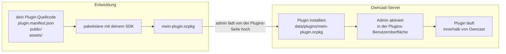

Owncast kann mit **Plugins** erweitert werden: kleine Programme, die vom Server zur Laufzeit geladen werden, um auf Chatnachrichten, Streamereignisse, Fediverse-Aktivitäten und HTTP-Anfragen zu reagieren. Sie laufen in einer Sandbox, sodass ein Plugin abstürzen kann, ohne den Server herunterzufahren, und der Host ein klares Genehmigungsmodell durchsetzt, sodass ein Administrator immer weiß, was ein Plugin ansprechen kann.

:::info[Neu in Owncast 0.3.0]
Plugins sind brandneue Funktionen, die in Owncast 0.3.0 eingeführt wurden, und die API entwickelt sich weiterhin. Wenn du einen Fehler entdeckst oder einen Vorschlag hast, bitte [öffne ein Problem](https://github.com/owncast/plugin-sdk/issues) oder [chatte live mit der Community](/chat?tab=community).
:::

Du kannst ein Plugin in **JavaScript** oder **Python** schreiben. Die beiden SDKs sind gleichwertige Partner mit voller Funktionsparität: die Handler, APIs, Berechtigungen und das Manifest in diesem Abschnitt gelten für beide, und nur das Gerüst und die Sprachsyntax unterscheiden sich.

## Was du bauen kannst

- Chatbots, die auf Schlüsselwörter oder Kommandos reagieren, Erinnerungen posten, Umfragen durchführen oder Spam moderieren.
- Filter, die Chatnachrichten umschreiben oder löschen, bevor sie die Zuschauer erreichen.
- Überlagerungen, die über deinem Stream gerendert werden und mit den HTTP-Endpunkten deines Plugins kommunizieren.
- Integrationen, die Owncast mit Discord, dem Fediverse, Browser-Push oder einem beliebigen HTTPS-Dienst verbinden.
- Admin-Tools, die einen Tab in der Owncast-Admin-Benutzeroberfläche für pluginspezifische Einstellungen hinzufügen.
- Aktionsschaltflächen, die unter deinem Stream erscheinen und Widgets, Spenden-Seiten oder alles andere, was du anbietest, starten.

Jedes Beispiel-Plugin im SDK ist ein vollständiger Ausgangspunkt, den du kopieren kannst.

## Zwei SDKs

Beide SDKs erzeugen dasselbe `.ocpkg`, laufen im Sandbox-Modus auf dem Server und haben etwa die gleiche Größe. Wähle die Sprache, in der du lieber schreiben möchtest.

- **[JavaScript](/docs/plugins/sdks/javascript)** mit [`@owncast/plugin-sdk`](https://www.npmjs.com/package/@owncast/plugin-sdk). Erstelle mit `npx create-owncast-plugin`, schreibe `definePlugin({ ... })`, baue mit `npm run package`.
- **[Python](/docs/plugins/sdks/python)** mit [`owncast-plugin-py`](https://pypi.org/project/owncast-plugin-py/). Erstelle mit `uvx owncast-plugin-py new`, schreibe dekorierte Funktionen, baue mit `owncast-plugin-py package`.

Der gleiche Echo-Bot in jedem:

```js
// JavaScript
const { definePlugin, owncast } = require('@owncast/plugin-sdk');

module.exports = definePlugin({
  onChatMessage(msg) {
    owncast.chat.send(`echo: ${msg.body}`);
  },
});
```

```python
# Python
from owncast_plugin import plugin, owncast

@plugin.on_chat_message
def echo(msg):
    owncast.chat.send(f"echo: {msg.body}")
```

## Wie es zusammenpasst

Ein Plugin ist eine einzelne `.ocpkg`-Datei, die das Manifest deines Plugins, den kompilierten Code und alle statischen Assets enthält. Ein Administrator legt die Datei in das Verzeichnis `data/plugins/` von Owncast ab und aktiviert sie auf der **Plugins**-Seite im Adminbereich.



Sobald aktiviert, läuft das Plugin innerhalb des Owncast-Prozesses. Handler, die du definiert hast, werden ausgelöst, wenn passende Ereignisse eintreten. APIs, die du aufrufst (Chat senden, Konfiguration lesen, URLs abrufen), laufen über den Host, der die Berechtigungen überprüft, die du in deinem Manifest deklariert hast.

Jedes aktivierte Plugin verbraucht ein wenig mehr Speicher des Servers. Das erste Plugin einer Sprache lädt auch die gemeinsame Laufzeit dieser Sprache, eine einmalige Kosten, die für Python höher ist als für JavaScript. Jedes nachfolgende Plugin fügt nur eine kleine Menge hinzu.

## Was ein Plugin tun kann

1. Ereignisse abonnieren. Chatnachrichten, Stream-Start und -Stopp, Fediverse-Followers, neuer Chatbenutzer tritt ein. Definiere eine Handler-Methode und das SDK leitet das Abonnement ab.
2. Chat filtern. Jede Chatnachricht sehen, bevor sie gesendet wird, sie ändern oder wegwerfen.
3. Owncast-APIs aufrufen. `owncast.chat.send(text)`, `owncast.kv.get(key)`, `owncast.http.fetch(url)` und Dutzende mehr, die meisten gesperrt durch eine deklarierte Berechtigung.
4. HTTP bedienen. Jedes Plugin kann den URL-Bereich bei `/plugins/<dein-slug>/...` für sowohl statische Assets als auch dynamische Handler besitzen.
5. UI hinzufügen. Deklariere Adminseiten, Aktionsschaltflächen, Stylesheets für Plugins, Skripte für Plugins oder einen HTML-Block für zusätzlichen Inhalt in deinem Manifest, und Owncast fügt sie in seinen eigenen Chrome ein.
6. Zugang beschränken. Ein Plugin kann der Authentifizierungsanbieter der Seite sein. Lass Zuschauer sich anmelden (OAuth, ein Passwort, alles über HTTP), bevor sie zur Seite, zum Video, zum Chat oder zur API gelangen.

## Was ein Plugin nicht tun kann

Von Design:

- Kein direkter Zugriff auf das Host-Dateisystem, Netzwerk oder Prozesse. Die Sandbox erzwingt dies. Plugins tun, was die Host-APIs bereitstellen und nur mit deklarierten Berechtigungen.
- Keine Identitätsvertretung. Jedes Plugin erhält eine Chatidentität (den Bot, den Owncast bei der Installation bereitstellt), und ausgehende Fediverse-Posts stammen vom eigenen Konto des Streamers.
- Keine inter-plugin-Lesungen. Der Speicher des Schlüssel-Wert-Speichers jedes Plugins ist benannt.
- Keine unbefristete Chatblockierung. Filteraufrufe sind zeitlich auf 50 ms begrenzt, und ein Plugin, das wiederholt Fehler auslöst, wird automatisch deaktiviert.

Deshalb kann ein Administrator ein Drittanbieter-Plugin installieren, ohne jede Codezeile zu prüfen. Die Vertrauensgrenze ist die Genehmigungsliste des Manifests.

## Was als Nächstes zu tun ist

- [Schnellstart](/docs/plugins/quickstart). Erstelle ein neues Plugin, baue es, installiere es.
- [JavaScript](/docs/plugins/sdks/javascript) und [Python](/docs/plugins/sdks/python). Die sprachspezifische Einrichtung, CLI und Syntax für jedes SDK.
- [Manifestreferenz](/docs/plugins/manifest). Jedes Feld, das deine `plugin.manifest.json` enthalten kann.
- [Chat-Plugins](/docs/plugins/chat). Bots, Moderationstools und Chatfilter bauen.
- [Ereignisse](/docs/plugins/events). Jedes Ereignis, auf das dein Plugin abonnieren kann, mit Payload-Formen.
- [Owncast-APIs](/docs/plugins/apis). Jede `owncast.*` Methode, was sie tut und welche Berechtigung sie benötigt.
- [Berechtigungen](/docs/plugins/permissions). Die vollständige Liste und wie das Sicherheitsmodell funktioniert.
- [HTTP bedienen](/docs/plugins/http). Bediene URLs von deinem Plugin und schicke Echtzeit-Ereignisse an Browser.
- [UI beitragen](/docs/plugins/ui). Registriere Adminseiten und trage Aktionsschaltflächen unter dem Stream bei.
- [Testen](/docs/plugins/testing). Szenarientests, die dein Plugin durch die echte Laufzeit treiben.
- [Verpacken & veröffentlichen](/docs/plugins/packaging). Bündle das `.ocpkg`, installiere es und liste es im Verzeichnis auf.

## Quelle

- SDK-Quelle: [github.com/owncast/plugin-sdk](https://github.com/owncast/plugin-sdk)
- Beispiel-Plugins, eines pro Funktion: [JavaScript](https://github.com/owncast/plugin-sdk/tree/main/examples/js) · [Python](https://github.com/owncast/plugin-sdk/tree/main/examples/python)
