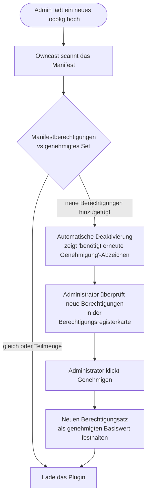

Jedes Owncast-Plugin läuft in einer Sandbox ohne impliziten Zugriff auf alles außerhalb des Plugins selbst. Um nützliche Arbeiten auszuführen (Chat lesen, im Fediverse posten, eine URL abrufen, in ein Schlüsselwertspeicher schreiben), fragt Ihr Plugin den Host über `owncast.*`-Methoden. Jede dieser Methoden wird durch eine Berechtigung geregelt, die Sie in Ihrem Manifest deklarieren.

Wenn ein Administrator ein Plugin installiert, listet die Registerkarte **Berechtigungen** auf der Detailseite des Plugins genau auf, was das Plugin angefragt hat, in einfacher Sprache. Das ist die Vertrauensgrenze: Ein Administrator kann ein Drittanbieter-Plugin installieren, ohne jede Codezeile zu prüfen, da das Manifest das obere Limit ist, was das Plugin tun kann.


:::info[In jedem SDK verfügbar]
Die Berechtigungsidentifikatoren und das Vertrauensmodell unten sind unabhängig vom verwendeten SDK identisch. `owncast.*`-Methoden werden hier mit ihren kanonischen Namen referenziert. Für die genaue Schreibweise in Ihrer Sprache, siehe die **[JavaScript](/docs/plugins/sdks/javascript)**- oder **[Python](/docs/plugins/sdks/python)**-SDK-Dokumentation.
:::

## Wie es funktioniert

1. Sie erklären Berechtigungen in `plugin.manifest.json`:

   ```json
   { "permissions": ["chat.send", "storage.kv"] }
   ```

2. Der Administrator überprüft diese beim Aktivieren. Die Detailseite des Owncast-Plugins listet jede Berechtigung mit einer für Menschen lesbaren Beschreibung auf.

3. Der Host durchsetzt sie zur Laufzeit. Ein Aufruf von `owncast.chat.send(...)` ohne `chat.send` in Ihrem Manifest löst einen klaren Fehler aus, bevor der Aufruf Owncast erreicht.

4. Der Host erkennt Drift. Ihr gebautes Plugin erklärt die Berechtigungen, die es zur Laufzeit verwendet. Der Host vergleicht dies mit dem Manifest und verweigert das Laden des Plugins, wenn zur Laufzeit um mehr gebeten wird, als das Manifest gewährt. Sie können keinen zusätzlichen Zugriff erlangen, indem Sie die Plugin-Datei nachträglich auswechseln.

### Neue Genehmigung bei erweiterten Berechtigungen

Wenn Sie ein Update versenden, das um mehr Berechtigungen bittet, als der Administrator zuvor genehmigt hat, deaktiviert Owncast das Plugin automatisch und zeigt ein „benötigt erneute Genehmigung“-Abzeichen in der Pluginliste an. Der Administrator überprüft die neuen Berechtigungen in der Registerkarte **Berechtigungen** und klickt auf **Genehmigen**, um den erweiterten Satz zu akzeptieren und das Plugin wieder zu aktivieren. Das Reduzieren von Berechtigungen erfolgt still.



Die effektiven Fähigkeiten eines installierten Plugins wachsen niemals ohne die Zustimmung des Administrators.

## Berechtigungsreferenz

### `chat.send`

Gewährt:

- `owncast.chat.send(text)`: als Identität des Plugins-Bots posten
- `owncast.chat.sendAction(text)`: eine "/me"-Nachricht posten
- `owncast.chat.sendTo(clientId, text)`: private Nachricht an einen verbundenen Client
- `owncast.chat.system(body)`: poste eine Systemmeldung ohne Benutzeridentität, dargestellt als Serverankündigung (der Inhalt ist HTML)

Nachrichten durchlaufen Owncasts normalen Chat-Pipeline (Filter, Ratenbeschränkungen, Persistenz, Moderation). Plugins können nicht unter beliebigen Namen senden oder tatsächliche Benutzer nachahmen.

### `chat.history`

Gewährt:

- `owncast.chat.history(limit?)`: ließt aktuelle Chat-Nachrichten
- `owncast.chat.clients()`: listet verbundene Chat-Clients auf

Nur Leseberechtigung.

### `chat.moderate`

Gewährt:

- `owncast.chat.deleteMessage(messageId)`: eine Nachricht vor Zuschauern verbergen
- `owncast.chat.kick(clientId)`: einen Chat-Client trennen

### `chat.filter`

Gewährt die Möglichkeit, `filterChatMessage(msg)` zu definieren: jede Chatnachricht zu sehen, bevor sie übertragen wird, mit der Möglichkeit, sie umzuschreiben oder zu verwerfen.

Das Filtern erfolgt inline bei jeder Chatnachricht, sodass der Administrator dies explizit sehen muss. Der Host lehnt das Laden ab, wenn ein Plugin `filterChatMessage` definiert, ohne diese Berechtigung zu erklären.

### `users.read`

Gewährt:

- `owncast.users.list()`: lese die Chat-Benutzerliste
- `owncast.users.get(id)`: lese einen einzelnen Benutzerdatensatz

### `users.moderate`

Gewährt:

- `owncast.users.setEnabled(id, enabled, reason?)`: Benutzer aktivieren oder deaktivieren
- `owncast.users.banIP(ip)`: eine IP vom Beitritt zum Chat ausschließen

### `users.register`

Gewährt `owncast.users.register({ authId, displayName?, scopes? })`: finde oder erstelle einen authentifizierten Owncast-Benutzer für eine externe Identität und gebe seine `userId` zurück. Der `authId` ist ein stabiler, provider-umfassender Bezeichner (z.B. `"github:583231"`); der Host namespaces ihn nach dem Slug Ihres Plugins, sodass zwei Plugins nicht aufeinanderstoßen oder sich gegenseitig betrügen können.

So verwandelt ein Plugin ein Drittanbieter-Login (OAuth, Discord, ein gemeinsames Passwort) in einen echten Owncast-Benutzer mit einer authentifizierten Chat-Identität. Für sich alleine schränkt es weder die Seite ein noch gibt es eine Sitzung aus: Kombinieren Sie es mit `auth.gate`, um ein Login-Gate zu erstellen, oder verwenden Sie es allein, um verifizierte Chat-Identitäten zu generieren.

### `auth.gate`

Gewährt das Authentifizierungs-Gate für Zuschauer:

- `owncast.auth.grantSession({ userId, ttl? })`: gibt eine signierte Sitzung für einen bereits registrierten Benutzer aus (siehe `users.register`)
- `owncast.auth.endSession()`: löscht die Sitzung des aktuellen Zuschauers (abmelden)
- Der optionale `onAuthCheck`-Handler: validiert die Sitzung eines Zuschauers bei jedem Seitenaufruf erneut

Ein Plugin, das `auth.gate` hält, ist ein **Identitätsanbieter**. Solange es aktiviert ist, muss jeder Zuschauer sich über dieses authentifizieren, bevor er die Seite, das Video, den Chat oder die API erreichen kann. Nur ein `auth.gate`-Plugin kann gleichzeitig aktiviert sein, und das Gate schlägt fehl, wenn es geschlossen bleibt: Wenn das Plugin nicht verfügbar ist, werden die Zuschauer ausgeschlossen, anstatt hereingelassen zu werden. Siehe **[Authentifizierung](/docs/plugins/auth)** für das vollständige Modell.

### `storage.kv`

Gewährt `owncast.kv.get(key)` und `owncast.kv.set(key, value)`: ein nach Plugin benannter Schlüssel/Wert-Speicher. Plugins können die Schlüssel anderer nicht lesen.

Der Zustand bleibt über Reloads und Host-Neustarts hinweg bestehen.

### `storage.upload`

Gewährt `owncast.storage.upload(name, bytes)`: eine Datei in den öffentlichen Dateibereich von Owncast hochladen und eine URL zurückerhalten. Nützlich für Abzeichen, dynamisch generierte Bilder, Attachments für Fediverse-Posts.

### `storage.fs`

Gewährt `owncast.fs.*`: ein privates, sandboxed-Dateisystem unter `data/plugin-data/<your-slug>/`, das Ihr Plugin lesen, schreiben, auflisten und darin löschen kann. Nützlich für Caches, generierte Datendateien, Protokolle im Anhang-Stil oder alles, was Sie als echte Dateien anstelle von Schlüssel/Wert-Strings speichern müssen.

Im Gegensatz zu `storage.upload` bleiben diese Dateien **serverseitig**: Sie werden niemals über HTTP bereitgestellt. Jeder Pfad ist auf das Verzeichnis des Plugins beschränkt: Ein Plugin kann die Dateien eines anderen Plugins nicht lesen oder aus seiner Sandbox entkommen (`../` und absolute Pfade werden zurückgekollabiert).

### `network.fetch`

Gewährt `owncast.http.fetch(url, opts?)`: synchrone ausgehende HTTP-Anfragen.

Erfordert eine begleitende `network.allowedHosts`-Liste im Manifest. Der Host lehnt das Laden ab, wenn `network.fetch` ohne eine Genehmigungsliste gewährt wird. Jeder Aufruf wird gegen die Genehmigungsliste überprüft. Hosts, die nicht übereinstimmen, geben einen Fehler zurück, bevor Daten den Server verlassen.

```json
{
  "permissions": ["network.fetch"],
  "network": { "allowedHosts": ["api.discord.com", "*.weather.com"] }
}
```

Das Wildcard `"*"` ist erlaubt, muss jedoch ausdrücklich geschrieben werden, damit die Administratoren, die das Manifest überprüfen, den Umfang sehen. Die Administratorenoberfläche zeigt die vollständige Liste der `allowedHosts` in der Registerkarte **Berechtigungen** neben der Zeile `network.fetch`, sodass ein Serverbetreiber, der ein Plugin überprüft, genau sieht, zu welchen Hosts es gelangen kann, ohne die `.ocpkg` zu entpacken.

### `events.emit`

Gewährt `owncast.events.emit(eventType, payload)`: sendet ein benutzerdefiniertes Ereignis, auf das andere Plugins über `on: { ...` abonnieren können. }\`.

Das Abonnieren von Ereignissen, die von anderen Plugins gesendet werden, erfordert keine Berechtigung.

### `http.serve`

Gewährt dem HTTP-Router des Hosts die Erlaubnis, Anfragen an `/plugins/<your-slug>/*` an Ihr Plugin zu senden. Dies umfasst sowohl statische Dateien in Ihrem `public/`-Verzeichnis als auch dynamische Anfragen, die an Ihren `onHttpRequest`-Handler weitergeleitet werden.

Ohne diese Berechtigung gibt die gesamte URL `/plugins/<your-slug>/` einen `404` zurück.

### `http.sse`

Gewährt `owncast.sse.send(channel, event, data)` und expose einen hosteigenen Endpunkt unter `/plugins/<your-slug>/_sse/<channel>`, zu dem Browser mit `EventSource` verbinden. Unabhängig von `http.serve`. Ein Plugin kann Ereignisse senden, ohne andere Routen zu bedienen.

### `server.read`

Gewährt die schreibgeschützten Stream- und Serverstatus-APIs:

- `owncast.stream.current()`: Status des Live-Streams
- `owncast.stream.broadcaster()`: eingehende codierte Telemetrie
- `owncast.server.info()`: Servername, Version, Zusammenfassung
- `owncast.server.socials()`: konfigurierte soziale Links
- `owncast.server.federation()`: Fediverse-Einstellungen
- `owncast.server.tags()`: konfigurierte Tags

### `videoconfig.read`

Gewährt `owncast.videoConfig.read()`: die Ausgabe- und Transcodierungs-Konfiguration lesen (Codecs, Latenzgrad, Stream-Varianten).

### `videoconfig.write`

Gewährt `owncast.videoConfig.write(partial)`: modifizieren der Videoausgabekonfiguration.

Hohes Vertrauen. Änderungen treten beim nächsten Stream-Start in Kraft. Der Host startet eine aktive Übertragung nicht neu. Administratoren sollten vorsichtig Genehmigungen erteilen.

### `notifications.send`

Gewährt die APIs zur Benachrichtigung des Senders:

- `owncast.notifications.discord(text)`: über den konfigurierten Discord-Web-Hook des Streamers
- `owncast.notifications.browserPush({ title, body, url? })`: an abonnierte Browser
- `owncast.notifications.fediverse({ type, body, image?, link? })`: fediverse-formatiert Benachrichtigung

### `fediverse.inbound`

Gewährt die Abonnierung aller sieben eingehenden Fediverse-Plugin-Ereignisse:

- `fediverse.follow`
- `fediverse.like`
- `fediverse.repost`
- `fediverse.quote`
- `fediverse.mention`
- `fediverse.reply`
- `fediverse.activity`

Das `fediverse.activity`-Catch-All erhält das überprüfte Aktivitäts-JSON-Objekt. Es läuft zusätzlich zu jedem übereinstimmenden spezialisierten Ereignis. Diese Berechtigung deckt nur den Empfang von Aktivitäten ab. Das Posten vom Owncast-Konto erfordert die separate Berechtigung `fediverse.post`.

### `fediverse.post`

Gewährt `owncast.fediverse.post(text)`: eine öffentliche Nachricht im Fediverse vom Owncast-Konto abgeben.

Hohes Vertrauen: Beiträge werden unter dem eigenen Fediverse-Namen des Streamers veröffentlicht und können nicht stillschweigend widerrufen werden. Administratoren sollten vorsichtig Genehmigungen erteilen.

### `ui.modify`

Gewährt die Fähigkeit, das UI im eigenen Chrome von Owncast zu platzieren:

- Deklarieren von `manifest.actions` (Aktionsschaltflächen unter dem Stream).
- Aufruf von `owncast.actions.add(...)` / `.clear()` zur Laufzeit.
- Deklarieren von `manifest.styles` (CSS, das in die Zuschauerseite eingefügt wird).
- Deklarieren von `manifest.scripts` (JavaScript, das in die Zuschauerseite eingefügt wird).
- Deklarieren von `manifest.extraPageContent` (ein HTML-Block, der dem Zusatzbereich des Zuschauers vorangestellt ist).
- Deklarieren von `manifest.tabs` (zusätzliche Registerkarten in der Registerzeile der Zuschauerseite).
- Implementierung eines `onPageStyles` oder `onPageScripts`-Handlers (CSS oder JavaScript, das zum Anforderungszeitpunkt zurückgegeben wird, ohne ein manifest-Feld).

Ohne diese Berechtigung werden manisfeste, die eines dieser Felder deklarieren, beim Laden abgelehnt. Die Handler `onPageStyles` und `onPageScripts` haben kein manifest-Feld, sodass sie beim Laden nicht abgelehnt werden. Der Host ruft sie einfach nicht auf, es sei denn, das Plugin verfügt über `ui.modify`. Jedes dieser Elemente greift auf die Zuschauerseite zu, anstatt innerhalb des eigenen URL-Raums des Plugins zu bleiben, sodass der Administrator die Genehmigung sehen muss, um zu verstehen, dass das Plugin in die Host-UI eingreifen kann.

Keines der vier Felder zur Zuschauerinjection erfordert `http.serve`, und auch die beiden Handler nicht. Der Host liest jede Datei aus dem `assets/`-Verzeichnis des Plugins (nicht von einer URL) oder ruft den Handler auf und fügt das Ergebnis in die bestehenden Konfigurations-/Custom-JS-Antworten ein, sodass `ui.modify` allein nicht ausreicht.

## Zusammenfassungstabelle

| Berechtigung         | Gewährungen                                                                                                                                                             |
| -------------------- | ----------------------------------------------------------------------------------------------------------------------------------------------------------------------- |
| `chat.send`          | `owncast.chat.send`, `.sendAction`, `.sendTo`, `.system`                                                                                                                |
| `chat.history`       | `owncast.chat.history`, `.clients`                                                                                                                                      |
| `chat.moderate`      | `owncast.chat.deleteMessage`, `.kick`                                                                                                                                   |
| `chat.filter`        | Abonnieren Sie `filterChatMessage` (lesen, ändern oder löschen Sie jede Chatnachricht).                                              |
| `users.read`         | `owncast.users.list`, `.get`                                                                                                                                            |
| `users.moderate`     | `owncast.users.setEnabled`, `.banIP`                                                                                                                                    |
| `users.register`     | `owncast.users.register`: einen authentifizierten Benutzer für eine externe Identität finden oder erstellen                                             |
| `auth.gate`          | `owncast.auth.grantSession`, `.endSession` und der `onAuthCheck`-Handler: die Authentifizierungsgate der Seite sein                                     |
| `storage.kv`         | Pro-Plugin benamter Schlüssel/Wert-Speicher                                                                                                                             |
| `storage.upload`     | Dateien in Owncasts öffentlichem Datei-Bereich hochladen                                                                                                                |
| `storage.fs`         | Privates, isoliertes serverseitiges Dateisystem in `data/plugin-data/<your-slug>/`                                                                                      |
| `network.fetch`      | Ausgehendes HTTP. Erfordert auch `network.allowedHosts`                                                                                                 |
| `events.emit`        | Benutzerdefinierte Ereignisse für andere Plugins ausgeben                                                                                                               |
| `http.serve`         | HTTP unter `/plugins/<your-slug>/*` bereitstellen                                                                                                                       |
| `http.sse`           | Echtzeitevents über `owncast.sse.send` und den `/_sse/`-Endpunkt senden                                                                                                 |
| `server.read`        | Streamstatus lesen, Serverkonfiguration, Telemetrie kodieren                                                                                                            |
| `videoconfig.read`   | Die Ausgabekonfiguration/transcoding-Konfiguration lesen                                                                                                                |
| `videoconfig.write`  | Die Videoausgabekonfiguration ändern (wirkt sich beim nächsten Streamstart aus)                                                                      |
| `notifications.send` | Discord-, Browser-Push- oder Fediverse-Benachrichtigungen senden                                                                                                        |
| `fediverse.inbound`  | Abonnieren Sie alle sieben eingehenden Ereignisse: `fediverse.follow`, `.like`, `.repost`, `.quote`, `.mention`, `.reply` und `.activity`               |
| `fediverse.post`     | Öffentliche Posts an das Fediverse (rate-limitiert)                                                                                                  |
| `ui.modify`          | Aktionsschaltflächen oder Registerkarten in Owncasts Viewer-Oberfläche hinzufügen. Inline-Plugin-CSS, JavaScript oder HTML in die Viewer-Seite einfügen |

## Prinzip der minimalen Berechtigung

Deklarieren Sie nur, was Sie tatsächlich verwenden. Je enger Ihr Manifest, desto einfacher die Vertrauensentscheidung des Administrators. Wenn Sie feststellen, dass Sie jede Berechtigung auflisten, treten Sie einen Schritt zurück und prüfen Sie, ob Ihr Plugin wirklich zwei Plugins sein sollte.

Wenn Sie während der Entwicklung eine Berechtigung nicht mehr verwenden, entfernen Sie sie aus dem Manifest. Reduzieren ist still. Es gibt keine Schwierigkeiten beim Entfernen nicht verwendeter Einträge.
