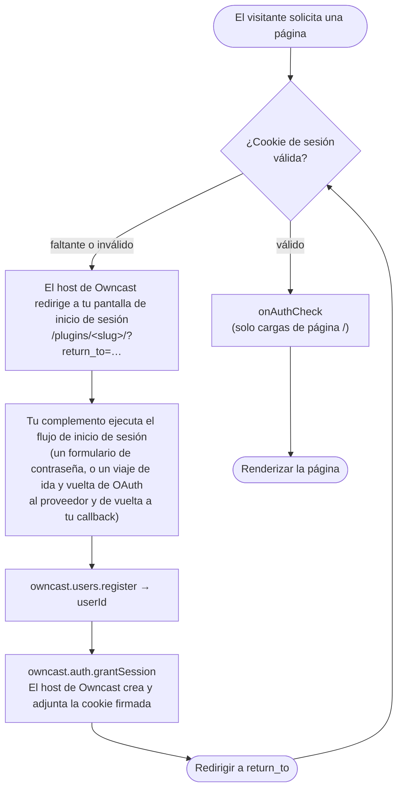

import Tabs from '@theme/Tabs';
import TabItem from '@theme/TabItem';

Un complemento puede ser la **puerta de autenticación** para un sitio de Owncast: los espectadores deben iniciar sesión a través de él antes de poder acceder a la página, al video, al chat o a la API. El complemento proporciona el método de inicio de sesión: OAuth (GitHub, Discord, Google), un enlace mágico, SAML o simplemente una contraseña compartida. Owncast hace cumplir la puerta. Esto reemplaza el patrón de alta fricción "colocar un proxy inverso como Vouch frente a Owncast" con una capacidad de complemento de primera clase.

La división de responsabilidades es todo el modelo:

* **Tu complemento es el proveedor de identidad.** Renderiza la pantalla de inicio de sesión, se comunica con el proveedor externo y decide quién tiene permitido entrar.
* **El host de Owncast es el guardián y autoridad de sesión.** Posee la cookie de sesión, hace cumplir la puerta en cada solicitud y nunca permite que tu complemento se acerque al camino crítico de cada solicitud.

:::info[Se requiere auth.gate]
Todo en esta página necesita el permiso [`auth.gate`](/docs/plugins/permissions#authgate), además de [`users.register`](/docs/plugins/permissions#usersregister) para crear el usuario autenticado y [`http.serve`](/docs/plugins/permissions#httpserve) para renderizar el flujo de inicio de sesión.
:::

## Lo que está restringido

Cuando un complemento `auth.gate` está habilitado, **todo el servidor web está restringido**, no solo la página HTML. La página del espectador (`/`), el video (`/hls/*`), el chat (`/ws`) y la API están detrás de la puerta. Las propias páginas de administración de Owncast son la excepción: permanecen detrás del inicio de sesión de administrador en lugar de la puerta del espectador, por lo que un administrador siempre puede acceder a los controles.

La consecuencia aceptada: **la transmisión solo se puede ver a través de la propia interfaz web de Owncast.** Los reproductores nativos (VLC, QuickTime) no pueden llevar la cookie de sesión, por lo que no pueden reproducir una transmisión restringida.

:::warning[Distribución de tu video con advertencia de almacenamiento externo (almacenamiento por objetos/CDN)]
Al distribuir tu transmisión de video directamente desde tu servidor, la puerta es hermética: cada byte fluye a través de Owncast. Con Almacenamiento por Objetos o CDN, las listas de reproducción se reescriben a URLs remotas absolutas y los segmentos se obtienen directamente del bucket, por lo que la puerta nunca ve esas solicitudes. La restricción aún detiene a un visitante anónimo de *descubrir* la lista de segmentos, pero una URL de segmento *filtrada o compartida* sigue siendo obtenible. **Puerta + distribución local es hermética. Puerta + Almacenamiento por Objetos es buena fricción, no hermética.**
:::

## Cómo funciona

Una vez que la puerta está armada, cada solicitud se verifica, incluidos cada segmento HLS, que un espectador activo solicita cada pocos segundos. Llamar a tu motor embebido del complemento en cada uno de esos sería abrumar el servidor, por lo que se mantiene al complemento fuera del camino crítico:

| Cuando                                              | Costo                                                                       | Qué sucede                                                          |
| --------------------------------------------------- | --------------------------------------------------------------------------- | ------------------------------------------------------------------- |
| **Cada solicitud** (`/hls/*`, imágenes, `/ws`, API) | Verificar firma de cookie + caducidad                                       | válido → pasar, faltante/inválido → redirigir a inicio de sesión    |
| **La página `/` carga solamente**                   | Llamada opcional al motor: [`onAuthCheck`](/docs/plugins/events#auth-check) | re-validate contra tu proveedor, devuelve `ok` / `refresh` / `deny` |

Tu complemento solo ejecuta el **flujo de inicio de sesión** (poco frecuente, aproximadamente una vez por sesión de espectador) y el opcional `onAuthCheck` por carga de página. El host de Owncast crea y verifica una **cookie de sesión firmada** para que la verificación por solicitud sea solo de firma y caducidad: sin búsqueda en base de datos, sin llamada al complemento.

La cookie es un sobre firmado que lleva el token de acceso existente de Owncast del usuario más una caducidad de sesión. El host de Owncast lo posee de extremo a extremo: reserva el nombre de la cookie, la firma con un secreto mantenido por el host y la adjunta a la respuesta. Tu complemento nunca ve o establece el token, por lo que no puede falsificarlo o filtrarlo. (Esto también es cómo el chat recoge automáticamente la identidad del espectador. Consulta [Identidad de chat](#chat-identity) a continuación.)

## Construyendo un complemento de puerta

Un complemento de puerta es un [complemento que sirve HTTP](/docs/plugins/http) con un flujo de inicio de sesión. El ciclo de control, por convención, está arraigado en el propio espacio de nombres de tu complemento `/plugins/\<your-slug>/`:



Tres piezas hacen el trabajo:

1. **Registra el usuario.** Convierte la identidad externa en un verdadero usuario de Owncast con [`owncast.users.register`](/docs/plugins/apis#users-register). Pasa un `authId` estable de alcance del proveedor (ej. `"github:583231"`). El host cuenta con su slug para que los complementos no puedan chocar o suplantarse entre sí.
2. **Concede la sesión.** Llama a [`owncast.auth.grantSession`](/docs/plugins/apis#auth-grant-session) con ese `userId`. El host de Owncast crea la cookie firmada y la adjunta a la respuesta en vuelo. Esto solo funciona dentro de un manejador `onHttpRequest`.
3. **Redirigir a casa.** El host de Owncast adjunta un parámetro de consulta `return_to` cuando reenvía a un visitante no autenticado a tu pantalla de inicio de sesión, y **lo desinfecta a una ruta de mismo origen** (para que no se pueda convertir en una redirección abierta). Envía al espectador allí después de un inicio de sesión exitoso.

Para cerrar la sesión de un espectador, llama a [`owncast.auth.endSession()`](/docs/plugins/apis#auth-end-session) y redirige. Tu complemento todavía controla a dónde (puede rebotar a la propia salida del proveedor).

### Revocación con `onAuthCheck`

Las sesiones son sin estado, por lo que no hay una lista de '¿sigue permitido este usuario?' por solicitud. Eso volvería a poner el complemento en el camino crítico. En cambio, define el manejador opcional [`onAuthCheck`](/docs/plugins/events#auth-check). Se dispara en cada carga de página `/` con la identidad del espectador resuelta y devuelve `ok`, `refresh` (re-emite la cookie, opcionalmente con un nuevo TTL para la caducidad deslizante), o `deny` (finaliza la sesión y rebota a inicio de sesión). Un complemento respaldado por el proveedor revisa nuevamente la membresía aquí (¿organización sigue válida? ¿cuenta no eliminada?).

Debido a que la verificación solo se ejecuta en `/`, un espectador a quien revocas mantiene funcionando cualquier pestaña abierta hasta que se vuelve a cargar o la cookie expira. La **TTL de la sesión es la última línea de defensa** contra la revocación, así que mantenla corta si es importante la revocación rápida.

## Ejemplo trabajado: una puerta de contraseña compartida

El complemento de `basic-auth` es la puerta más simple posible: una contraseña compartida, una identidad compartida de "Invitado", ningún proveedor externo. Se incluye tanto en [`examples/js/basic-auth`](https://github.com/owncast/plugin-sdk/tree/main/examples/js/basic-auth) como en [`examples/python/basic-auth`](https://github.com/owncast/plugin-sdk/tree/main/examples/python/basic-auth).

Su manifiesto declara los permisos y un único campo de configuración para la contraseña:

```json
{
  "name": "Autenticación Básica",
  "slug": "basic-auth",
  "version": "0.1.0",
  "permissions": ["auth.gate", "users.register", "http.serve", "storage.kv"],
  "config": {
    "password": {
      "type": "string",
      "default": "letmein",
      "description": "Contraseña compartida que los espectadores deben ingresar para ver"
    }
  }
}
```

El manejador presenta un formulario de contraseña en `/`, verifica la contraseña enviada contra el valor configurado y, si tiene éxito, registra la identidad compartida, concede una sesión y redirige de vuelta. `onAuthCheck` lee una bandera `revoked` que se puede invertir por el administrador para expulsar a todos en su próxima carga de página. (El ayudante `page()` que construye el formulario HTML se omite a continuación por brevedad. Consulta el código fuente del ejemplo.)

<Tabs groupId="plugin-lang">
<TabItem value="js" label="JavaScript" default>

```js
const { definePlugin, owncast, authCheck } = require('@owncast/plugin-sdk');

module.exports = definePlugin({
  onHttpRequest(req) {
    const query = req.query || {};
    const returnTo = query.return_to || '/';

    if (req.method === 'GET' && req.path === '/') {
      return {
        status: 200,
        headers: { 'content-type': 'text/html' },
        body: page(returnTo),
      };
    }

    if (req.path === '/login') {
      const expected = owncast.config.get('password', 'letmein');
      if ((query.password || '') !== expected) {
        return {
          status: 200,
          headers: { 'content-type': 'text/html' },
          body: page(returnTo, 'Contraseña incorrecta.'),
        };
      }
      // Todos los que conocen la contraseña comparten una identidad autenticada.
      const { userId } = owncast.users.register({
        authId: 'compartido',
        displayName: 'Invitado',
      });
      owncast.auth.grantSession({ userId });
      return { status: 302, headers: { Location: returnTo } };
    }

    if (req.path === '/logout') {
      owncast.auth.endSession();
      return { status: 302, headers: { Location: '/' } };
    }

    // Solo revocación para administradores. req.authenticated es verdadero solo para administradores.
    if (req.path === '/revoke' || req.path === '/unrevoke') {
      if (!req.authenticated) return { status: 403, body: 'solo administradores' };
      owncast.kv.set('revoked', req.path === '/revoke' ? '1' : '');
      return {
        status: 200,
        body: req.path === '/revoke' ? 'revocado' : 'no revocado',
      };
    }

    return { status: 404, body: 'no encontrado' };
  },

  // Re- valida en cada carga de página. Mientras esté revocado, finaliza cada sesión.
  onAuthCheck() {
    if (owncast.kv.get('revoked') === '1') return authCheck.deny('el acceso ha sido revocado');
    return authCheck.ok();
  },
});
```

</TabItem>
<TabItem value="py" label="Python">

```python
from owncast_plugin import plugin, owncast, auth_check


@plugin.get("/")
def login_form(req):
    return_to = (req.raw.get("query") or {}).get("return_to") or "/"
    return {"status": 200, "headers": {"content-type": "text/html"}, "body": page(return_to)}


@plugin.get("/login")
def login(req):
    query = req.raw.get("query") or {}
    return_to = query.get("return_to") or "/"
    expected = owncast.config.get("password", "letmein")
    if (query.get("password") or "") != expected:
        return {"status": 200, "headers": {"content-type": "text/html"},
                "body": page(return_to, "Contraseña incorrecta.")}
    # Todos los que conocen la contraseña comparten una identidad autenticada.
    result = owncast.users.register("compartido", display_name="Invitado")
    owncast.auth.grant_session(result.user_id)
    return {"status": 302, "headers": {"Location": return_to}}


@plugin.get("/logout")
def logout(req):
    owncast.auth.end_session()
    return {"status": 302, "headers": {"Location": "/"}}


@plugin.get("/revoke")
def revoke(req):
    if not req.authenticated:  # verdadero solo para solicitudes de administrador
        return {"status": 403, "body": "solo administradores"}
    owncast.kv.set("revoked", "1")
    return {"status": 200, "body": "revocado"}


@plugin.on_auth_check
def check(_req):
    # Re- valida en cada carga de página. Mientras esté revocado, finaliza cada sesión.
    if owncast.kv.get("revoked") == "1":
        return auth_check.deny("el acceso ha sido revocado")
    return auth_check.ok()
```

</TabItem>
</Tabs>

Para un flujo OAuth real (CSRF `state` en [`storage.kv`](/docs/plugins/permissions#storagekv), un intercambio de código a través de [`network.fetch`](/docs/plugins/permissions#networkfetch), aplicación de membresía de organización, y un URL de callback construido a partir de [`owncast.server.info()`](/docs/plugins/apis#stream-and-server-state)), consulta el ejemplo `github-auth` en el SDK.

## Habilitando la puerta

Declarar `auth.gate` no hace nada por sí solo. La puerta se activa al **habilitar el complemento** a través del ciclo de vida normal de habilitar/deshabilitar en el administrador. Desactivalo y la puerta cae instantáneamente.

* **Solo un complemento `auth.gate` puede estar habilitado a la vez.** Owncast se niega a habilitar un segundo mientras uno ya esté activo ("deshabilita el otro primero").
* **Configura antes de habilitar.** Un complemento puede ser instalado y configurado mientras está deshabilitado, luego habilitarse para entrar en funcionamiento. Usa el [formulario de configuración](https://docs/plugins/configuration) autogenerado para credenciales como un ID de cliente OAuth y secreto.

### Fallar cerrado

La postura de la puerta está desacoplada de la salud de tu complemento. Si la puerta está armada pero el complemento no está disponible (se bloqueó, falló al cargar, tuvo un error o se deshabilitó automáticamente después de fallos repetidos), Owncast **niega todo el tráfico de los espectadores** y sirve una página estática "autenticación temporalmente no disponible". Nunca se abre. El administrador siempre es accesible (las rutas de administrador utilizan la Autenticación Básica existente de Owncast y evitan la puerta) para que puedas corregir la configuración o deshabilitar el complemento. Las sesiones ya válidas sobreviven a una interrupción, porque verificar una cookie no necesita una llamada de complemento.

### Lo que elude la puerta

El principio: la puerta cubre solo la superficie que de otro modo sería pública. Cualquier ruta que ya aplique su propia credencial elude la puerta.

* El propio espacio de nombres del complemento `/plugins/\<your-slug>/*` y sus activos estáticos (por lo que la pantalla de inicio de sesión es accesible mientras estás bloqueado).
* `/admin/*` y `/api/admin/*`, ya detrás de la Autenticación Básica del administrador.
* Rutas de token de API externa, donde un cliente válida portador no lleva cookie y la restricción lo enviaría a una página de inicio de sesión.
* Los propios activos estáticos de la página del espectador (el paquete JS/CSS necesario para renderizar la interfaz de inicio de sesión).

Todo lo demás está restringido, **incluyendo `/api/status` y las incrustaciones**. Filtrar detalles de estado en vivo o recuentos de espectadores a visitantes anónimos socavaría el propósito de la restricción.

## Detalles de la sesión

* **Cookie firmada sin estado**, `HttpOnly`, `Secure` (en solicitudes HTTPS), `SameSite=Lax`, `Path=/`. Lax en lugar de Strict porque el callback del proveedor es una redirección a nivel superior entre sitios.
* **TTL predeterminado es de 24 horas**, con un refresco deslizante disponible a través del veredicto `refresh` de `onAuthCheck`. Debido a que la TTL es el tope para la revocación, es un verdadero control de seguridad.
* **El secreto de firma es responsabilidad del host de Owncast.** Se genera automáticamente en el primer uso y se persiste en la configuración. Rotarlo invalida cada sesión (un botón de pánico). Los autores de complementos nunca lo tocan, y está separado de cualquier secreto de *cliente* de OAuth, que es la preocupación de configuración de tu complemento.

## Identidad de chat {#chat-identity}

Un inicio de sesión de puerta produce automáticamente una identidad de chat autenticada. Debido a que `users.register` crea o vincula un verdadero usuario de Owncast (marcado como autenticado, con un nombre visible sembrado del proveedor) y la cookie de sesión lleva el token de acceso de ese usuario, el chat lee la identidad directamente de la cookie: cuando `/ws` (o una llamada REST de chat) llega sin parámetro de consulta `?accessToken=`, vuelve a usar el token de acceso en la cookie de la puerta. Ningún token se transporta nunca al `localStorage` del navegador. El espectador inicia sesión una vez y aparece en el chat bajo su nombre de proveedor.

## Relacionado

* [Permisos](/docs/plugins/permissions): `auth.gate`, `users.register`
* [APIs de Owncast](/docs/plugins/apis#authentication): `users.register`, `auth.grantSession`, `auth.endSession`
* [Eventos](/docs/plugins/events#auth-check): el manejador `onAuthCheck`
* [Sirviendo HTTP](/docs/plugins/http): el modelo de solicitud en el que se basa el flujo de inicio de sesión
