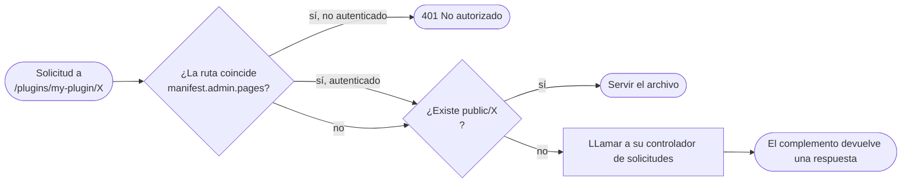

import Tabs from '@theme/Tabs';
import TabItem from '@theme/TabItem';

Los complementos pueden servir sus propias URLs. Una vez que declare `http.serve` en su manifiesto, el espacio de URL en `/plugins/\<su-slug>/` es suyo: los archivos estáticos de su directorio `public/` se sirven tal cual, y cualquier otra cosa pasa a su controlador de solicitudes.

El código se muestra para ambos SDKs. Consulte [JavaScript](/docs/plugins/sdks/javascript) o [Python](/docs/plugins/sdks/python) para la instalación y configuración.

## Enrutamiento

Una vez que `http.serve` esté declarado, el host enruta cada solicitud bajo `/plugins/\<su-slug>/` a su complemento:

1. Archivos estáticos. Cualquier cosa en su directorio `public/` se sirve tal cual.
2. Controlador dinámico. Cualquier otra cosa pasa a su controlador de solicitudes del complemento.



La ruta de una solicitud es relativa al espacio de nombres de su complemento: una solicitud a `/plugins/my-plugin/api/messages` llega a su controlador como `/api/messages` (se excluye la cadena de consulta). El controlador lee parámetros de consulta y el cuerpo de la solicitud desde la solicitud, y devuelve una respuesta con un estado, encabezados opcionales y un cuerpo opcional.

Hay dos estilos de enrutamiento. En **JavaScript**, se escribe un solo controlador `onHttpRequest(req)` y se ramifica en `req.method` / `req.path`. En **Python**, se declaran rutas por método con decoradores. Una solicitud cuya ruta coincide con una ruta pero no con su método recibe un **405** automático, y una ruta no coincidente pasa al catch-all básico, de lo contrario **404**.

<Tabs groupId="plugin-lang">
<TabItem value="js" label="JavaScript" default>

```js
const { definePlugin } = require("@owncast/plugin-sdk");

module.exports = definePlugin({
  onHttpRequest(req) {
    // req: { method, path, headers, query, body, user? }
    if (req.method === "GET" && req.path === "/api/messages") {
      return {
        status: 200,
        headers: { "Content-Type": "application/json" },
        body: "[]",
      };
    }
    if (req.method === "POST" && req.path === "/api/messages") {
      const data = JSON.parse(req.body || "{}");
      return { status: 201 };
    }
    return { status: 404 };
  },
});
```

</TabItem>
<TabItem value="py" label="Python">

```python
from owncast_plugin import plugin

@plugin.get("/api/messages")
def list_messages(req):
    return {"status": 200, "headers": {"Content-Type": "application/json"}, "body": "[]"}

@plugin.post("/api/messages")
def add_message(req):
    body = req.body          # cuerpo de la solicitud sin procesar
    return {"status": 201}

@plugin.on_http_request      # simple: captura todo por defecto (cualquier método, cualquier ruta)
def fallback(req):
    return {"status": 404}
```

Las rutas son exactas y relativas al complemento. Lea los parámetros de consulta de `req.query`. Un controlador devuelve un `dict` (`{status, body, headers}`), un `str` (→ 200), o `None` (→ 204). `@plugin.route(path, methods=[...])` cubre múltiples métodos en una sola ruta.

</TabItem>
</Tabs>

La puerta `manifest.admin.pages` en la parte superior se cubre en [UI: Páginas de administración](/docs/plugins/ui#admin-pages). Desde la perspectiva de la provisión HTTP, es simplemente un filtro de 401 antes de que se ejecute su controlador aplicado a rutas coincidentes.

## Archivos estáticos

El directorio `public/` alberga archivos servidos en `/plugins/\<su-slug>/\<path>`. Un directorio `assets/` separado alberga archivos que el host lee internamente para campos de manifiesto que contienen contenido en línea (`styles`, `scripts`, `extraPageContent`). Esos no son accesibles a través del espacio de URL de su complemento.

```text
my-plugin/
└── public/
    ├── index.html        → /plugins/my-plugin/index.html (y /plugins/my-plugin/)
    ├── style.css         → /plugins/my-plugin/style.css
    └── img/
        └── logo.png      → /plugins/my-plugin/img/logo.png
```

Una solicitud a `/plugins/my-plugin/` (sin ruta de cierre) sirve automáticamente `public/index.html`.

## Límites de solicitud y respuesta

* Los cuerpos de solicitud están limitados a 1 MB.
* Los cuerpos de respuesta están limitados a 10 MB.
* La travesía de ruta (`..`) en URLs está bloqueada a nivel de host. Nunca lo verá en la ruta de su controlador.
* Los encabezados de respuesta se filtran a través de una lista de permitidos. Puede establecer `Content-Type`, `Content-Encoding`, `Content-Language`, `Cache-Control`, `Set-Cookie`, `Location`, `ETag`, `Last-Modified`, `Vary`, `Link`, y encabezados de CORS (`Access-Control-*`). Los encabezados propiedad de Owncast (`Server`, `Content-Security-Policy`, `Strict-Transport-Security`, `X-Frame-Options`) están bloqueados.
* Las cookies que configure se aplican al espacio de URL de su complemento por defecto (`/plugins/\<su-slug>/`). Si desea que una cookie se envíe en solicitudes fuera de esa ruta, configure `Path=...` explícitamente. De lo contrario, el navegador lo limitará a su espacio de nombres y no lo filtrará a otros complementos o a las propias rutas de Owncast.
* Cada solicitud tiene un límite de tiempo de 5 segundos antes de que el host devuelva un `504` y descarte su respuesta.

## Público vs. autenticado

Los puntos finales son públicos por defecto. Para hacer algo solo para administradores, verifique si la solicitud está autenticada dentro de su controlador y devuelva `401` cuando no lo esté, o declare la ruta en `manifest.admin.pages[]` y deje que el host controle por usted (vea [UI: Páginas de administración](/docs/plugins/ui#admin-pages)).

Para solicitudes realizadas por un usuario de chat con un token de usuario válido, la solicitud lleva la identidad del usuario (`id`, nombre para mostrar y `scopes`). Útil para paneles por usuario o herramientas solo para moderadores:

<Tabs groupId="plugin-lang">
<TabItem value="js" label="JavaScript" default>

```js
module.exports = definePlugin({
  onHttpRequest(req) {
    if (!req.user) return { status: 401 };           // no autenticado
    if (!req.user.scopes?.includes("MODERATOR")) return { status: 403 };
    return { status: 200, body: `hola ${req.user.displayName}` };
  },
});
```

</TabItem>
<TabItem value="py" label="Python">

```python
@plugin.get("/my-data")
def my_data(req):
    if not req.user:                                  # no autenticado
        return {"status": 401}
    if "MODERATOR" not in (req.user.scopes or []):
        return {"status": 403}
    return {"status": 200, "body": f"hola {req.user.display_name}"}
```

</TabItem>
</Tabs>

Para rutas declaradas en `manifest.admin.pages[]`, el host devuelve `401` antes de que se ejecute su controlador, por lo que no tiene que verificar en absoluto.

## Actualizaciones en tiempo real (Eventos enviados por el servidor)

Para enviar actualizaciones en vivo a un navegador (una superposición que reacciona al chat, un panel que actualiza el conteo de espectadores, un widget de alerta) declare `http.sse` y use `owncast.sse.send`.

No abre ni mantiene la conexión usted mismo. Su controlador de solicitudes no puede enviar en streaming: cada llamada es una única solicitud/respuesta en búfer. El host posee la conexión de larga duración y expone un punto final listo en `/plugins/\<su-slug>/_sse/\<channel>`. Su complemento envía. El host envía cada mensaje a cada navegador conectado.

```mermaid
sequenceDiagram
    participant Browser
    participant Host as anfitrión de Owncast<br/>/plugins/my-plugin/_sse/overlay
    participant Plugin as Su complemento

    Browser->>Host: new EventSource('/plugins/my-plugin/_sse/overlay')
    Host-->>Browser: conexión abierta, mantenida viva

    Nota sobre el complemento: Llega un mensaje de chat
    Plugin->>Host: owncast.sse.send('overlay', 'chat', payload)
    Host-->>Browser: event: chat<br/>data: { ... }

    Nota sobre el complemento: Otro evento
    Plugin->>Host: owncast.sse.send('overlay', 'chat', payload)
    Host-->>Browser: event: chat<br/>data: { ... }
```

### Lado del complemento

Envíe desde cualquier controlador, por ejemplo, desde su controlador de chat, llamando a `owncast.sse.send(channel, event, data)`:

<Tabs groupId="plugin-lang">
<TabItem value="js" label="JavaScript" default>

```js
const { definePlugin, owncast } = require("@owncast/plugin-sdk");

module.exports = definePlugin({
  onChatMessage(msg) {
    owncast.sse.send("overlay", "chat", {
      from: msg.user?.displayName,
      body: msg.body,
    });
  },
});
```

</TabItem>
<TabItem value="py" label="Python">

```python
from owncast_plugin import plugin, owncast

@plugin.on_chat_message
def push(msg):
    owncast.sse.send("overlay", "chat", {
        "from": msg.user.display_name if msg.user else None,
        "body": msg.body,
    })
```

</TabItem>
</Tabs>

* `channel`: qué flujo enviar. Los navegadores se suscriben por canal, por lo que puede ejecutar varios flujos independientes (`"overlay"`, `"admin-stats"`) desde un solo complemento. Use `""` para un solo canal por defecto.
* `event`: el nombre del evento que el navegador escucha (`addEventListener("chat", ...`). Pase `""` para el evento `message` por defecto del navegador.
* `data`: la carga útil. Las cadenas se envían tal cual. Cualquier otra cosa se codifica en JSON para usted.

Los envíos son fuego y olvido. La llamada devuelve de inmediato y nunca bloquea, incluso si nadie está conectado o un cliente es lento. Los clientes lentos desechas tramas en lugar de bloquear su complemento. También hay eventos de ciclo de vida de conexión SSE (un flujo de un espectador abriéndose y cerrándose) a los que puede suscribirse: consulte la [referencia de controladores](/docs/plugins/events#sse-events).

### Lado del navegador

API estándar `EventSource` en la página del espectador. Sin biblioteca. Esto se ejecuta en el navegador, por lo que siempre es JavaScript independientemente del lenguaje en el que esté escrito su complemento:

```html
<!-- public/index.html, servido en /plugins/my-plugin/ -->
<script>
  const events = new EventSource("/plugins/my-plugin/_sse/overlay");
  events.addEventListener("chat", (e) => {
    const { from, body } = JSON.parse(e.data);
    document.getElementById("feed").textContent = `${from}: ${body}`;
  });
</script>
```

### Notas

* Hasta 64 conexiones simultáneas por complemento. Más que eso, el punto final devuelve `503`. `EventSource` se reconecta automáticamente.
* Si el canal coincide con uno de sus globos de `admin.pages[]`, está controlado por autenticación como cualquier ruta de administrador. Útil para un flujo de estadísticas solo para administradores.
* El punto final es propiedad del host. Su controlador de solicitudes nunca ve solicitudes de `/_sse/...`, y no puede servir su propia ruta allí.

## Poniéndolo todo junto: un complemento de superposición completo

El manifiesto declara los dos permisos que necesita la superposición:

```json
{
  "api": "1",
  "name": "Superposición de chat",
  "slug": "overlay",
  "version": "0.1.0",
  "permissions": ["http.serve", "http.sse"]
}
```

El complemento se suscribe a mensajes de chat y envía cada uno al canal SSE `overlay`:

<Tabs groupId="plugin-lang">
<TabItem value="js" label="JavaScript" default>

```js
// src/plugin.js
const { definePlugin, owncast } = require("@owncast/plugin-sdk");

module.exports = definePlugin({
  onChatMessage(msg) {
    owncast.sse.send("overlay", "chat", {
      from: msg.user?.displayName,
      body: msg.body,
    });
  },
});
```

</TabItem>
<TabItem value="py" label="Python">

```python
# src/plugin.py
from owncast_plugin import plugin, owncast

@plugin.on_chat_message
def push(msg):
    owncast.sse.send("overlay", "chat", {
        "from": msg.user.display_name if msg.user else None,
        "body": msg.body,
    })
```

</TabItem>
</Tabs>

La página del espectador es el mismo fragmento de `EventSource` mostrado arriba, apuntado al punto final relativo `./_sse/overlay`:

```html
<!-- public/index.html -->
<!doctype html>
<body>
  <div id="feed"></div>
  <script>
    const events = new EventSource("./_sse/overlay");
    events.addEventListener("chat", (e) => {
      const { from, body } = JSON.parse(e.data);
      document.getElementById("feed").textContent = `${from}: ${body}`;
    });
  </script>
</body>
```

Construir, empaquetar, instalar. Abra `/plugins/overlay/` en OBS como una fuente de navegador.
