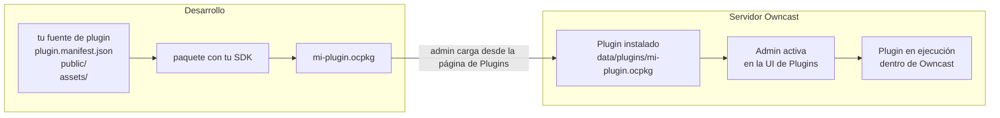

Owncast se puede extender con **plugins**: pequeños programas que el servidor carga en tiempo de ejecución para reaccionar a mensajes de chat, eventos de transmisión, actividad en el fediverso y solicitudes HTTP. Se ejecutan dentro de un entorno aislado, por lo que un plugin puede fallar sin afectar al servidor, y el host impone un modelo de permisos claro, por lo que un administrador siempre sabe qué puede tocar un plugin.

:::info[Novedad en Owncast 0.3.0]
Los plugins son una funcionalidad completamente nueva, introducida en Owncast 0.3.0, y la API aún está evolucionando. Si encuentras un error o tienes una sugerencia, por favor [informa un problema](https://github.com/owncast/plugin-sdk/issues) o [chatea en vivo con la comunidad](/chat?tab=community).
:::

Puedes escribir un plugin en **JavaScript** o **Python**. Los dos SDK son compañeros de primera clase con paridad completa de funciones: los controladores, APIs, permisos y manifiesto en esta sección se aplican a ambos, y solo la estructura y la sintaxis del lenguaje difieren.

## Lo que puedes construir

- Bots de chat que responden a palabras clave o comandos, publican recordatorios, realizan encuestas o moderan spam.
- Filtros que reescriben o eliminan mensajes de chat antes de que lleguen a los espectadores.
- Superposiciones renderizadas sobre tu transmisión, comunicándose con los puntos finales HTTP de tu plugin.
- Integraciones que conectan Owncast con Discord, el fediverso, notificaciones del navegador o cualquier servicio HTTPS.
- Herramientas de administración que añaden una pestaña al UI de administración de Owncast para configuraciones específicas del plugin.
- Botones de acción que aparecen debajo de tu transmisión, lanzando widgets, páginas de donaciones o cualquier cosa que sirvas.

Cada plugin de ejemplo en el SDK es un punto de partida completo que puedes copiar.

## Dos SDK

Ambos SDK producen el mismo `.ocpkg`, se ejecutan en un entorno aislado en el servidor y empaquetan aproximadamente al mismo tamaño. Elige el lenguaje en el que prefieras escribir.

- **[JavaScript](/docs/plugins/sdks/javascript)** con [`@owncast/plugin-sdk`](https://www.npmjs.com/package/@owncast/plugin-sdk). Estructura con `npx create-owncast-plugin`, escribe `definePlugin({ ... })`, compila con `npm run package`.
- **[Python](/docs/plugins/sdks/python)** con [`owncast-plugin-py`](https://pypi.org/project/owncast-plugin-py/). Estructura con `uvx owncast-plugin-py new`, escribe funciones decoradas, compila con `owncast-plugin-py package`.

El mismo bot de eco en cada uno:

```js
// JavaScript
const { definePlugin, owncast } = require('@owncast/plugin-sdk');

module.exports = definePlugin({
  onChatMessage(msg) {
    owncast.chat.send(`eco: ${msg.body}`);
  },
});
```

```python
# Python
from owncast_plugin import plugin, owncast

@plugin.on_chat_message
def echo(msg):
    owncast.chat.send(f"eco: {msg.body}")
```

## Cómo se integra todo

Un plugin es un único archivo `.ocpkg` que contiene el manifiesto de tu plugin, el código compilado y cualquier activo estático. Un administrador coloca el archivo en el directorio `data/plugins/` de Owncast y lo activa desde la página de **Plugins** en la administración.



Una vez activado, el plugin se ejecuta dentro del proceso Owncast. Los controladores que defines se activan cuando ocurren eventos coincidentes. Las APIs que llamas (enviando chat, leyendo configuración, obteniendo URLs) pasan a través del host, que verifica los permisos que declaraste en tu manifiesto.

Cada plugin habilitado utiliza un poco más de memoria del servidor. El primer plugin de un lenguaje también carga el tiempo de ejecución compartido de ese lenguaje, un costo único que es mayor para Python que para JavaScript. Cada plugin adicional después de eso agrega solo una pequeña cantidad más.

## Lo que un plugin puede hacer

1. Suscribirse a eventos. Mensajes de chat, inicio y parada de transmisión, seguimientos del fediverso, nuevos usuarios de chat que se unen. Define un método de controlador y el SDK deriva la suscripción.
2. Filtrar chat. Ve cada mensaje de chat antes de que se difunda, modifícalo o elimínalo.
3. Llamar a las APIs de Owncast. `owncast.chat.send(text)`, `owncast.kv.get(key)`, `owncast.http.fetch(url)`, y docenas más, la mayoría controladas por un permiso declarado.
4. Servir HTTP. Cada plugin puede poseer el espacio de URL en `/plugins/<tu-slug>/...` tanto para activos estáticos como para controladores dinámicos.
5. Agregar UI. Declara páginas de administración, botones de acción, hojas de estilo de plugins, scripts de plugins o un bloque HTML de contenido extra en tu manifiesto y Owncast los inserta en su propia interfaz.
6. Controlar el acceso. Un plugin puede ser el proveedor de autenticación del sitio. Haz que los espectadores inicien sesión (OAuth, una contraseña, cualquier cosa por HTTP) antes de que puedan acceder a la página, el video, el chat o la API.

## Lo que un plugin no puede hacer

Por diseño:

- Sin acceso directo al sistema de archivos del host, red o procesos. El entorno aislado hace cumplir esto. Los plugins hacen lo que las APIs del host exponen, y solo con permisos declarados.
- Sin suplantación de identidad. Cada plugin recibe una identidad de chat (el bot que Owncast proporciona en la instalación), y las publicaciones salientes del fediverso provienen de la cuenta del streamer.
- Sin lecturas entre plugins. El almacenamiento clave-valor de cada plugin tiene un espacio de nombres.
- Sin bloqueo indefinido de chat. Las llamadas a los filtros tienen un límite de tiempo de 50 ms, y un plugin que lanza errores repetidamente se desactiva automáticamente.

Por eso un administrador puede instalar un plugin de terceros sin auditar cada línea de código. El límite de confianza es la lista de permisos del manifiesto.

## Dónde ir a continuación

- [Guía rápida](/docs/plugins/quickstart). Estructura un nuevo plugin, compílalo, instálalo.
- [JavaScript](/docs/plugins/sdks/javascript) y [Python](/docs/plugins/sdks/python). La configuración específica del idioma, CLI y sintaxis para cada SDK.
- [Referencia de manifiesto](/docs/plugins/manifest). Cada campo que tu `plugin.manifest.json` puede contener.
- [Plugins de chat](/docs/plugins/chat). Crea bots, herramientas de moderación y filtros de chat.
- [Eventos](/docs/plugins/events). Cada evento al que tu plugin puede suscribirse, con formas de carga útil.
- [APIs de Owncast](/docs/plugins/apis). Cada método `owncast.*`, lo que hace y el permiso que necesita.
- [Permisos](/docs/plugins/permissions). La lista completa y cómo funciona el modelo de seguridad.
- [Servir HTTP](/docs/plugins/http). Sirve URLs desde tu plugin y envía eventos en tiempo real a los navegadores.
- [Contribuyendo a la UI](/docs/plugins/ui). Registra páginas de administración y contribuye con botones de acción debajo de la transmisión.
- [Pruebas](/docs/plugins/testing). Pruebas de escenario que llevan tu plugin a través del tiempo de ejecución real.
- [Empaquetado y publicación](/docs/plugins/packaging). Agrupa el `.ocpkg`, instálalo y anúncialo en el directorio.

## Origen

- Código fuente del SDK: [github.com/owncast/plugin-sdk](https://github.com/owncast/plugin-sdk)
- Plugins de ejemplo, uno por función: [JavaScript](https://github.com/owncast/plugin-sdk/tree/main/examples/js) · [Python](https://github.com/owncast/plugin-sdk/tree/main/examples/python)
