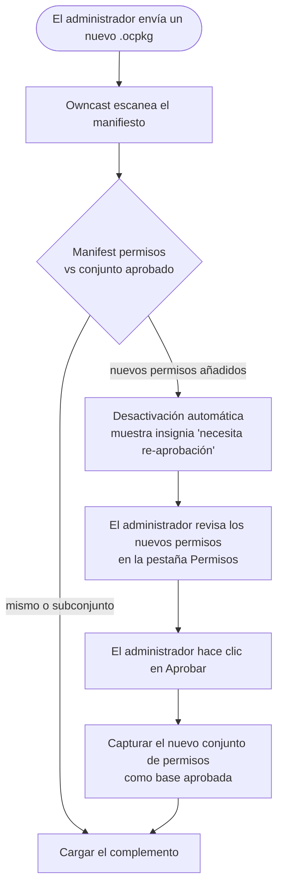

Cada complemento de Owncast se ejecuta en un sandbox sin acceso implícito a nada fuera del complemento mismo. Para hacer un trabajo útil (leer el chat, publicar en el fediverso, obtener una URL, escribir en un almacén clave-valor), su complemento solicita al anfitrión a través de métodos `owncast.*`. Cada uno de esos métodos está controlado por un permiso que declares en tu manifiesto.

Cuando un administrador instala un complemento, la pestaña **Permisos** en la página de detalles del complemento enumera exactamente lo que el complemento solicitó, en un lenguaje sencillo. Esa es la frontera de confianza: un administrador puede instalar un complemento de terceros sin auditar cada línea de código, porque el manifiesto es el límite superior de lo que el complemento puede hacer.


:::info[Disponible en cada SDK]
Los identificadores de permisos y el modelo de confianza a continuación son los mismos, independientemente de qué SDK uses. Los métodos `owncast.*` se mencionan aquí por sus nombres canónicos. Para la ortografía exacta en tu idioma, consulta la referencia del SDK de **[JavaScript](/docs/plugins/sdks/javascript)** o **[Python](/docs/plugins/sdks/python)**.
:::

## Cómo funciona

1. Declara permisos en `plugin.manifest.json`:

   ```json
   { "permissions": ["chat.send", "storage.kv"] }
   ```

2. El administrador los revisa al habilitarlos. La página de detalles del complemento de Owncast enumera cada permiso con una descripción comprensible.

3. El anfitrión los hace cumplir en tiempo de ejecución. Llamar a `owncast.chat.send(...)` sin `chat.send` en tu manifiesto genera un error claro antes de que la llamada llegue a Owncast.

4. El anfitrión detecta cambios inesperados. Tu complemento construido declara los permisos que utiliza en tiempo de ejecución. El anfitrión compara eso con el manifiesto y se niega a cargar el complemento si el tiempo de ejecución solicita más de lo que concede el manifiesto. No puedes obtener acceso adicional cambiando el archivo del complemento después del hecho.

### Re-aprobación cuando los permisos se expanden

Si envías una actualización que solicita más permisos de los que el administrador aprobó previamente, Owncast desactiva automáticamente el complemento y muestra una insignia de "necesita re-aprobación" en la lista de complementos. El administrador revisa los nuevos permisos en la pestaña **Permisos** y hace clic en **Aprobar** para aceptar el conjunto ampliado y volver a habilitar el complemento. Reducir permisos es silencioso.



Las capacidades efectivas de un complemento instalado nunca crecen sin que el administrador lo apruebe nuevamente.

## Referencia de permisos

### `chat.send`

Otorga:

- `owncast.chat.send(text)`: publicar como la identidad del bot del complemento
- `owncast.chat.sendAction(text)`: publicar un mensaje "/me"
- `owncast.chat.sendTo(clientId, text)`: mensaje privado a un cliente conectado
- `owncast.chat.system(body)`: publicar un mensaje del sistema sin identidad de usuario, renderizado como un anuncio del servidor (el cuerpo es HTML)

Los mensajes pasan por la canalización de chat normal de Owncast (filtros, límites de tasa, persistencia, moderación). Los complementos no pueden enviar bajo nombres arbitrarios ni suplantar a usuarios reales.

### `chat.history`

Otorga:

- `owncast.chat.history(limit?)`: leer mensajes recientes del chat
- `owncast.chat.clients()`: listar clientes conectados al chat

Solo lectura.

### `chat.moderate`

Otorga:

- `owncast.chat.deleteMessage(messageId)`: ocultar un mensaje de los espectadores
- `owncast.chat.kick(clientId)`: desconectar un cliente de chat

### `chat.filter`

Otorga la capacidad de definir `filterChatMessage(msg)`: ver cada mensaje de chat antes de que se transmita, con la posibilidad de reescribirlo o eliminarlo.

El filtrado ocurre en línea en cada mensaje de chat, por lo que el administrador necesita ver esto específicamente llamado. El anfitrión rechaza la carga si un complemento define `filterChatMessage` sin declarar este permiso.

### `users.read`

Otorga:

- `owncast.users.list()`: leer la lista de usuarios del chat
- `owncast.users.get(id)`: leer un registro de usuario individual

### `users.moderate`

Otorga:

- `owncast.users.setEnabled(id, enabled, reason?)`: habilitar o deshabilitar a un usuario
- `owncast.users.banIP(ip)`: prohibir una IP de unirse al chat

### `users.register`

Otorga `owncast.users.register({ authId, displayName?, scopes? })`: encontrar o crear un usuario de Owncast autenticado para una identidad externa y devolver su `userId`. El `authId` es un identificador estable, delimitado por el proveedor (por ejemplo, `"github:583231"`); el anfitrión lo organiza por el slug de tu complemento, de modo que dos complementos no pueden colisionar o suplantar a los usuarios de los demás.

Así es como un complemento convierte un inicio de sesión de terceros (OAuth, Discord, una contraseña compartida) en un usuario real de Owncast con una identidad de chat autenticada. Por sí solo, no limita el sitio ni emite una sesión: combínalo con `auth.gate` para construir una puerta de inicio de sesión, o úsalo solo para crear identidades de chat verificadas.

### `auth.gate`

Otorga la puerta de autenticación de espectadores:

- `owncast.auth.grantSession({ userId, ttl? })`: emitir una sesión firmada para un usuario ya registrado (ver `users.register`)
- `owncast.auth.endSession()`: limpiar la sesión actual del espectador (cerrar sesión)
- el controlador opcional `onAuthCheck`: revalidar la sesión de un espectador en cada carga de página

Un complemento que tiene `auth.gate` es un **proveedor de identidad**. Mientras esté habilitado, cada espectador debe autenticarse a través de él antes de poder acceder a la página, al video, al chat o a la API. Solo se puede habilitar un complemento `auth.gate` a la vez, y la puerta falla cerrada: si el complemento no está disponible, los espectadores son excluidos en lugar de permitidos. Consulta **[Autenticación](/docs/plugins/auth)** para el modelo completo.

### `storage.kv`

Otorga `owncast.kv.get(key)` y `owncast.kv.set(key, value)`: una tienda de claves/valores con nombre por complemento. Los complementos no pueden leer las claves de los demás.

El estado persiste a través de recargas y reinicios del anfitrión.

### `storage.upload`

Otorga `owncast.storage.upload(name, bytes)`: cargar un archivo en el área de archivos pública de Owncast y obtener de vuelta una URL. Útil para insignias, imágenes generadas dinámicamente, archivos adjuntos de publicaciones del fediverso.

### `storage.fs`

Otorga `owncast.fs.*`: un sistema de archivos privado y en sandbox en `data/plugin-data/<your-slug>/` que tu complemento puede leer, escribir, listar y eliminar. Útil para cachés, archivos de datos generados, registros de estilo append o cualquier cosa que necesites persistir como archivos reales en lugar de cadenas clave/valor.

A diferencia de `storage.upload`, estos archivos permanecen **del lado del servidor**: nunca se sirven a través de HTTP. Cada ruta está confinada al propio directorio de tu complemento: un complemento no puede leer los archivos de otro complemento ni escapar de su sandbox (`../` y rutas absolutas se colapsan de nuevo dentro).

### `network.fetch`

Otorga `owncast.http.fetch(url, opts?)`: HTTP saliente sincrónico.

Requiere una lista `network.allowedHosts` en el manifiesto. El anfitrión rechaza la carga si se otorga `network.fetch` sin una lista permitida. Cada llamada se revisa contra la lista permitida. Los anfitriones que no coinciden devuelven un error antes de que se envíen bytes desde el servidor.

```json
{
  "permissions": ["network.fetch"],
  "network": { "allowedHosts": ["api.discord.com", "*.weather.com"] }
}
```

El comodín `"*"` es permitido pero debe escribirse explícitamente para que los administradores que revisan el manifiesto vean el alcance. La interfaz de usuario del administrador presenta la lista completa `allowedHosts` en la pestaña **Permisos** junto a la fila `network.fetch`, por lo que un operador de servidor que revisa un complemento ve exactamente a qué hosts puede acceder sin descomprimir el `.ocpkg`.

### `events.emit`

Otorga `owncast.events.emit(eventType, payload)`: emitir un evento personalizado al que otros complementos pueden suscribirse a través de `on: { ... }`.

Suscribirse a eventos emitidos por otros complementos no requiere un permiso.

### `http.serve`

Otorga al enrutador HTTP del anfitrión el permiso para enviar solicitudes a `/plugins/<your-slug>/*` a tu complemento. Esto cubre tanto archivos estáticos en tu directorio `public/` como solicitudes dinámicas enrutadas a tu controlador `onHttpRequest`.

Sin este permiso, todo el espacio URL `/plugins/<your-slug>/` devuelve `404`.

### `http.sse`

Otorga `owncast.sse.send(channel, event, data)` y expone un punto de entrada de propiedad del host en `/plugins/<your-slug>/_sse/<channel>` al que los navegadores se conectan con `EventSource`. Independiente de `http.serve`. Un complemento puede enviar eventos sin servir ninguna otra ruta.

### `server.read`

Otorga las API de estado de lectura y de transmisión:

- `owncast.stream.current()`: estado de la transmisión en vivo
- `owncast.stream.broadcaster()`: telemetría de codificación de entrada
- `owncast.server.info()`: nombre del servidor, versión, resumen
- `owncast.server.socials()`: enlaces sociales configurados
- `owncast.server.federation()`: configuraciones del fediverso
- `owncast.server.tags()`: etiquetas configuradas

### `videoconfig.read`

Otorga `owncast.videoConfig.read()`: leer la configuración de salida y transcodificación (codecs, nivel de latencia, variantes de transmisión).

### `videoconfig.write`

Otorga `owncast.videoConfig.write(partial)`: modificar la configuración de salida de video.

Alta confianza. Los cambios se aplican en el próximo inicio de transmisión. El anfitrión no reinicia una transmisión activa. Los administradores deben conceder con moderación.

### `notifications.send`

Otorga las API de notificación del transmisor:

- `owncast.notifications.discord(text)`: a través del webhook de Discord configurado del transmisor
- `owncast.notifications.browserPush({ title, body, url? })`: a los navegadores suscritos
- `owncast.notifications.fediverse({ type, body, image?, link? })`: notificación formateada para el fediverso

### `fediverse.inbound`

Otorga suscripción a todos los siete eventos entrantes de complementos del Fediverso:

- `fediverse.follow`
- `fediverse.like`
- `fediverse.repost`
- `fediverse.quote`
- `fediverse.mention`
- `fediverse.reply`
- `fediverse.activity`

El `fediverse.activity` general recibe el objeto JSON sin procesar de la actividad verificada. Se ejecuta además de cualquier evento especializado coincidente. Este permiso solo cubre la recepción de actividad. Publicar desde la cuenta de Owncast requiere el permiso separado `fediverse.post`.

### `fediverse.post`

Otorga `owncast.fediverse.post(text)`: hacer una publicación pública en el fediverso desde la cuenta de Owncast.

Alta confianza: las publicaciones se realizan bajo el propio manejo del fediverso del transmisor y no pueden ser revocadas silenciosamente. Los administradores deben conceder con moderación.

### `ui.modify`

Otorga la capacidad de colocar la interfaz de usuario dentro del propio marco de Owncast:

- Declarar `manifest.actions` (botones de acción bajo la transmisión).
- Llamar a `owncast.actions.add(...)` / `.clear()` en tiempo de ejecución.
- Declarar `manifest.styles` (CSS en línea en la página del espectador).
- Declarar `manifest.scripts` (JavaScript en línea en la página del espectador).
- Declarar `manifest.extraPageContent` (un bloque HTML precedido al área de contenido adicional del espectador).
- Declarar `manifest.tabs` (pestañas adicionales en la fila de pestañas de la página del espectador).
- Implementar un controlador `onPageStyles` o `onPageScripts` (CSS o JavaScript devueltos en el momento de la solicitud, sin campo de manifiesto).

Sin este permiso, los manifiestos que declaran cualquiera de esos campos son rechazados al cargar. Los controladores `onPageStyles` y `onPageScripts` no tienen campo de manifiesto, por lo que no son rechazados al cargar. El anfitrión simplemente no los llama a menos que el complemento tenga `ui.modify`. Cada uno de estos llega a la página del espectador en lugar de mantenerse dentro del propio espacio URL del complemento, por lo que el administrador necesita ver el permiso para entender que el complemento pinta en la interfaz de usuario del anfitrión.

Ninguno de los cuatro campos de inyección en el espectador requiere `http.serve`, ni tampoco los dos controladores. El anfitrión lee cada archivo del directorio `assets/` del complemento (no desde una URL), o llama al controlador, e inserta el resultado en las respuestas de configuración existentes / de JS personalizadas, por lo que con `ui.modify` solo es suficiente.

## Tabla de resumen

| Permiso              | Concesiones                                                                                                                                      |
| -------------------- | ------------------------------------------------------------------------------------------------------------------------------------------------ |
| `chat.send`          | `owncast.chat.send`, `.sendAction`, `.sendTo`, `.system`                                                                                         |
| `chat.history`       | `owncast.chat.history`, `.clients`                                                                                                               |
| `chat.moderate`      | `owncast.chat.deleteMessage`, `.kick`                                                                                                            |
| `chat.filter`        | Suscribirse a `filterChatMessage` (leer, modificar o eliminar cada mensaje de chat).                          |
| `users.read`         | `owncast.users.list`, `.get`                                                                                                                     |
| `users.moderate`     | `owncast.users.setEnabled`, `.banIP`                                                                                                             |
| `users.register`     | `owncast.users.register`: encontrar o crear un usuario autenticado para una identidad externa                                    |
| `auth.gate`          | `owncast.auth.grantSession`, `.endSession`, y el manejador `onAuthCheck`: ser la puerta de enlace de autenticación del sitio     |
| `storage.kv`         | Almacenamiento de clave/valor con nombre de espacio por complemento                                                                              |
| `storage.upload`     | Subir archivos al área de archivos públicos de Owncast                                                                                           |
| `storage.fs`         | Sistema de archivos del lado del servidor privado y con sandbox en `data/plugin-data/<tu-slug>/`                                                 |
| `network.fetch`      | HTTP saliente. También requiere `network.allowedHosts`                                                                           |
| `events.emit`        | Emitir eventos personalizados para otros complementos                                                                                            |
| `http.serve`         | Servir HTTP en `/plugins/<tu-slug>/*`                                                                                                            |
| `http.sse`           | Enviar eventos en tiempo real a través de `owncast.sse.send` y el punto de enlace `/_sse/`                                                       |
| `server.read`        | Leer el estado de la transmisión, configuración del servidor, codificar telemetría                                                               |
| `videoconfig.read`   | Leer la configuración de salida/transcodificación                                                                                                |
| `videoconfig.write`  | Modificar la configuración de salida de video (se aplica al inicio de la próxima transmisión)                                 |
| `notifications.send` | Enviar notificaciones de Discord, push del navegador o del fediverso                                                                             |
| `fediverse.inbound`  | Suscribirse a los siete eventos entrantes: `fediverse.follow`, `.like`, `.repost`, `.quote`, `.mention`, `.reply`, y `.activity` |
| `fediverse.post`     | Publicar en el fediverso (limitado por tasa)                                                                                  |
| `ui.modify`          | Agregar botones de acción o pestañas en el chrome del visor de Owncast. CSS, JavaScript o HTML en línea en la página del visor   |

## Principio de menor privilegio

Declara solo lo que realmente usas. Cuanto más estrecho sea tu manifiesto, más fácil será la decisión de confianza del administrador. Si te encuentras enumerando todos los permisos, retrocede y observa si tu complemento realmente debería ser dos complementos.

Si dejas de usar un permiso durante el desarrollo, elimínalo del manifiesto. Reducir es silencioso. No hay fricción al eliminar entradas no utilizadas.
