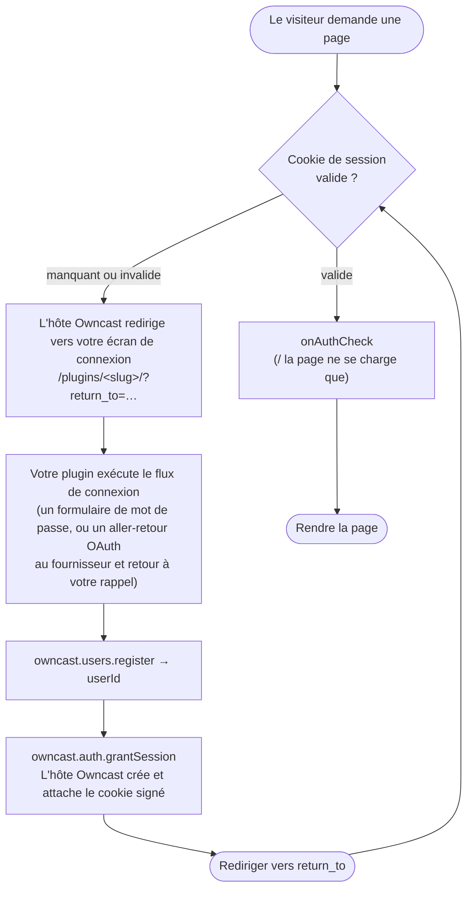

import Tabs from '@theme/Tabs';
import TabItem from '@theme/TabItem';

Un plugin peut être la **porte d'authentification** pour un site Owncast : les spectateurs doivent s'y connecter avant de pouvoir atteindre la page, la vidéo, le chat, ou l'API. Le plugin fournit la méthode de connexion : OAuth (GitHub, Discord, Google), un lien magique, SAML, ou simplement un mot de passe partagé. Owncast impose la porte. Cela remplace le schéma à friction élevée "mettre un proxy inverse comme Vouch devant Owncast" par une capacité de plugin de première classe.

La répartition des responsabilités est tout le modèle :

* **Votre plugin est le fournisseur d'identité.** Il rend l'écran de connexion, communique avec le fournisseur externe, et décide qui est autorisé à entrer.
* **L'hôte Owncast est le gardien et l'autorité de session.** Il possède le cookie de session, impose la porte à chaque demande, et ne laisse jamais votre plugin s'approcher du chemin chaud par demande.

:::info[Nécessite auth.gate]
Tout sur cette page nécessite la permission [`auth.gate`](/docs/plugins/permissions#authgate), plus [`users.register`](/docs/plugins/permissions#usersregister) pour créer l'utilisateur authentifié et [`http.serve`](/docs/plugins/permissions#httpserve) pour rendre le flux de connexion.
:::

## Ce qui est soumis à l'authentification

Lorsqu'un plugin `auth.gate` est activé, **l'ensemble du serveur web est soumis à l'authentification**, pas seulement la page HTML. La page du spectateur (`/`), la vidéo (`/hls/*`), le chat (`/ws`), et l'API sont tous derrière la porte. Les propres pages d'administration d'Owncast sont l'exception : elles restent derrière la connexion administrateur plutôt que la porte du spectateur, de sorte qu'un administrateur puisse toujours accéder aux contrôles.

La conséquence acceptée : **le flux n'est visible que par l'interface web d'Owncast.** Les lecteurs natifs (VLC, QuickTime) ne peuvent pas transporter le cookie de session, donc ils ne peuvent pas lire un flux soumis à l'authentification.

:::warning[Distribution de votre vidéo avec stockage externe (Stockage d'objets/CDN) mise en garde]
Lors de la distribution de votre flux vidéo directement depuis votre serveur, la porte est hermétique : chaque octet passe par Owncast. Avec le Stockage d'objets ou le CDN, les listes de lecture sont réécrites en URL distantes absolues et les segments sont récupérés directement à partir du compartiment, donc la porte ne voit jamais ces demandes. La porte empêche toujours un visiteur anonyme de *découvrir* la liste des segments, mais une URL de segment *fuitée ou partagée* reste récupérable. **La porte + distribution locale est hermétique. La porte + stockage d'objets génère une bonne friction, mais n'est pas hermétique.**
:::

## Comment ça fonctionne

Une fois la porte armée, chaque demande est vérifiée, y compris chaque segment HLS, que chaque spectateur en direct tire toutes les quelques secondes. Appeler le moteur intégré de votre plugin à chacune de ces demandes ferait fondre le serveur, donc le plugin est tenu hors du chemin chaud :

| Quand                                             | Coût                                                                          | Que se passe-t-il ?                                                              |
| ------------------------------------------------- | ----------------------------------------------------------------------------- | -------------------------------------------------------------------------------- |
| **Chaque demande** (`/hls/*`, images, `/ws`, API) | Vérifiez la signature du cookie + expiration                                  | valide → passer, manquant/invalid → rediriger vers la connexion                  |
| **La page `/` ne se charge que**                  | Appel facultatif du moteur : [`onAuthCheck`](/docs/plugins/events#auth-check) | re-vérifier auprès de votre fournisseur, renvoie `ok` / `rafraîchir` / `refuser` |

Votre plugin exécute uniquement le **flux de connexion** (rare, environ une fois par session de spectateur) et le `onAuthCheck` facultatif par chargement de page. L'hôte Owncast crée et vérifie un **cookie de session signé** afin que la vérification par demande ne soit que par signature et expiration : pas de recherche en base de données, pas d'appel au plugin.

Le cookie est une enveloppe signée contenant le jeton d'accès Owncast existant de l'utilisateur ainsi qu'une expiration de session. L'hôte Owncast le possède de bout en bout : il réserve le nom du cookie, le signe avec un secret détenu par l'hôte, et l'attache à la réponse. Votre plugin ne voit jamais ni ne définit le jeton, donc il ne peut pas en forger ou en divulguer un. (C'est aussi ainsi que le chat récupère automatiquement l'identité du spectateur. Voir [Identité du chat](#chat-identity) ci-dessous.)

## Création d'un plugin de porte

Un plugin de porte est un [plugin servant HTTP](/docs/plugins/http) avec un flux de connexion. La boucle de contrôle, par convention, est enracinée dans l'espace de noms de votre plugin `/plugins/\<your-slug>/`:



Trois éléments effectuent le travail :

1. **Inscrire l'utilisateur.** Transformez l'identité externe en un véritable utilisateur Owncast avec [`owncast.users.register`](/docs/plugins/apis#users-register). Passez un `authId` stable, périmé par le fournisseur (ex. `"github:583231"`). L'hôte lui attribue par votre slug afin que les plugins ne puissent pas se heurter ou se falsifier.
2. **Accorder la session.** Appelez [`owncast.auth.grantSession`](/docs/plugins/apis#auth-grant-session) avec ce `userId`. L'hôte Owncast crée le cookie signé et l'attache à la réponse en vol. Cela ne fonctionne qu'à l'intérieur d'un gestionnaire `onHttpRequest`
3. **Redirigez vers l'accueil.** L'hôte Owncast ajoute un paramètre de requête `return_to` lorsqu'il redirige un visiteur non authentifié vers votre écran de connexion, et **le sanitise en un chemin de même origine** (afin qu'il ne puisse pas être transformé en une redirection ouverte). Envoyez le spectateur là après une connexion réussie.

Pour déconnecter un spectateur, appelez [`owncast.auth.endSession()`](/docs/plugins/apis#auth-end-session) et redirigez. Votre plugin contrôle toujours où aller (il peut rediriger vers la déconnexion de son propre fournisseur).

### Révocation avec `onAuthCheck`

Les sessions sont sans état, donc il n'y a pas de liste de "cet utilisateur est-il toujours autorisé" par requête. Cela remettrait le plugin sur le chemin chaud. Au lieu de cela, définissez le gestionnaire optionnel [`onAuthCheck`](/docs/plugins/events#auth-check). Il se déclenche à chaque chargement de page `/` avec l'identité du spectateur résolue, et renvoie `ok`, `refresh` (réémettre le cookie, éventuellement avec un nouveau TTL pour l'expiration glissante), ou `deny` (mettre fin à la session et renvoyer vers la connexion). Un plugin soutenu par le fournisseur vérifie à nouveau l'adhésion ici (organisation toujours valide ? compte non supprimé ?).

Parce que la vérification ne s'exécute que sur `/`, un spectateur que vous révoquez garde n'importe quel onglet ouvert fonctionnant jusqu'à ce qu'il recharge ou que le cookie expire. **Le TTL de la session est la limite stricte** pour la révocation, donc gardez-le court si une révocation rapide est importante.

## Exemple de travail : une porte avec mot de passe partagé

Le plugin d'exemple `basic-auth` est la porte la plus simple possible : un mot de passe partagé, une seule identité "Invité" partagée, aucun fournisseur externe. Il est disponible dans [`examples/js/basic-auth`](https://github.com/owncast/plugin-sdk/tree/main/examples/js/basic-auth) et [`examples/python/basic-auth`](https://github.com/owncast/plugin-sdk/tree/main/examples/python/basic-auth).

Son manifeste déclare les permissions et un seul champ de configuration pour le mot de passe :

```json
{
  "name": "Authentification de Base",
  "slug": "basic-auth",
  "version": "0.1.0",
  "permissions": ["auth.gate", "users.register", "http.serve", "storage.kv"],
  "config": {
    "password": {
      "type": "string",
      "default": "letmein",
      "description": "Mot de passe partagé que les spectateurs doivent entrer pour regarder"
    }
  }
}
```

Le gestionnaire affiche un formulaire de mot de passe à `/`, vérifie le mot de passe soumis contre la valeur configurée, et, en cas de succès, enregistre l'identité partagée, accorde une session, et redirige en retour. `onAuthCheck` lit un drapeau `révoqué` modifiable par l'administrateur pour mettre tout le monde hors ligne lors de leur prochain chargement de page. (L'aide `page()` qui construit le formulaire HTML est omise ci-dessous pour plus de concision. Voir la source de l'exemple.)

<Tabs groupId="plugin-lang">
<TabItem value="js" label="JavaScript" default>

```js
const { definePlugin, owncast, authCheck } = require('@owncast/plugin-sdk');

module.exports = definePlugin({
  onHttpRequest(req) {
    const query = req.query || {};
    const returnTo = query.return_to || '/';

    if (req.method === 'GET' && req.path === '/') {
      return {
        status: 200,
        headers: { 'content-type': 'text/html' },
        body: page(returnTo),
      };
    }

    if (req.path === '/login') {
      const expected = owncast.config.get('password', 'letmein');
      if ((query.password || '') !== expected) {
        return {
          status: 200,
          headers: { 'content-type': 'text/html' },
          body: page(returnTo, 'Mot de passe incorrect.'),
        };
      }
      // Tout le monde qui connaît le mot de passe partage une identité authentifiée.
      const { userId } = owncast.users.register({
        authId: 'shared',
        displayName: 'Invité',
      });
      owncast.auth.grantSession({ userId });
      return { status: 302, headers: { Location: returnTo } };
    }

    if (req.path === '/logout') {
      owncast.auth.endSession();
      return { status: 302, headers: { Location: '/' } };
    }

    // Activez la révocation uniquement pour les administrateurs. req.authenticated est vrai uniquement pour les demandes d'administration.
    if (req.path === '/revoke' || req.path === '/unrevoke') {
      if (!req.authenticated) return { status: 403, body: 'administrateur uniquement' };
      owncast.kv.set('révoqué', req.path === '/revoke' ? '1' : '');
      return {
        status: 200,
        body: req.path === '/revoke' ? 'révoqué' : 'non révoqué',
      };
    }

    return { status: 404, body: 'non trouvé' };
  },

  // Validez à nouveau à chaque chargement de page. Tant que révoqué, terminez chaque session.
  onAuthCheck() {
    if (owncast.kv.get('révoqué') === '1') return authCheck.deny('l’accès a été révoqué');
    return authCheck.ok();
  },
});
```

</TabItem>
<TabItem value="py" label="Python">

```python
from owncast_plugin import plugin, owncast, auth_check


@plugin.get("/")
def login_form(req):
    return_to = (req.raw.get("query") or {}).get("return_to") or "/"
    return {"status": 200, "headers": {"content-type": "text/html"}, "body": page(return_to)}


@plugin.get("/login")
def login(req):
    query = req.raw.get("query") or {}
    return_to = query.get("return_to") or "/"
    expected = owncast.config.get("password", "letmein")
    if (query.get("password") or "") != expected:
        return {"status": 200, "headers": {"content-type": "text/html"},
                "body": page(return_to, "Mot de passe incorrect.")}
    # Tout le monde qui connaît le mot de passe partage une identité authentifiée.
    result = owncast.users.register("shared", display_name="Invité")
    owncast.auth.grant_session(result.user_id)
    return {"status": 302, "headers": {"Location": return_to}}


@plugin.get("/logout")
def logout(req):
    owncast.auth.end_session()
    return {"status": 302, "headers": {"Location": "/"}}


@plugin.get("/revoke")
def revoke(req):
    if not req.authenticated:  # vrai uniquement pour les demandes d'administration
        return {"status": 403, "body": "administrateur uniquement"}
    owncast.kv.set("révoqué", "1")
    return {"status": 200, "body": "révoqué"}


@plugin.on_auth_check
def check(_req):
    # Validez à nouveau à chaque chargement de page. Tant que révoqué, terminez chaque session.
    if owncast.kv.get("révoqué") == "1":
        return auth_check.deny("l’accès a été révoqué")
    return auth_check.ok()
```

</TabItem>
</Tabs>

Pour un vrai flux OAuth (CSRF `state` dans [`storage.kv`](/docs/plugins/permissions#storagekv), un échange de code sur [`network.fetch`](/docs/plugins/permissions#networkfetch), validation de l'adhésion à une organisation, et une URL de rappel construite à partir de [`owncast.server.info()`](/docs/plugins/apis#stream-and-server-state)), voir l'exemple `github-auth` dans le SDK.

## Activation de la porte

Déclarer `auth.gate` ne fait rien en soi. La porte est armée par **l’activation du plugin** via le cycle normal d’activation/désactivation dans l’administration. Désactivez-le et la porte tombe instantanément.

* **Un seul plugin `auth.gate` peut être activé à la fois.** Owncast refuse d'activer un second alors qu'un est déjà actif ("désactivez l'autre d'abord").
* **Configurez avant d’activer.** Un plugin peut être installé et configuré tout en étant désactivé, puis activé pour être mis en ligne. Utilisez le [formulaire de configuration auto-généré](/docs/plugins/configuration) pour des identifiants comme un ID client OAuth et un secret.

### Échouer avec une fermeture

La posture de la porte est découplée de la santé de votre plugin. Si la porte est armée mais que le plugin est indisponible (planté, échec de chargement, erreur ou désactivé automatiquement après des échecs répétés), Owncast \*\* interdit tout trafic de spectateurs \*\* et sert une page statique "authentification temporairement indisponible". Elle ne s'ouvre jamais. L'administrateur est toujours joignable (les routes d'administration utilisent l'authentification de base existante d'Owncast et contournent la porte) afin que vous puissiez corriger la configuration ou désactiver le plugin. Les sessions déjà valides survivent à une panne, car la vérification d'un cookie ne nécessite pas d'appel au plugin.

### Ce qui contourne la porte

Le principe : la porte ne couvre que la surface autrement publique. Toute route qui impose déjà ses propres identifiants la contourne.

* L'espace de noms propre au plugin `/plugins/\<your-slug>/*` et ses ressources statiques (donc l'écran de connexion est accessible tant que vous êtes verrouillé).
* /admin/\* et /api/admin/\*, déjà derrière l'authentification de base des administrateurs.
* Les routes d'API externes, où un client Bearer valide ne transporte pas de cookie et la porte pourrait le renvoyer vers une page de connexion.
* Les propres ressources statiques de la page des spectateurs (le bundle JS/CSS nécessaire pour rendre l'UI de connexion).

Tout le reste est soumis à l'authentification, **y compris `/api/status` et les intégrations**. Fuir l'état en direct ou le nombre de spectateurs aux visiteurs anonymes compromettrait le but même de l'authentification.

## Détails de la session

* **Cookie signé sans état**, `HttpOnly`, `Secure` (sur les requêtes HTTPS), `SameSite=Lax`, `Path=/`. Lax plutôt que Strict parce que le rappel du fournisseur est une redirection en haut niveau à travers le site.
* **Le TTL par défaut est de 24 heures**, avec un rafraîchissement glissant disponible via le verdict `refresh` d'`onAuthCheck`. Parce que le TTL est le dernier recours pour la révocation, c'est un vrai moyen de sécurité.
* **Le secret de signature est la responsabilité de l'hôte Owncast.** Il est auto-généré lors de la première utilisation et conservé dans la configuration. Le fait de le faire tourner invalide chaque session (un bouton de panique). Les auteurs de plugins ne le touchent jamais, et il est séparé de tout secret *client* OAuth, qui concerne la configuration de votre plugin.

## Identité du chat {#chat-identity}

Une connexion par porte produit automatiquement une identité de chat authentifiée. Parce que `users.register` crée ou relie un véritable utilisateur Owncast (marqué comme authentifié, avec un nom d'affichage semé à partir du fournisseur) et le cookie de session contient le jeton d'accès de cet utilisateur, le chat lit l'identité directement à partir du cookie : lorsque `/ws` (ou un appel REST de chat) arrive sans paramètre de requête `?accessToken=`, il tombe en arrière sur le jeton d'accès dans le cookie de la porte. Aucun jeton n'est jamais transporté dans le `localStorage` du navigateur. Le spectateur se connecte une fois et apparaît dans le chat sous son nom de fournisseur.

## Lié

* [Autorisations](/docs/plugins/permissions): `auth.gate`, `users.register`
* [API d'Owncast](/docs/plugins/apis#authentication): `users.register`, `auth.grantSession`, `auth.endSession`
* [Événements](/docs/plugins/events#auth-check): le gestionnaire `onAuthCheck`
* [Servir HTTP](/docs/plugins/http): le modèle de requête sur lequel repose le flux de connexion
