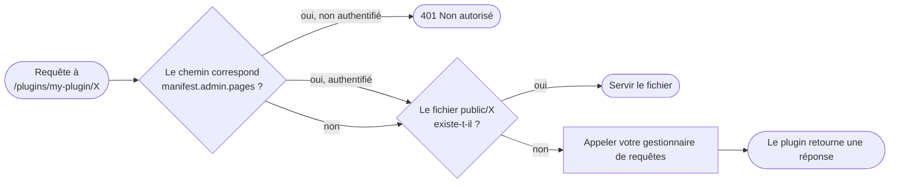
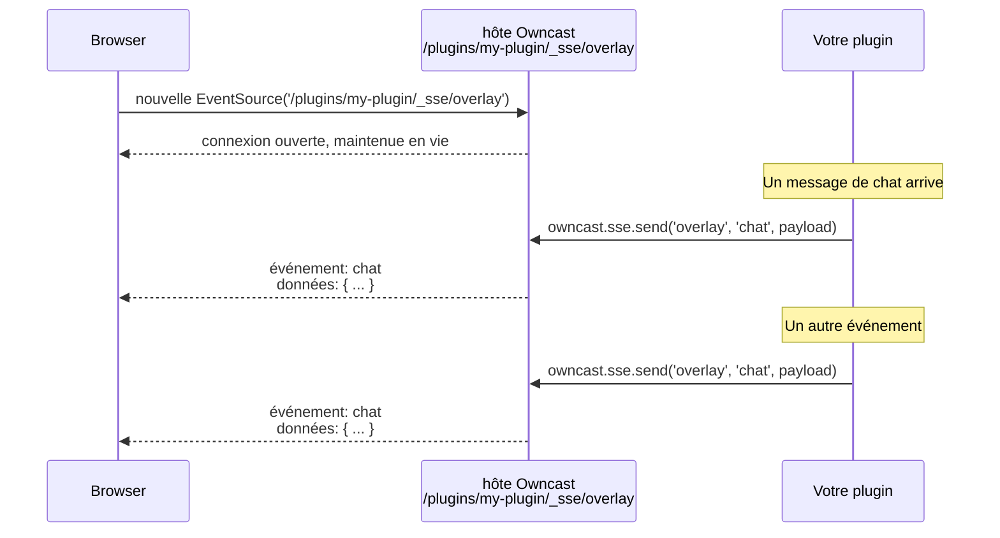

import Tabs from '@theme/Tabs';
import TabItem from '@theme/TabItem';

Les plugins peuvent servir leurs propres URL. Une fois que vous avez déclaré `http.serve` dans votre manifeste, l'espace URL à `/plugins/\<votre-slug>/` vous appartient : les fichiers statiques de votre répertoire `public/` sont envoyés tels quels, et tout le reste passe à votre gestionnaire de requêtes.

Le code est montré pour les deux SDK. Voir [JavaScript](/docs/plugins/sdks/javascript) ou [Python](/docs/plugins/sdks/python) pour l'installation et la configuration.

## Routage

Une fois que `http.serve` est déclaré, l'hôte dirige chaque requête sous `/plugins/\<votre-slug>/` vers votre plugin :

1. Fichiers statiques. Tout dans votre répertoire `public/` est servi tel quel.
2. Gestionnaire dynamique. Tout le reste passe par le gestionnaire de requêtes de votre plugin.



Le chemin d'une requête est relatif à l'espace de noms de votre plugin : une requête à `/plugins/my-plugin/api/messages` atteint votre gestionnaire comme `/api/messages` (la chaîne de requête est exclue). Le gestionnaire lit les paramètres de requête et le corps de la requête, puis retourne une réponse avec un statut, des en-têtes optionnels et un corps optionnel.

Il existe deux styles de routage. En **JavaScript**, vous écrivez un seul gestionnaire `onHttpRequest(req)` et bifurquez sur `req.method` / `req.path`. En **Python**, vous déclarez des routes par méthode avec des décorateurs. Une requête dont le chemin correspond à une route mais pas à sa méthode obtient automatiquement un **405**, et un chemin non correspondant tombe dans le piège général, sinon **404**.

<Tabs groupId="plugin-lang">
<TabItem value="js" label="JavaScript" default>

```js
const { definePlugin } = require("@owncast/plugin-sdk");

module.exports = definePlugin({
  onHttpRequest(req) {
    // req: { méthode, chemin, en-têtes, requête, corps, utilisateur ? }
    if (req.method === "GET" && req.path === "/api/messages") {
      return {
        status: 200,
        headers: { "Content-Type": "application/json" },
        body: "[]",
      };
    }
    if (req.method === "POST" && req.path === "/api/messages") {
      const data = JSON.parse(req.body || "{}");
      return { status: 201 };
    }
    return { status: 404 };
  },
});
```

</TabItem>
<TabItem value="py" label="Python">

```python
from owncast_plugin import plugin

@plugin.get("/api/messages")
def list_messages(req):
    return {"status": 200, "headers": {"Content-Type": "application/json"}, "body": "[]"}

@plugin.post("/api/messages")
def add_message(req):
    body = req.body          # corps de la requête brut
    return {"status": 201}

@plugin.on_http_request      # générique : attraper au cas où (toute méthode, tout chemin)
def fallback(req):
    return {"status": 404}
```

Les routes sont exactes et relatives au plugin. Lisez les paramètres de requête à partir de `req.query`. Un gestionnaire retourne un `dict` (`{status, body, headers}`), une `str` (→ 200), ou `None` (→ 204). `@plugin.route(path, methods=[...])` couvre plusieurs méthodes sur un seul chemin.

</TabItem>
</Tabs>

La porte `manifest.admin.pages` en haut est couverte dans [UI : Pages Admin](/docs/plugins/ui#admin-pages). Du point de vue du service HTTP, c'est simplement un filtre 401 avant l'exécution de votre gestionnaire appliqué aux chemins correspondants.

## Fichiers statiques

Le répertoire `public/` contient des fichiers servis à `/plugins/\<votre-slug>/\<chemin>`. Un répertoire `assets/` séparé contient des fichiers que l'hôte lit en interne pour des champs de manifeste qui contiennent du contenu (`styles`, `scripts`, `extraPageContent`). Ceux-ci ne sont pas accessibles à partir de l'espace URL du plugin.

```text
my-plugin/
└── public/
    ├── index.html        → /plugins/my-plugin/index.html (et /plugins/my-plugin/)
    ├── style.css         → /plugins/my-plugin/style.css
    └── img/
        └── logo.png      → /plugins/my-plugin/img/logo.png
```

Une requête à `/plugins/my-plugin/` (sans chemin à la fin) sert automatiquement `public/index.html`.

## Limites de requêtes et de réponses

* Les corps de requêtes sont limités à 1 Mo.
* Les corps de réponse sont limités à 10 Mo.
* Le passage par chemin (`..`) dans les URL est bloqué au niveau de l'hôte. Vous ne le verrez jamais dans le chemin de votre gestionnaire.
* Les en-têtes de réponse sont filtrés par une liste d'autorisation. Vous pouvez définir les en-têtes `Content-Type`, `Content-Encoding`, `Content-Language`, `Cache-Control`, `Set-Cookie`, `Location`, `ETag`, `Last-Modified`, `Vary`, `Link`, et CORS (`Access-Control-*`). Les en-têtes détenus par Owncast (`Server`, `Content-Security-Policy`, `Strict-Transport-Security`, `X-Frame-Options`) sont bloqués.
* Les cookies que vous définissez s'appliquent par défaut à l'espace URL de votre plugin (`/plugins/\<votre-slug>/`). Si vous souhaitez qu'un cookie soit envoyé sur des requêtes en dehors de ce chemin, définissez explicitement `Path=...`. Sinon, le navigateur le limite à votre espace de noms et ne le laissera pas fuiter dans d'autres plugins ou dans les propres chemins d'Owncast.
* Chaque requête est limitée à 5 secondes avant que l'hôte retourne un `504` et abandonne votre réponse.

## Public vs. authentifié

Les points de terminaison sont publics par défaut. Pour rendre quelque chose uniquement administrateur, vérifiez si la requête est authentifiée au sein de votre gestionnaire et retournez `401` lorsqu'elle ne l'est pas, ou déclarez le chemin dans `manifest.admin.pages[]` et laissez l'hôte le contrôler pour vous (voir [UI : Pages Admin](/docs/plugins/ui#admin-pages)).

Pour les requêtes faites par un utilisateur de chat avec un jeton utilisateur valide, la requête porte l'identité de l'utilisateur (`id`, nom d'affichage, et `scopes`). Utile pour des tableaux de bord par utilisateur ou des outils réservés aux modérateurs :

<Tabs groupId="plugin-lang">
<TabItem value="js" label="JavaScript" default>

```js
module.exports = definePlugin({
  onHttpRequest(req) {
    if (!req.user) return { status: 401 };           // non connecté
    if (!req.user.scopes?.includes("MODERATOR")) return { status: 403 };
    return { status: 200, body: `bonjour ${req.user.displayName}` };
  },
});
```

</TabItem>
<TabItem value="py" label="Python">

```python
@plugin.get("/my-data")
def my_data(req):
    if not req.user:                                  # non connecté
        return {"status": 401}
    if "MODERATOR" not in (req.user.scopes or []):
        return {"status": 403}
    return {"status": 200, "body": f"bonjour {req.user.display_name}"}
```

</TabItem>
</Tabs>

Pour les chemins déclarés dans `manifest.admin.pages[]`, l'hôte retourne `401` avant l'exécution de votre gestionnaire, donc vous n'avez pas à vérifier du tout.

## Mises à jour en temps réel (Événements envoyés par le serveur)

Pour envoyer des mises à jour en direct à un navigateur (une superposition qui réagit au chat, un tableau de bord qui indique le nombre de spectateurs, un widget d'alerte) déclarez `http.sse` et utilisez `owncast.sse.send`.

Vous n'ouvrez pas ou ne conservez pas la connexion vous-même. Votre gestionnaire de requêtes ne peut pas faire de streaming : chaque appel est une requête/réponse tamponnée unique. L'hôte possède la connexion à long terme et expose un point de terminaison prêt à l'emploi à `/plugins/\<votre-slug>/_sse/\<canal>`. Votre plugin pousse. L'hôte envoie chaque message à chaque navigateur connecté.



### Côté plugin

Poussez depuis n'importe quel gestionnaire, par exemple, depuis votre gestionnaire de chat, en appelant `owncast.sse.send(canal, événement, données)` :

<Tabs groupId="plugin-lang">
<TabItem value="js" label="JavaScript" default>

```js
const { definePlugin, owncast } = require("@owncast/plugin-sdk");

module.exports = definePlugin({
  onChatMessage(msg) {
    owncast.sse.send("overlay", "chat", {
      from: msg.user?.displayName,
      body: msg.body,
    });
  },
});
```

</TabItem>
<TabItem value="py" label="Python">

```python
from owncast_plugin import plugin, owncast

@plugin.on_chat_message
def push(msg):
    owncast.sse.send("overlay", "chat", {
        "from": msg.user.display_name if msg.user else None,
        "body": msg.body,
    })
```

</TabItem>
</Tabs>

* `canal` : quel flux pousser. Les navigateurs s'abonnent par canal, donc vous pouvez faire fonctionner plusieurs flux indépendants (`"overlay"`, `"admin-stats"`) à partir d'un seul plugin. Utilisez `""` pour un seul canal par défaut.
* `événement` : le nom de l'événement que le navigateur écoute (`addEventListener("chat", ...)`). Passez `""` pour l'événement par défaut `message` du navigateur.
* `données` : la charge utile. Les chaînes sont envoyées telles quelles. Tout le reste est encodé en JSON pour vous.

Les envois sont de type fire-and-forget. L'appel retourne immédiatement et ne bloque jamais, même si personne n'est connecté ou qu'un client est lent. Les clients lents perdent des trames plutôt que d'arrêter votre plugin. Il existe également des événements du cycle de vie de la connexion SSE (ouverture et fermeture du flux d'un spectateur) auxquels vous pouvez vous abonner : voir la [référence des gestionnaires](/docs/plugins/events#sse-events).

### Côté navigateur

API `EventSource` standard sur la page du spectateur. Pas de bibliothèque. Cela s'exécute dans le navigateur, donc c'est toujours JavaScript peu importe dans quel langage votre plugin est écrit :

```html
<!-- public/index.html, servi à /plugins/my-plugin/ -->
<script>
  const events = new EventSource("/plugins/my-plugin/_sse/overlay");
  events.addEventListener("chat", (e) => {
    const { from, body } = JSON.parse(e.data);
    document.getElementById("feed").textContent = `${from}: ${body}`;
  });
</script>
```

### Notes

* Jusqu'à 64 connexions simultanées par plugin. Au-delà, le point de terminaison retourne `503`. `EventSource` se reconnecte automatiquement.
* Si le canal correspond à l'un de vos globes `admin.pages[]`, il est protégé par authentification comme tout chemin administrateur. Pratique pour un flux de statistiques réservé aux administrateurs.
* Le point de terminaison est détenu par l'hôte. Votre gestionnaire de requêtes ne voit jamais les requêtes `/_sse/...`, et vous ne pouvez pas servir votre propre route là-bas.

## Rassembler : un plugin de superposition complet

Le manifeste déclare les deux permissions dont la superposition a besoin :

```json
{
  "api": "1",
  "name": "Superposition de chat",
  "slug": "overlay",
  "version": "0.1.0",
  "permissions": ["http.serve", "http.sse"]
}
```

Le plugin s'abonne aux messages de chat et pousse chacun vers le canal SSE `overlay` :

<Tabs groupId="plugin-lang">
<TabItem value="js" label="JavaScript" default>

```js
// src/plugin.js
const { definePlugin, owncast } = require("@owncast/plugin-sdk");

module.exports = definePlugin({
  onChatMessage(msg) {
    owncast.sse.send("overlay", "chat", {
      from: msg.user?.displayName,
      body: msg.body,
    });
  },
});
```

</TabItem>
<TabItem value="py" label="Python">

```python
# src/plugin.py
from owncast_plugin import plugin, owncast

@plugin.on_chat_message
def push(msg):
    owncast.sse.send("overlay", "chat", {
        "from": msg.user.display_name if msg.user else None,
        "body": msg.body,
    })
```

</TabItem>
</Tabs>

La page du spectateur est le même extrait `EventSource` montré ci-dessus, pointé vers le point de terminaison relatif `./_sse/overlay` :

```html
<!-- public/index.html -->
<!doctype html>
<body>
  <div id="feed"></div>
  <script>
    const events = new EventSource("./_sse/overlay");
    events.addEventListener("chat", (e) => {
      const { from, body } = JSON.parse(e.data);
      document.getElementById("feed").textContent = `${from}: ${body}`;
    });
  </script>
</body>
```

Construire, emballer, installer. Ouvrez `/plugins/overlay/` dans OBS en tant que source de navigateur.
