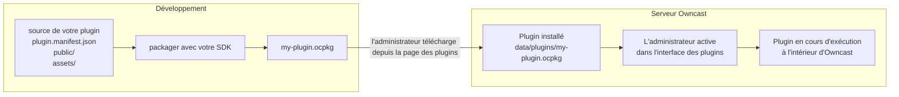

Owncast peut être étendu avec des **plugins** : de petits programmes que le serveur charge à l'exécution pour réagir aux messages de chat, aux événements de diffusion, aux activités du fediverse et aux requêtes HTTP. Ils s'exécutent dans un environnement isolé, de sorte qu'un plugin peut planter sans faire tomber le serveur, et l'hôte applique un modèle de permissions clair afin qu'un administrateur sache toujours ce qu'un plugin peut toucher.

:::info[Nouveau dans Owncast 0.3.0]
Les plugins sont une toute nouvelle fonctionnalité, introduite dans Owncast 0.3.0, et l'API est encore en évolution. Si vous rencontrez un bug ou avez une suggestion, veuillez [ouvrir un problème](https://github.com/owncast/plugin-sdk/issues) ou [discuter en direct avec la communauté](/chat?tab=community).
:::

Vous pouvez écrire un plugin en **JavaScript** ou **Python**. Les deux SDKs sont des pairs de première classe avec une parité de fonctionnalités complète : les gestionnaires, les API, les permissions et le manifeste dans cette section s'appliquent aux deux, seule la structure et la syntaxe du langage diffèrent.

## Ce que vous pouvez construire

- Des chatbots qui répondent à des mots-clés ou des commandes, publient des rappels, organisent des sondages ou modèrent le spam.
- Des filtres qui réécrivent ou suppriment les messages de chat avant qu'ils n'atteignent les spectateurs.
- Des superpositions rendues au-dessus de votre flux, parlant aux points de terminaison HTTP de votre plugin.
- Des intégrations qui relient Owncast à Discord, au fediverse, aux notifications push du navigateur ou à tout service HTTPS.
- Des outils d'administration qui ajoutent un onglet à l'interface d'administration d'Owncast pour les paramètres spécifiques aux plugins.
- Des boutons d'action qui apparaissent sous votre stream, lançant des widgets, des pages de dons ou autre chose que vous servez.

Chaque exemple de plugin dans le SDK est un point de départ complet que vous pouvez copier.

## Deux SDKs

Les deux SDKs produisent le même `.ocpkg`, s'exécutent isolés dans le serveur et s'emballent dans à peu près la même taille. Choisissez le langage dans lequel vous préférez écrire.

- **[JavaScript](/docs/plugins/sdks/javascript)** avec [`@owncast/plugin-sdk`](https://www.npmjs.com/package/@owncast/plugin-sdk). Créez une structure avec `npx create-owncast-plugin`, écrivez `definePlugin({ ... })`, construisez avec `npm run package`.
- **[Python](/docs/plugins/sdks/python)** avec [`owncast-plugin-py`](https://pypi.org/project/owncast-plugin-py/). Créez une structure avec `uvx owncast-plugin-py new`, écrivez des fonctions décorées, construisez avec `owncast-plugin-py package`.

Le même bot echo dans chacun :

```js
// JavaScript
const { definePlugin, owncast } = require('@owncast/plugin-sdk');

module.exports = definePlugin({
  onChatMessage(msg) {
    owncast.chat.send(`echo: ${msg.body}`);
  },
});
```

```python
# Python
from owncast_plugin import plugin, owncast

@plugin.on_chat_message
def echo(msg):
    owncast.chat.send(f"echo: {msg.body}")
```

## Comment cela s'assemble

Un plugin est un seul fichier `.ocpkg` contenant le manifeste de votre plugin, le code compilé et tous les actifs statiques. Un administrateur place le fichier dans le répertoire `data/plugins/` d'Owncast et l'active depuis la page **Plugins** dans l'administration.



Une fois activé, le plugin s'exécute à l'intérieur du processus Owncast. Les gestionnaires que vous avez définis sont déclenchés lorsque des événements correspondants se produisent. Les API que vous appelez (envoi de chat, lecture de config, récupération d'URL) passent par l'hôte, qui vérifie les permissions que vous avez déclarées dans votre manifeste.

Chaque plugin activé utilise un peu plus de mémoire du serveur. Le premier plugin d'un langage charge également l'environnement d'exécution partagé de ce langage, un coût unique qui est plus élevé pour Python que pour JavaScript. Chaque plugin après cela ajoute uniquement un petit montant en plus.

## Ce qu'un plugin peut faire

1. S'abonner aux événements. Messages de chat, début et fin de diffusion, suivis du fediverse, nouveaux utilisateurs de chat rejoignent. Définissez une méthode gestionnaire et le SDK dérive l'abonnement.
2. Filtrer le chat. Voir chaque message de chat avant qu'il ne soit diffusé, le modifier ou le supprimer.
3. Appeler les API d'Owncast. `owncast.chat.send(text)`, `owncast.kv.get(key)`, `owncast.http.fetch(url)` et des dizaines d'autres, la plupart soumis à une permission déclarée.
4. Servir HTTP. Chaque plugin peut posséder l'espace d'URL à `/plugins/<votre-slug>/...` pour les actifs statiques et les gestionnaires dynamiques.
5. Ajouter une interface utilisateur. Déclarez des pages d'administration, des boutons d'action, des feuilles de style de plugins, des scripts de plugins ou un bloc HTML supplémentaire dans votre manifeste et Owncast les intègre dans son propre chrome.
6. Gérer l'accès. Un plugin peut être le fournisseur d'authentification du site. Faire en sorte que les spectateurs se connectent (OAuth, un mot de passe, quoi que ce soit par HTTP) avant de pouvoir accéder à la page, à la vidéo, au chat ou à l'API.

## Ce qu'un plugin ne peut pas faire

De par sa conception :

- Pas d'accès direct au système de fichiers, au réseau ou aux processus de l'hôte. Le bac à sable impose cela. Les plugins font ce que les API de l'hôte exposent, et uniquement avec les permissions déclarées.
- Pas d'usurpation d'identité. Chaque plugin obtient une identité de chat (le bot qu'Owncast fournit à l'installation), et les publications sortantes sur le fediverse proviennent du compte de celui qui diffuse.
- Pas de lectures inter-plugins. Le stockage de clé-valeur de chaque plugin est dans un espace de noms.
- Pas de blocage de chat indéfini. Les appels de filtrage sont limités dans le temps à 50 ms, et un plugin qui échoue de manière répétée est désactivé automatiquement.

C'est pourquoi un administrateur peut installer un plugin tiers sans auditer chaque ligne de code. La frontière de confiance est la liste de permissions du manifeste.

## Où aller ensuite

- [Démarrage rapide](/docs/plugins/quickstart). Créez un nouveau plugin, construisez-le, installez-le.
- [JavaScript](/docs/plugins/sdks/javascript) et [Python](/docs/plugins/sdks/python). La configuration spécifique au langage, CLI et syntaxe pour chaque SDK.
- [Référence du manifeste](/docs/plugins/manifest). Chaque champ que votre `plugin.manifest.json` peut contenir.
- [Plugins de chat](/docs/plugins/chat). Construire des bots, des outils de modération et des filtres de chat.
- [Événements](/docs/plugins/events). Chaque événement auquel votre plugin peut s'abonner, avec des formes de charge utile.
- [APIs d'Owncast](/docs/plugins/apis). Chaque méthode `owncast.*`, ce qu'elle fait et la permission qu'elle nécessite.
- [Permissions](/docs/plugins/permissions). La liste complète et comment fonctionne le modèle de sécurité.
- [Servir HTTP](/docs/plugins/http). Servez des URL depuis votre plugin et poussez des événements en temps réel aux navigateurs.
- [Contribuer à l'interface utilisateur](/docs/plugins/ui). Enregistrer des pages d'administration et contribuer des boutons d'action sous le stream.
- [Tester](/docs/plugins/testing). Tests de scénario qui évaluent votre plugin dans le réel d'exécution.
- [Emballage et publication](/docs/plugins/packaging). Regrouper le `.ocpkg`, l'installer et le répertorier dans le répertoire.

## Source

- Source du SDK : [github.com/owncast/plugin-sdk](https://github.com/owncast/plugin-sdk)
- Exemples de plugins, un par fonctionnalité : [JavaScript](https://github.com/owncast/plugin-sdk/tree/main/examples/js) · [Python](https://github.com/owncast/plugin-sdk/tree/main/examples/python)
