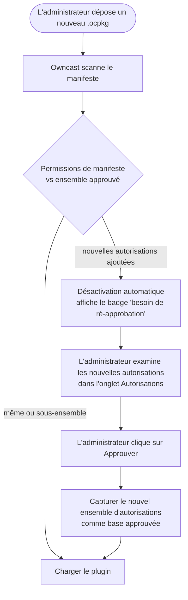

Chaque plugin Owncast fonctionne dans un bac à sable sans accès implicite à quoi que ce soit en dehors du plugin lui-même. Pour effectuer des travaux utiles (lire le chat, publier sur le fediverse, récupérer une URL, écrire dans un store clé-valeur), votre plugin demande l'hôte via les méthodes `owncast.*`. Chacune de ces méthodes est soumise à une autorisation que vous déclarez dans votre manifeste.

Lorsqu'un administrateur installe un plugin, l'onglet **Autorisations** sur la page de détails du plugin énumère exactement ce que le plugin a demandé, en termes simples. C'est la frontière de confiance : un administrateur peut installer un plugin tiers sans vérifier chaque ligne de code, car le manifeste est la limite supérieure de ce que le plugin peut faire.


:::info[Disponible dans chaque SDK]
Les identifiants d'autorisation et le modèle de confiance ci-dessous sont les mêmes, quel que soit le SDK utilisé. Les méthodes `owncast.*` sont référencées ici par leurs noms canoniques. Pour l'orthographe exacte dans votre langue, consultez la référence SDK **[JavaScript](/docs/plugins/sdks/javascript)** ou **[Python](/docs/plugins/sdks/python)**.
:::

## Comment ça fonctionne

1. Vous déclarez des autorisations dans `plugin.manifest.json` :

   ```json
   { "permissions": ["chat.send", "storage.kv"] }
   ```

2. L'administrateur les examine lors de l'activation. La page de détails du plugin d'Owncast liste chaque autorisation avec une description lisible par un humain.

3. L'hôte les applique à l'exécution. Appeler `owncast.chat.send(...)` sans `chat.send` dans votre manifeste génère une erreur claire avant que l'appel n'atteigne Owncast.

4. L'hôte détecte le dérive. Votre plugin construit déclare les autorisations qu'il utilise à l'exécution. L'hôte compare cela avec le manifeste et refuse de charger le plugin si l'exécution demande plus que ce que le manifeste accorde. Vous ne pouvez pas vous faufiler un accès supplémentaire en remplaçant le fichier du plugin après coup.

### Nouvelle approbation lorsque les autorisations s'étendent

Si vous livrez une mise à jour qui demande plus d'autorisations que celles précédemment approuvées par l'administrateur, Owncast désactive automatiquement le plugin et affiche un badge "besoin de ré-approbation" dans la liste des plugins. L'administrateur examine les nouvelles autorisations dans l'onglet **Autorisations** et clique sur **Approuver** pour accepter l'ensemble élargi et réactiver le plugin. Réduire les autorisations est silencieux.



Les capacités effectives d'un plugin installé ne croissent jamais sans que l'administrateur dise à nouveau oui.

## Référence d'autorisation

### `chat.send`

Accorde :

- `owncast.chat.send(text)` : publier sous l'identité de bot du plugin
- `owncast.chat.sendAction(text)` : publier un message "/me"
- `owncast.chat.sendTo(clientId, text)` : envoyer un message privé à un client connecté
- `owncast.chat.system(body)` : publier un message système sans identité d'utilisateur, rendu comme une annonce serveur (le corps est HTML)

Les messages passent par le pipeline de chat normal d'Owncast (filtres, limites de fréquence, persistance, modération). Les plugins ne peuvent pas envoyer sous des noms arbitraires ou usurper de vrais utilisateurs.

### `chat.history`

Accorde :

- `owncast.chat.history(limit?)` : lire les messages récents du chat
- `owncast.chat.clients()` : lister les clients de chat connectés

Lecture seule.

### `chat.moderate`

Accorde :

- `owncast.chat.deleteMessage(messageId)` : cacher un message aux spectateurs
- `owncast.chat.kick(clientId)` : déconnecter un client de chat

### `chat.filter`

Accorde la capacité de définir `filterChatMessage(msg)` : voir chaque message de chat avant qu'il ne soit diffusé, avec la possibilité de le réécrire ou de le supprimer.

Le filtrage se fait en ligne sur chaque message de chat, donc l'administrateur doit voir cela apparaître explicitement. L'hôte rejette le chargement si un plugin définit `filterChatMessage` sans déclarer cette autorisation.

### `users.read`

Accorde :

- `owncast.users.list()` : lire la liste des utilisateurs du chat
- `owncast.users.get(id)` : lire un enregistrement d'utilisateur unique

### `users.moderate`

Accorde :

- `owncast.users.setEnabled(id, enabled, reason?)` : activer ou désactiver un utilisateur
- `owncast.users.banIP(ip)` : interdire un IP de rejoindre le chat

### `users.register`

Accorde `owncast.users.register({ authId, displayName?, scopes? })` : trouver ou créer un utilisateur Owncast authentifié pour une identité externe et retourner son `userId`. L'`authId` est un identifiant stable, limité au fournisseur (par exemple, `"github:583231"`) ; l'hôte l'namespace selon le slug de votre plugin, donc deux plugins ne peuvent pas entrer en collision ni usurper les utilisateurs de l'autre.

C'est ainsi qu'un plugin transforme une connexion tierce (OAuth, Discord, un mot de passe partagé) en un véritable utilisateur Owncast avec une identité de chat authentifiée. À lui seul, il ne limite ni ne délivre de session : associez-le à `auth.gate` pour créer une porte d'entrée de connexion, ou utilisez-le seul pour distribuer des identités de chat vérifiées.

### `auth.gate`

Accorde la porte d'authentification des spectateurs :

- `owncast.auth.grantSession({ userId, ttl? })` : délivrer une session signée pour un utilisateur déjà enregistré (voir `users.register`)
- `owncast.auth.endSession()` : effacer la session actuelle du spectateur (déconnexion)
- le gestionnaire `onAuthCheck` optionnel : re-valider la session d'un spectateur à chaque chargement de page

Un plugin détenant `auth.gate` est un **fournisseur d'identité**. Tant qu'il est activé, chaque spectateur doit s'authentifier via lui avant qu'il puisse accéder à la page, à la vidéo, au chat ou à l'API. Un seul plugin `auth.gate` peut être activé à la fois, et la porte échoue en mode fermé : si le plugin n'est pas disponible, les spectateurs sont exclus plutôt que de laisser entrer. Voir **[Authentification](/docs/plugins/auth)** pour le modèle complet.

### `storage.kv`

Accorde `owncast.kv.get(key)` et `owncast.kv.set(key, value)` : un store clé/valeur par plugin. Les plugins ne peuvent pas lire les clés des autres.

L'état persiste entre les rechargements et les redémarrages de l'hôte.

### `storage.upload`

Accorde `owncast.storage.upload(name, bytes)` : télécharger un fichier dans l'espace public de fichiers d'Owncast et récupérer une URL. Utile pour les badges, les images générées dynamiquement, les pièces jointes de publications dans le fediverse.

### `storage.fs`

Accorde `owncast.fs.*` : un système de fichiers privé, sandboxé à `data/plugin-data/<your-slug>/` que votre plugin peut lire, écrire, lister et supprimer. Utile pour les caches, les fichiers de données générés, les journaux de type append, ou tout ce que vous avez besoin de persister sous forme de fichiers réels plutôt que de chaînes clé/valeur.

Contrairement à `storage.upload`, ces fichiers restent **côté serveur** : ils ne sont jamais servis via HTTP. Chaque chemin est confiné au répertoire de votre plugin : un plugin ne peut pas lire les fichiers d'un autre plugin ni sortir de son bac à sable (`../` et les chemins absolus sont réduits à l'intérieur).

### `network.fetch`

Accorde `owncast.http.fetch(url, opts?)` : HTTP sortant synchrone.

Nécessite une liste `network.allowedHosts` en complément dans le manifeste. L'hôte rejette le chargement si `network.fetch` est accordé sans liste d'autorisation. Chaque appel est vérifié contre la liste d'autorisation. Les hôtes qui ne correspondent pas retournent une erreur avant que des octets ne quittent le serveur.

```json
{
  "permissions": ["network.fetch"],
  "network": { "allowedHosts": ["api.discord.com", "*.weather.com"] }
}
```

Le caractère générique `"*"` est autorisé mais doit être écrit explicitement afin que les administrateurs examinant le manifeste voient la portée. L'UI administrateur affiche la liste complète des `allowedHosts` dans l'onglet **Autorisations** à côté de la ligne `network.fetch`, donc un opérateur de serveur examinant un plugin voit exactement quels hôtes il peut atteindre sans déballer le `.ocpkg`.

### `events.emit`

Accorde `owncast.events.emit(eventType, payload)` : émettre un événement personnalisé auquel d'autres plugins peuvent s'abonner via `on: { ... }`.

S'abonner aux événements émis par d'autres plugins ne nécessite pas de permission.

### `http.serve`

Accorde à l'API du routeur HTTP de l'hôte la permission d'envoyer des requêtes à `/plugins/<your-slug>/*` à votre plugin. Cela inclut à la fois les fichiers statiques dans votre répertoire `public/` et les requêtes dynamiques routées vers votre gestionnaire `onHttpRequest`.

Sans cette autorisation, tout l'espace d'URL `/plugins/<your-slug>/` retourne `404`.

### `http.sse`

Accorde `owncast.sse.send(channel, event, data)` et expose un point de terminaison détenu par l'hôte à `/plugins/<your-slug>/_sse/<channel>` auquel les navigateurs se connectent avec `EventSource`. Indépendant de `http.serve`. Un plugin peut pousser des événements sans servir d'autres routes.

### `server.read`

Accorde les API de flux en lecture seule et d'état du serveur :

- `owncast.stream.current()` : état du flux en direct
- `owncast.stream.broadcaster()` : télémétrie d'encodage entrant
- `owncast.server.info()` : nom du serveur, version, résumé
- `owncast.server.socials()` : liens sociaux configurés
- `owncast.server.federation()` : paramètres du fediverse
- `owncast.server.tags()` : tags configurés

### `videoconfig.read`

Accorde `owncast.videoConfig.read()` : lire la configuration de sortie et de transcodage (codecs, niveau de latence, variantes de flux).

### `videoconfig.write`

Accorde `owncast.videoConfig.write(partial)` : modifier la configuration de sortie vidéo.

Forte confiance. Les changements s'appliquent au prochain démarrage de flux. L'hôte ne redémarre pas une diffusion active. Les administrateurs devraient accorder parcimonieusement.

### `notifications.send`

Accorde les API de notification du diffuseur :

- `owncast.notifications.discord(text)` : via le webhook Discord configuré par le streamer
- `owncast.notifications.browserPush({ title, body, url? })` : aux navigateurs abonnés
- `owncast.notifications.fediverse({ type, body, image?, link? })` : notification formatée pour le fediverse

### `fediverse.inbound`

Accorde l'abonnement à tous les sept événements entrants du plugin Fediverse :

- `fediverse.follow`
- `fediverse.like`
- `fediverse.repost`
- `fediverse.quote`
- `fediverse.mention`
- `fediverse.reply`
- `fediverse.activity`

L'objet JSON brut de l'activité vérifiée est reçu par `fediverse.activity`. Il s'exécute en complément de tout événement spécialisé correspondant. Cette permission ne couvre que la réception d'activité. Publier depuis le compte Owncast nécessite l'autorisation séparée `fediverse.post`.

### `fediverse.post`

Accorde `owncast.fediverse.post(text)` : faire une publication publique au fediverse depuis le compte Owncast.

Forte confiance : les publications sortent sous la propre identification fediverse du streamer et ne peuvent pas être révoquées silencieusement. Les administrateurs devraient accorder parcimonieusement.

### `ui.modify`

Accorde la capacité de placer une interface utilisateur à l'intérieur du chrome d'Owncast :

- Déclarer `manifest.actions` (boutons d'action sous le flux).
- Appeler `owncast.actions.add(...)` / `.clear()` à l'exécution.
- Déclarer `manifest.styles` (CSS intégré dans la page du spectateur).
- Déclarer `manifest.scripts` (JavaScript intégré dans la page du spectateur).
- Déclarer `manifest.extraPageContent` (un bloc HTML ajouté à la zone de contenu supplémentaire du spectateur).
- Déclarer `manifest.tabs` (onglets supplémentaires dans la ligne d'onglets de la page du spectateur).
- Implémenter un gestionnaire `onPageStyles` ou `onPageScripts` (CSS ou JavaScript retourné au moment de la demande, sans champ de manifeste).

Sans cette autorisation, les manifestes qui déclarent l'un de ces champs sont rejetés lors du chargement. Les gestionnaires `onPageStyles` et `onPageScripts` n'ont pas de champ de manifeste, donc ils ne sont pas rejetés lors du chargement. L'hôte ne les appelle tout simplement pas à moins que le plugin détienne `ui.modify`. Chacun de ces éléments s'intègre dans la page du spectateur plutôt que de rester dans l'espace URL du plugin lui-même, donc l'administrateur doit voir la permission pour comprendre comment le plugin s'intègre à l'interface utilisateur de l'hôte.

Aucun des quatre champs d'injection de spectateur ne nécessite `http.serve`, et les deux gestionnaires non plus. L'hôte lit chaque fichier depuis le répertoire `assets/` du plugin (et non depuis une URL), ou appelle le gestionnaire, et intègre le résultat dans les réponses configurées / JS personnalisées existantes, donc `ui.modify` seul suffit.

## Tableau récapitulatif

| Permission           | Accès                                                                                                                                                                  |
| -------------------- | ---------------------------------------------------------------------------------------------------------------------------------------------------------------------- |
| `chat.send`          | `owncast.chat.send`, `.sendAction`, `.sendTo`, `.system`                                                                                                               |
| `chat.history`       | `owncast.chat.history`, `.clients`                                                                                                                                     |
| `chat.moderate`      | `owncast.chat.deleteMessage`, `.kick`                                                                                                                                  |
| `chat.filter`        | Abonnez-vous à `filterChatMessage` (lire, modifier ou supprimer chaque message de chat).                                            |
| `users.read`         | `owncast.users.list`, `.get`                                                                                                                                           |
| `users.moderate`     | `owncast.users.setEnabled`, `.banIP`                                                                                                                                   |
| `users.register`     | `owncast.users.register`: trouver ou créer un utilisateur authentifié pour une identité externe                                                        |
| `auth.gate`          | `owncast.auth.grantSession`, `.endSession`, et le gestionnaire `onAuthCheck`: être la porte d'authentification du site                                 |
| `storage.kv`         | Magasin de clés/valeurs par nom de plugin                                                                                                                              |
| `storage.upload`     | Télécharger des fichiers dans l'espace public de fichiers d'Owncast                                                                                                    |
| `storage.fs`         | Système de fichiers privé et sandboxé côté serveur à `data/plugin-data/<your-slug>/`                                                                                   |
| `network.fetch`      | HTTP sortant. Nécessite également `network.allowedHosts`                                                                                               |
| `events.emit`        | Émettre des événements personnalisés pour d'autres plugins                                                                                                             |
| `http.serve`         | Servir HTTP à `/plugins/<your-slug>/*`                                                                                                                                 |
| `http.sse`           | Envoyer des événements en temps réel via `owncast.sse.send` et le point de terminaison `/_sse/`                                                                        |
| `server.read`        | Lire l'état du flux, config du serveur, encoder la télémétrie                                                                                                          |
| `videoconfig.read`   | Lire la configuration de sortie/transcodage                                                                                                                            |
| `videoconfig.write`  | Modifier la configuration de sortie vidéo (appliqué au démarrage du prochain flux)                                                                  |
| `notifications.send` | Envoyer des notifications Discord, de navigateur, ou fediverse                                                                                                         |
| `fediverse.inbound`  | Abonnez-vous à tous les sept événements entrants : `fediverse.follow`, `.like`, `.repost`, `.quote`, `.mention`, `.reply`, et `.activity`              |
| `fediverse.post`     | Publication publique dans le fediverse (limité par le taux)                                                                                         |
| `ui.modify`          | Ajouter des boutons d'action ou des onglets au chrome du visualiseur d'Owncast. Intégrer CSS, JavaScript ou HTML de plugin dans la page du visualiseur |

## Principe du moindre privilège

Déclarez seulement ce que vous utilisez réellement. Plus votre manifeste est étroit, plus la décision de confiance de l'administrateur est facile. Si vous vous trouvez à énumérer chaque permission, prenez du recul et voyez si votre plugin devrait vraiment être deux plugins.

Si vous cessez d'utiliser une permission pendant le développement, retirez-la du manifeste. Réduire est silencieux. Il n'y a pas de friction à retirer des entrées non utilisées.
