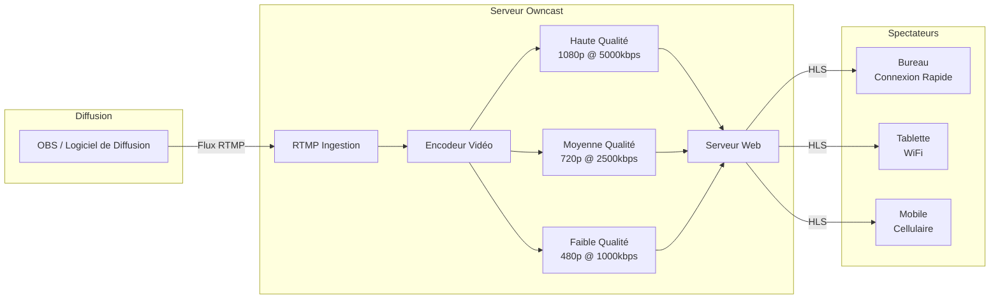

```mermaid
flowchart LR
    subgraph Diffusion
        OBS[OBS / Logiciel de Diffusion]
    end

    subgraph Serveur Owncast[Serveur Owncast]
        direction TB
        RTMP[RTMP Ingestion]
        Encodeur[Encodeur Vidéo]
        Haute[Haute Qualité<br/>1080p @ 5000kbps]
        Moyenne[Moyenne Qualité<br/>720p @ 2500kbps]
        Faible[Faible Qualité<br/>480p @ 1000kbps]
        ServeurWeb[Serveur Web]
        RTMP --> Encodeur
        Encodeur --> Haute
        Encodeur --> Moyenne
        Encodeur --> Faible
        Haute --> ServeurWeb
        Moyenne --> ServeurWeb
        Faible --> ServeurWeb
    end

    subgraph Spectateurs
        Bureau[Bureau<br/>Connexion Rapide]
        Tablette[Tablette<br/>WiFi]
        Mobile[Mobile<br/>Cellulaire]
    end

    OBS -->|Flux RTMP| RTMP
    ServeurWeb -->|HLS| Bureau
    ServeurWeb -->|HLS| Tablette
    ServeurWeb -->|HLS| Mobile
```
